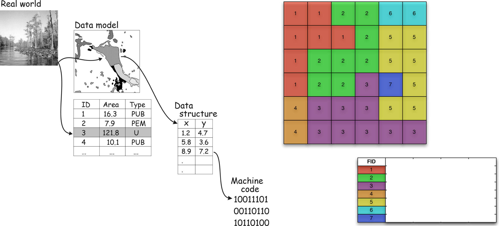
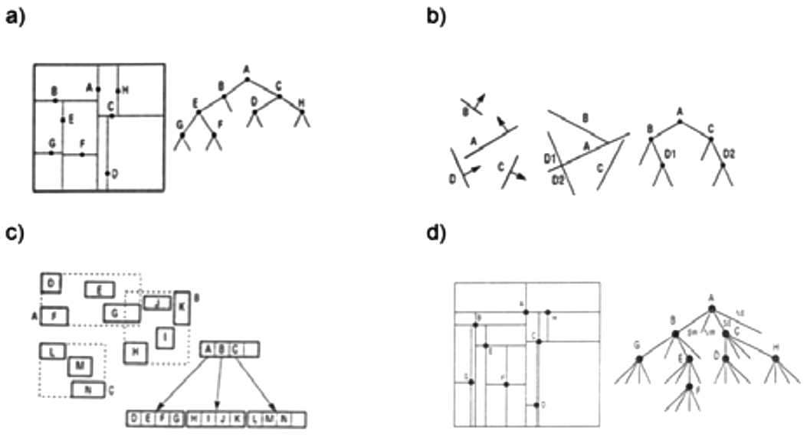

*******************
Prostorové databáze
*******************

.. warning:: :red:`Tato kapitola je zatím pouze ve formě osnovy!`

Prostorové databáze jsou databáze, v nichž jsou uloženy i prostorové data, 
resp. informace o objektech reálného světa reprezentované prostorovými daty.
Jak bylo již zmíněno v části :ref:`Geodata, geoprvky <geodata-geoprvky>`, 
prostorové data obsahují formální polohovou referenci a zpravidla bývají 
vyjádřené i pomocí geometrické a topologické informace.

Výhodou prostorových databází je, že spolu s prostorovými daty v nich mohou být 
uloženy a spravovány i atributové, textové, obrazové a jiné druhy dat. Už  
:ref:`víme <proc-gis>`, 
že pokud jsou prostorové data vztažené k Zemi, nazývají se geografická data 
nebo geodata. Prostorové databáze se pak označují jako *geografické databáze* 
nebo geodatabáze. Někdy se výraz geografické databáze používá jako synonym 
pojmu prostorové databáze, ale není to správné, protože pojem prostorové databáze 
má obecnější význam (Ďuračiová, 2014).
Tabulka s prostorovým atributem (atribut obsahující geometrické data) se nazývá 
*prostorová tabulka*. 

    
   Atributy prostorových dat (Zdroj: `www.indiana.edu <http://www.indiana.edu/~gisci/courses/g338/images/chapter2figs/fig2-2.gif>`_).

Protože prostorové tabulky reprezentují jak ​​metrické, tak 
i topologické vztahy příslušných objektů, jejichž struktura je podstatně složitější 
než struktura klasických vazeb v relačních databázích, mají i jiné specifické 
vlastnosti než konvenční atributové tabulky. Požadavek na jejich zajištění 
nedovoluje běžným způsobem využívat klasické relační databázové systémy, 
které jsou pro ostatní (neprostorové) datové typy a databáze nejpoužívanější. 
Mezi specifika patří i implementace speciálních prostorových indexů (kromě 
indexů i složitější struktura prostorových dat a nutnost rozšíření standardního 
dotazovacího jazyka v příslušných databázích o možnost práce s prostorovými daty).

Prostorové indexy
-----------------

Indexy jsou v databázových systémech důležitou součástí. Kromě podpory prostorových 
datových typů a funkcí podpora speciálních indexových struktur pro prostorové 
data hraje významnou roli. Indexové struktury se liší od konvenčního způsobu 
vytváření indexů, netřeba si to mýlit (`B-stromy <https://cs.wikipedia.org/wiki/B-strom>`_, 
`B+ stromy <https://cs.wikipedia.org/wiki/B%2B_strom>`_, 
`lineární hašování <https://en.wikipedia.org/wiki/Linear_hashing>`_, atd).
Prostorová data vyžadují použití specifických postupů indexování, které nejsou 
běžně implementovány přímo v relačních databázových systémech. Indexy obecně 
urychlují vyhledávání dat a také urychlují provádění různých prostorových poptávek.
Mezi indexové struktury pro prostorové data patří tzv. 
`stromy <https://cs.wikipedia.org/wiki/Strom_(datov%C3%A1_struktura)>`_, například 
`KD-stromy <https://en.wikipedia.org/wiki/K-d_tree>`_ (a), 
`BSP-stromy <https://en.wikipedia.org/wiki/Binary_space_partitioning>`_ (b), 
`R-stromy <https://en.wikipedia.org/wiki/R-tree>`_ (c), 
`štvorstromy <https://en.wikipedia.org/wiki/Quadtree>`_ (d).

    
   Indexové struktury pro prostorová data.

*Další témata:*
    
.. toctree::
   :maxdepth: 2

   sql
   nosql
