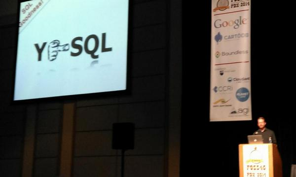

*******************
Prostorové databáze
*******************

.. warning:: :red:`Tato kapitola je zatím pouze ve formě osnovy!`

Prostorové databáze založené na SQL
===================================

    
    Zdroj: `Arnulf Christl <https://twitter.com/sevenspatial/status/510524995584270337/photo/1>`_

Dvě nejrozšířenější open source geodatabáze :program:`PostGIS` a :program:`SpatiaLite`
implementují specifikaci `OGC SimpleFeature pro databáze
<http://www.opengeospatial.org/standards/sfs>`_.

PostGIS
-------

Viz školení :program:`PostGIS`

* :skoleni:`Začátečník <postgis-zacatecnik>`
* :skoleni:`Pokročilý <postgis-pokrocily>`

SpatiaLite
----------

`SpatiLite <http://spatialite.org>`_ je prostorové rozšíření populární
souborové SQL databáze `SQLite <http://sqlite.org>`_.

Prostorové NoSQL databáze
=========================

.. figure:: images/nosql-plm.png
   :class: small
        
CouchDB, Cassandra, ...
