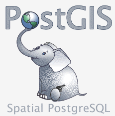

.. _db-sql:

Prostorové databáze založené na SQL
-----------------------------------

.. figure:: images/BxW_xy5CIAEQONU.jpg
   :class: small    

   Zdroj: `Arnulf Christl <https://twitter.com/sevenspatial/status/510524995584270337/photo/1>`_.

Dvě nejrozšířenější open source geodatabáze :program:`PostGIS` a :program:`SpatiaLite`
implementují specifikaci `OGC SimpleFeature pro databáze
<http://www.opengeospatial.org/standards/sfs>`_.

PostGIS
^^^^^^^

Jde o prostorové rozšíření databáze `PostgreSQL <http://www.postgresql.org>`_.
Nástavbě PostGIS se podrobně věnujeme ve školeních 
:skoleni:`PostGIS začátečník <postgis-zacatecnik>` a :skoleni:`pokročilý <postgis-pokrocily>`.

   PostGIS logo (zdroj: `wikipedia <https://upload.wikimedia.org/wikipedia/en/6/60/PostGIS_logo.png>`__).

SpatiaLite
^^^^^^^^^^

`SpatiaLite <http://spatialite.org>`_ je prostorové rozšíření populární
souborové SQL databáze `SQLite <http://sqlite.org>`_.

.. figure:: images/spatialite_logo.png
   :width: 150px    

   SpatiaLite logo (zdroj: `wikipedia <https://upload.wikimedia.org/wikipedia/en/f/f1/SpatiaLite_logo.png>`__).
