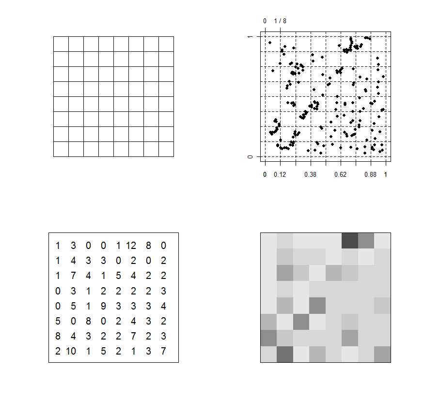

**************
Datové formáty
**************

Programy GIS modelují objekty reálného světa pomocí dvou základních forem dat:

* Rastrových dat
* Vektorových dat

Mezi těmito formáty lze, za přijmutí určité ztráty informace, volně převádět.

Rastrová data
=============
Rastrová data (:wikipediaen:`Raster data`) jsou strukturována do nejčastěji do
ploché matice uspořádaných hodnot. Struktura matice je nejčastěji pravidelná
mrížka, teoreticky lze použít i hexagonální tvar. Jednotlivé buňky rastrové mapy
se nazývají *pixely*.

Hodnoty jednotlivých rastrových buněk jsou většinou číselné - ať už celo číselné
nebo hodnoty s plovoucí desetinnou čárkou.

    Reprezentace frekvence výskytu fenoménu reálného světa jako rastrová data

    Zdroj: http://en.wikipedia.org/wiki/Raster_data

Rastrová data jsou vhodná zejména pro reprezentaci *spojitých fenoménů*, jako je

* Teplota vzduchu a vody
* Výška nad mořem
* Geologická data
* Mapa srážek
* Hustota povrchového odtoku
* Letecké a družicové snímkování
* ...

.. figure:: ../../grass-gis/raster/images/rast-num.png
    :class: middle

.. figure:: ../../grass-gis/raster/images/rast-num-float.png
    :class: middle

.. figure:: ../../grass-gis/raster/images/slope.png
    :class: middle

    Mapa sklonu svahu v České republice

Velikost hrany rastrové buňky určuje tzv. *rozlišení* rastrové mapy, která
určuje její polohovou přesnost - celá rastrová buňka reprezentuje hodnotu, která
se nachází v jejím ideálním středu.

Atributy rastrových dat
-----------------------
Jak již bylo napsáno, rastrové buňky - *pixely* - obsahují číselnou
reprezentaci nějaké hodnoty. Tato hodnota může nést informaci sama o sobě
(teplota, výška, ...) nebo může sloužit jako číselný klíč k přidružené
informační tabulce, např.

+----------------+---------------------+
| Hodnota pixelu | Význam              |
+================+=====================+
| 1              | lehké půdy          |
+----------------+---------------------+
| 2              | středně zrnité půdy |
+----------------+---------------------+
| 3              | těžké půdy          |
+----------------+---------------------+

Další atributy nelze rastrovým datům přiřazovat.

Vektorová data
==============
Vektorová data (:wikipediaen:`Vector graphics`) jsou souborem geometrických
primitiv, reprezentující objekty reálného světa. Objekty jsou podle svého
charakteru reprezentovány jako *bod*, *linie* nebo *polygon*.

Vektorová data jsou vhodná všude tam, kde se jedná o *diskrétní* objekty, jako
ideální reprezentace nějakého fenoménu:

* Výskyt jedince sledovaného druhu (bod)
* Výzmaný orientační prvek (bod)
* Středová linie silnice, silniční síť (linie)
* Průběh elektrického vedení (linie)
* Říční síť, dráhy povrchového odtoku (linie)
* Hranice parcel katastru nemovitostí (polygon)
* Hranice vodních ploch (polygon)
* Hranice půdního krytu (polygon)
* ...

.. figure:: ../../grass-gis/vector/images/grass7-topo.png
    :class: middle

    Ukázka vektorových dat *bod*, *linie* a *polygony*.

Vektorová data jsou většinou uložena ve formě uspořádaných dvojic souřadnic X,Y.
Linie a plocha je zapsána pomocí množiny těchto uspořádaných dvojic. Přesnost
takto zadaných souřadnic tak může být teoreticky nekonečná (co umožňí počítačové
systémy).

Zvláštním případem jsou *multipoints*, *multilinies* a *multipolygons* -
vektorové objekty skládající se z více vzájemně neprojpojených geometrických
objektů (např. dálnice D8 je v úseku přes České středohoří přerušena - lze ji
tak reprezentovat jako objekt *multiline* sestávající se ze dvou liniových
objektů.

Atributy vektorových dat
------------------------
Kromě informace o *geometrických vlastnostech* objektů, nesou vektorová data
také informaci o dalších vlastnostech objektů - jejich *atributech*. Atributy
jsou většinou zaznamenány do nějaké formy databázové tabulky. V závislosti na
použitém software se jedná buď o primitivní souborý formát nebo plnohodnotný
databázový server.

.. figure:: images/vector-attributes.png
    :class: middle

    Mapa velkopločných chráněných území spolu s atributy uloženými v databázi

    Zdroj dat: `AOPK OGC WFS Server
    <https://gis.nature.cz/arcgis/services/UzemniOchrana/ChranUzemi/MapServer/WFSServer>`_

Geometrická složka a atributová složka bývají obvykle odděleny zvlášť a navzájem
projpojeny pomocí jednoznačného interního identifikátoru.

Počet atributů vektorových objektů je teoreticky nekonečný. Pokud použijeme pro
uložení atributů databázový systém, je možné s daty dále pracovat jako 

.. note:: Na problém se některé softwary (např. databázový systém PostGIS nebo
    souborová databáze SpatialLite)
    dívají tak, že geometrická složka dat je pouze *jedním z atributů*
    geometrického objektu. Data jsou uspořádána do klasické databázové tabulky,
    geometrie je pouze další sloupeček - geometrie není od atributů nijak
    oddělena.

    +------------+------------------------------------------------------+--------+
    |    fid     |                       geometry                       |  cislo |
    +============+======================================================+========+
    |45496175010 | POLYGON((-728524.789710812 -1066515.49883718,-728... | 515    |
    +------------+------------------------------------------------------+--------+
    |2982799209  | POLYGON((-723694.909701298 -1063302.12883134,-723... | 1331/10|
    +------------+------------------------------------------------------+--------+
    |2969999209  | POLYGON((-718640.439694238 -1037240.20878015,-718... | 1276   |
    +------------+------------------------------------------------------+--------+
    |17076174010 | POLYGON((-722180.859702737 -1027388.94876021,-722... | 260    |
    +------------+------------------------------------------------------+--------+
    |3825204209  | POLYGON((-715023.709686742 -1038171.52878245,-715... | 483    |
    +------------+------------------------------------------------------+--------+
    |3010454209  | POLYGON((-718516.42969393 -1037654.72878097,-7185... | 4169   |
    +------------+------------------------------------------------------+--------+
    |3756714209  | POLYGON((-716647.359686897 -1063110.74883183,-716... | 353/11 |
    +------------+------------------------------------------------------+--------+
    |3789127209  | POLYGON((-728971.089716029 -1031879.47876821,-729... | 496/124|
    +------------+------------------------------------------------------+--------+
    |3060136209  | POLYGON((-733967.459726413 -1030652.32876515,-733... | 322/2  |
    +------------+------------------------------------------------------+--------+
    |3142451209  | POLYGON((-735750.959725715 -1066084.18883546,-735... | 205    |
    +------------+------------------------------------------------------+--------+

    Příklad: Výpis parcel s jejich identifikátorem, parcelním číslem a geometrií
    z databáze PostGIS

.. note:: V anglické literatuře je "vektorový objekt" označován jako *feature*.
    Slovo "feature" je pak tradičně do češtiny překládáno jako "charakteristický
    rys", vlastnost nějakého objektu.

    Aby zmatení bylo dokonalé, v českých normách je anglické "feature" ve
    významnu vektorového objektu v GIS překládáno jako "vzhled jevu".

    Závěr: narazíte-li v anglické literatuře na slovo *feature* nebo v čekých
    normách na *vzhled jevu*, vždy se jedná o "vektorový objekt v GIS s
    geometrií a atributy".

Převod vektor->rastr
====================
Jak bylo napsáno výše, rastrovým pixelům můžeme přiřadit vždy pouze jeden
atribut. Tímto atributem může být buď některý z číselných atributů (nebo číselná
reprezentace textového atributu) vektorových objektů nebo nějaká geometrická
veličina (plocha, délka, ...).

V závislosti na rozlišení se ztrácí idální přesnost vektorových dat a je
nahrazena rozlišením rastrových dat. Data od určitého zvětšení vypadají
"rozkostičkovaně".

Převod vektor->rastr
====================
Protože pixely rastrové mapy obsahují pouze jednu číselnou hodnotu (případně
je tato hodnta zasociována s textovou informací), obsahuje u vektrových objektů 
výsledná tabulka atributů pouze jeden sloupeček.

V závislosti na zvoleném výstupním formátu dat - zda se jedná o data bodová,
liniová nebo polygonová - se softwary pokouší ideální aproxyovat a vyhlazovat
kostrbatý tvar, který by nutně vzniknul při převodu rastrový buněk na liniové
objekty.

Vektorová topologie
===================
:wikipedia:`Topologie` je vlastnost geometrií vektorových dat, pomocí které lze
určit vztahy mezi objekty. Pomocí topologie lze popsat charakteristiky dvou
vektorových objektů jako

* Objekt *leží v* objektu
* Objekt *se kříží s* objektem
* Objekt *je nalevo/napravo od* objektu
* Objekt *je shodný* s objektem

Různé softwary a jejich formáty přistupují k topologii různě, dnes ale převládá
takový přístup, že data jsou uložena v *netopologickém* formátu a topologické
charakteristiky jsou počítány na vyžádání.

.. note:: GRASS GIS naopak data vždy ukládá v topologickém formátu

Nejsou-li data tzv. *topologicky čistá*, obsahují různé různě závažné *chyby
topologie*. Např. společná hranice dvou parcel není stejná, ale každá parcela má
lehce posunuté hraniční lomové body a tudíž dochází v některých místech k
nedotažení společné hranice, na jiných místech zase obě parcely do sebe
zasahují.

Dalšími chybami jsou nedotažení lomových bodů nebo naopak jejich přetažení.

.. figure:: images/overshoot.png

.. figure:: images/v_clean_rmsa.png

