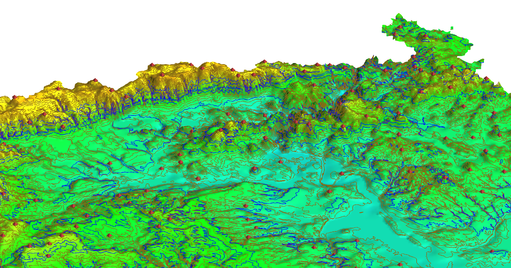

****************
Reprezentace dat
****************

Jak již bylo uvedeno v :doc:`úvodní kapitole <../uvod>` GIS programy
modelují fenomény reálného světa pomocí dvou základních reprezentací
dat **rastrovou** a **vektorovou**.

   Ukázka vizualizace rastrových (digitální model terénu) a
   vektorových dat (vrstevnice a výškové kóty)

Data lze mezi těmito reprezentacemi, za přijmutí určité ztráty
informace, volně převádět.

.. toctree::
   :maxdepth: 2

   uvod
   rastr
   vektor
   prevody
