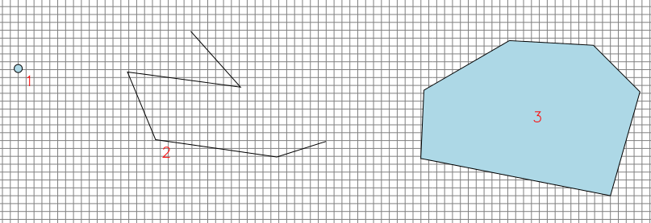
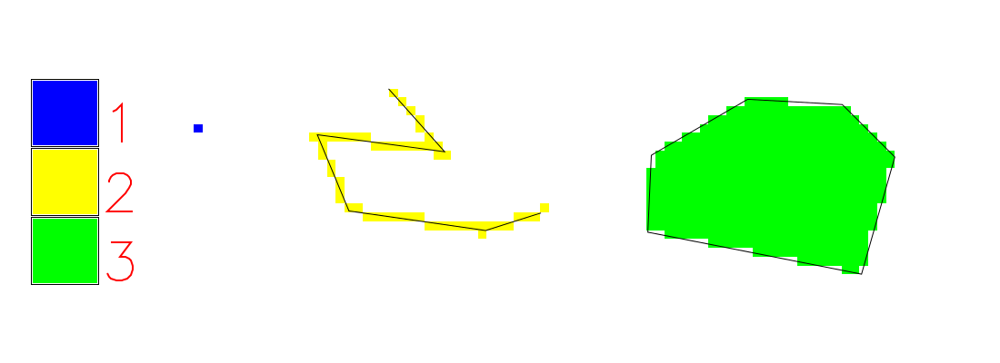
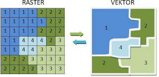

Převod dat
==========

.. _rasterizace:

.. index:: Rasterizace
           
Rasterizace
-----------

Jak bylo napsáno výše, rastrovým pixelům můžeme přiřadit vždy pouze
jeden atribut. Tímto atributem může být buď některý z číselných
atributů nebo číselná reprezentace textového atributu vektorových
objektů či nějaká geometrická veličina (plocha, délka, ...).  V
závislosti na prostorovém rozlišení se ztrácí přesnost vektorových dat
a je nahrazena rozlišením rastrových dat. Data od určitého zvětšení
vypadají "rozkostičkovaně".

   Příklad rasterizace (příprava).

   Příklad rasterizace (výsledek).

.. index:: Vektorizace
              
Vektorizace
-----------

Protože buňky rastrové mapy obsahují pouze jednu číselnou hodnotu, případně
je tato hodnota asociována s textovou informací, obsahuje u vektorových prvků 
výsledná tabulka atributů pouze jeden sloupeček.
V závislosti na zvoleném výstupním formátu dat, zda se jedná o data
bodová, liniová nebo polygonová, se softwary pokouší ideální
aproximovat a vyhlazovat kostrbatý tvar prvků, který by nutně vzniknul
při převodu rastrových buněk na liniové objekty.

   Příklad vektorizace (zdroj: `Open Source GIS in Windows
   <http://o-gis.blogspot.sk/2008/09/rasterization-and-vectorization.html>`_).

.. task:: Rasterizace

    Rasterizujte zobrazený soubor velkoplošných chráněných krajinných oblastí
    (`shp/aopk/velkoplosna_chranena_uzemi.shp`) pomocí nástroje
    :menuselection:`Rastr --> Převod --> Rasterizovat`

    Zvolte pole `Kod` pro hodnoty pixelů, zvolte rozlišení 1000m, zvolte
    hraniční souřadnice rastru podle vstupního vektorového souboru.

    .. figure:: images/chko-rasterize.png
