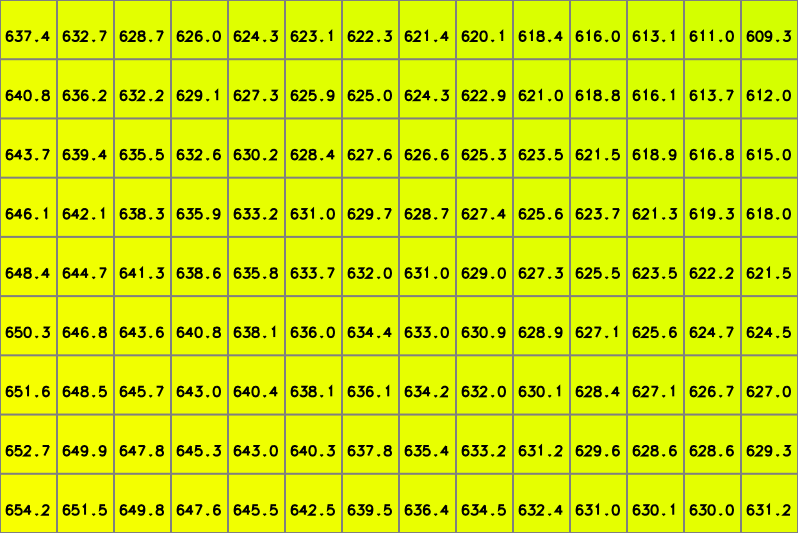

.. index:: Rastrová data
           
Rastrová data
=============

**Rastrová data** (:wikipedia-en:`Raster data`) jsou strukturována
nejčastěji do matice uspořádaných hodnot. Struktura matice je většinou
pravidelná mrížka, teoreticky lze použít i hexagonální
tvar. Jednotlivé buňky rastrové mapy se nazývají *pixely*.

.. figure:: images/The_use_of_a_raster_data_structure_to_summarize_a_point_pattern.png

    Reprezentace frekvence výskytu fenoménu reálného světa jako
    rastrová data (zdroj: :wikipedia-en:`wikipedia <Raster data>`).

Hodnoty jednotlivých rastrových buněk jsou většinou číselné - ať už
celočíselné hodnoty (*integer*) nebo hodnoty s plovoucí desetinnou
čárkou (*float*).

.. figure:: images/rast-num.png

   Příklad rastrové mřížky s celočíselnými hodnotami.

               
   Příklad rastrové mřížky s hodnotami s plovoucí desetinnou čárkou.

Rastrová data jsou vhodná zejména pro reprezentaci *spojitých
fenoménů*, jako je například:

* teplota vzduchu a vody,
* výška nad mořem,
* geologická data,
* mapa srážek,
* hustota povrchového odtoku,
* letecké a družicové snímkování,
* ...

.. figure:: images/slope.png

    Mapa sklonu svahu v České republice jako příklad rastrové reprezentace.

Velikost hrany rastrové buňky určuje tzv. *prostorové rozlišení*
rastrové mapy. Tím je dána polohová přesnost. Rastrová buňka
reprezentuje hodnotu, která se nachází v jejím ideálním středu a je
platná v celé ploše buňky.

.. figure:: images/raster-res.png
   :width: 175px

   Prostorové rozlišení rastrových dat.

.. index:: Atributy rastrových dat
              
Atributy rastrových dat
-----------------------

Hodnota rastrové buňky může nést informaci sama o sobě (teplota,
výška, ...) nebo může sloužit jako celočíselný klíč k přidružené
informační tabulce, například:

.. table::
   :class: border
           
   +----------------+---------------------+
   | Hodnota pixelu | Význam              |
   +================+=====================+
   | 1              | lehké půdy          |
   +----------------+---------------------+
   | 2              | středně zrnité půdy |
   +----------------+---------------------+
   | 3              | těžké půdy          |
   +----------------+---------------------+

Více atributů většinou nelze rastrovým datům přiřazovat.

.. index:: Rastrové formáty
           
Rastrové formáty
----------------

Mezi nejčastěji používané rastrové formáty v GIS patří
:wikipedia-en:`GeoTIFF` a :wikipedia-en:`JPEG`.  Zejména v prostředí
webových prohlížečů se pak ještě setkáváme s formáty
:wikipedia-en:`PNG <Portable Network Graphics>` a
:wikipedia-en:`GIF`. Ty však nejsou pro geografická data příliš
vhodná.  Programátorská knihovna pro práci s rastrovými daty `GDAL
<http://gdal.org>`_ obsahuje v tuto chvíli podporu pro `140 rastrových
formátů <http://gdal.org/formats_list.html>`_.

.. tip:: Více informací o knihovně GDAL na školení :skoleni:`GeoPython
         pro pokročilé <geopython-pokrocily>`.

.. index:: GeoTIFF, TIFF
                    
Formát GeoTIFF
^^^^^^^^^^^^^^

:wikipedia-en:`GeoTIFF` je tvořen v základu standardním formátem
:wikipedia-en:`TIFF`, ke kterému jsou přidána metadata určující jeho
prostorové umístění a souřadnicový systém.

.. note:: Alternativou k formátu GeoTIFF je použití standardního
    formátu TIFF a tzv. :wikipedia-en:`World file` - externího
    souboru, obsahujícím 6 řádků textu:

    * velikost pixelu ve směru osy X
    * rotace okolo osy Y
    * rotace okolo osy X
    * velikost pixelu ve směru osy Y
    * souřadnice X středu levého-horního pixelu
    * souřadnice Y středu levého-horního pixelu

    Pokud se soubor *worldfile* jmenuje stejně jako soubor TIFF a má koncovku
    `tfw`, tak jej většina GIS automaticky použijí. Příklad: `dmt.tif, dmt.tfw`.

    Obdobně můžeme *worldfile* použít pro formáty JPG (`.jgw`) a někdy PNG.

**Některé speciality formátu GeoTIFF**

*Číselné formáty*

    Formát GeoTIFF umožňuje uložit data v celočíselné podobě nebo jako čísla s
    plovoucí desetinnou čárkou.

*Interní maska a hodnota NODATA*
    
    Do souboru GeoTIFF lze uložit interní masku hodnot, označující místa, která
    "nemají být vidět".
    
    GeoTIFF umožňuje nastavit zapsat hodnotu "žádná data" - buňka s
    touto hodnotou se jeví jako prázdná.

*Přehledové mapy*

    GeoTIFF umožňuje vytvářet vnitřní přehledové mapky.

*Barvy a kanály*
    
    Většina prohlížečů se snaží interpretovat data v GeoTIFF jako tři
    barevné kanály :wikipedia:`RGB`. GeoTIFF umožňuje zapsat více
    kanálová data (ne pouze 3), s čímž se prohlížečky obrázků smiřují
    jen těžko. Obsahuje-li soubor GeoTIFF 3 pásma s hodnotami 0-255
    (tj. 8bitová data), je výsledek většinou očekávatelný.

*Vnitřní komprese*
    
    Data ve formátu GeoTIFF mohou být vnitřně komprimována některou z
    metod či knihoven. Kromě běžného ZIP lze použít např. i kompresi
    JPEG. Výsledný rastrový soubor je pak fyzicky menší, než když
    bysme se pokoušeli soubor bez vnitřní komprese zkomprimovat
    externím algoritmem. Více na toto téma píše např.  `Paul Ramsey ve
    svém blogu
    <http://blog.cleverelephant.ca/2015/02/geotiff-compression-for-dummies.html>`_.
