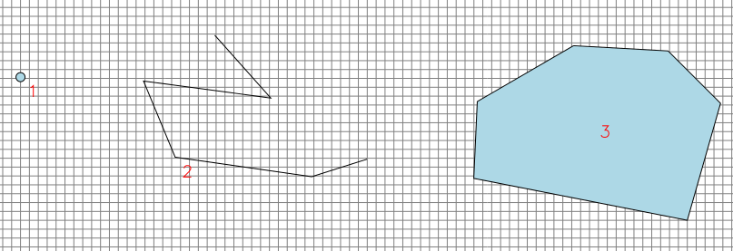
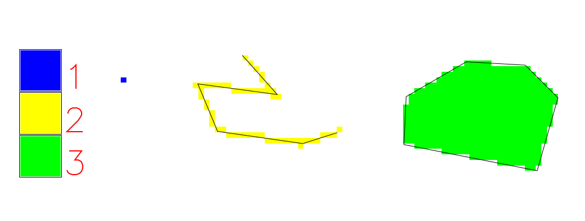

.. _rastrova-data:

Rastrová data
=============

**Rastrová data** (:wikipedia-en:`Raster data`) jsou strukturována nejčastěji do
matice uspořádaných hodnot. Struktura matice je většinou pravidelná
mrížka, teoreticky lze použít i hexagonální tvar. Jednotlivé buňky rastrové mapy
se nazývají *pixely*.

.. figure:: images/The_use_of_a_raster_data_structure_to_summarize_a_point_pattern.png

    Reprezentace frekvence výskytu fenoménu reálného světa jako
    rastrová data (zdroj: :wikipedia-en:`wikipedia <Raster data>`)

Hodnoty jednotlivých rastrových buněk jsou většinou číselné - ať už
celočíselné hodnoty (*integer*) nebo hodnoty s plovoucí desetinnou
čárkou (*float*).

   Příklad rastrové mřížky s celočíselnými hodnotami

.. figure:: images/rast-num-float.png
               
   Příklad rastrové mřížky s hodnotami s plovoucí desetinnou čárkou

Rastrová data jsou vhodná zejména pro reprezentaci *spojitých fenoménů*, jako je
například:

* teplota vzduchu a vody,
* výška nad mořem,
* geologická data,
* mapa srážek,
* hustota povrchového odtoku,
* letecké a družicové snímkování,
* ...

    Mapa sklonu svahu v České republice jako příklad rastrové reprezentace.

Velikost hrany rastrové buňky určuje tzv. *prostorové rozlišení*
rastrové mapy. Tím je dána polohová přesnost. Celá rastrová buňka
reprezentuje hodnotu, která se nachází v jejím ideálním středu.

.. figure:: images/raster-res.png
   :width: 175px

   Prostorové rozlišení rastrových dat

Atributy rastrových dat
-----------------------

Hodnota rastrové buňky může nést informaci sama o sobě (teplota,
výška, ...) nebo může sloužit jako celočíselný klíč k přidružené
informační tabulce, například:

.. table::
   :class: border
           
   +----------------+---------------------+
   | Hodnota pixelu | Význam              |
   +================+=====================+
   | 1              | lehké půdy          |
   +----------------+---------------------+
   | 2              | středně zrnité půdy |
   +----------------+---------------------+
   | 3              | těžké půdy          |
   +----------------+---------------------+

Další atributy nelze rastrovým datům přiřazovat.

.. _vektorova-data:

Vektorová data
==============

**Vektorová data** (:wikipedia-en:`Vector graphics`) jsou souborem
geometrických elementů, reprezentující fenomény reálného světa jako
diskrétní prvky. Prvky jsou podle svého charakteru reprezentovány jako
*bod*, *linie* nebo *polygon*.

.. figure:: images/vektor.png
   :class: middle
        
   Vektorové prvky - bod, linie a polygon

.. note:: V anglické literatuře je *vektorový prvek* označován jako *feature*.
    Slovo *feature* je pak tradičně do češtiny překládáno jako *charakteristický
    rys*, resp. *vlastnost objektu*.
    Aby zmatení bylo dokonalé, v českých normách je anglické *feature* ve
    významu vektorového objektu v GIS překládáno jako *vzhled jevu*.
    Závěr**: narazíte-li v anglické literatuře na slovo *feature* nebo v čekých
    normách na *vzhled jevu*, vždy se jedná o **vektorový objekt** v GIS s
    geometrií a atributy.

Vektorová data jsou vhodná všude tam, kde se jedná o *diskrétní*
objekty, jako ideální reprezentace nějakého fenoménu:

* výskyt jedince sledovaného druhu (bod),
* významný orientační prvek (bod),
* středová linie silnice, silniční síť (linie),
* průběh elektrického vedení (linie),
* říční síť, dráhy povrchového odtoku (linie),
* hranice parcel katastru nemovitostí (polygon),
* hranice vodních ploch (polygon),
* hranice půdního krytu (polygon),
* ...

.. figure:: images/vector-model-sfa.png
   :width: 350px
        
   Ukázka vektorových dat *bod*, *linie* a *polygony*.

Vektorová data jsou většinou uložena ve formě uspořádaných dvojic souřadnic 
:math:`x, y`.
Linie a plocha je zapsána pomocí množiny těchto uspořádaných dvojic definující 
jejich lomové body. Přesnost
takto zadaných souřadnic tak může být teoreticky nekonečná (co umožní počítačové
systémy).

Zvláštním případem jsou tzv. *multiprvky* (angl. *multipoints, multilinies,
multipolygons*). Jde o vektorové objekty skládající se z více vzájemně
nepropojených geometrických objektů. Například dálnice D8 je v úseku přes
České středohoří přerušena - lze ji tak reprezentovat jako objekt
*multiline* sestávající se ze dvou liniových geometrických elementů.

Atributy vektorových dat
------------------------

Kromě informace o *geometrických vlastnostech* prvků nesou vektorová data
také popisnou informaci uloženou v *atributech*. Atributy
jsou většinou zaznamenány do formy databázové tabulky. V závislosti na
použitém software se jedná buď o souborý formát (například ``DBF`` u formátu 
``Esri Shapefile``) nebo plnohodnotný databázový server (například ``PostgreSQL``).

.. figure:: images/vector-attributes.png
    :class: middle

    Mapa velkoplošných chráněných území spolu s atributy uloženými v
    databázi (zdroj: `AOPK OGC WFS Server
    <https://gis.nature.cz/arcgis/services/UzemniOchrana/ChranUzemi/MapServer/WFSServer>`_)

Geometrická a atributová složka bývají obvykle uloženy zvlášť a navzájem
propojeny pomocí jednoznačného interního identifikátoru (tzv. *feature id*).

Počet atributů vektorových prvků je teoreticky nekonečný. Pokud použijeme pro
uložení atributů databázový systém, je možné s daty dále pracovat jako

.. todo:: jako co?

.. note:: Některé softwary, například databázový systém PostGIS nebo souborová 
    databáze SpatialLite, ukládají geometrickou složku dat jako *jeden z atributů*
    vektorového prvku. Data jsou uspořádána do klasické databázové tabulky,
    geometrie je pouze další atribut - geometrie tak není od atributů nijak
    oddělena. Příklad: výpis parcel s jejich identifikátorem, parcelním číslem 
    a geometrií z databáze PostGIS:
    
    ::
          
          +------------+------------------------------------------------------+--------+
          |    fid     |                       geometry                       |  cislo |
          +============+======================================================+========+
          |45496175010 | POLYGON((-728524.789710812 -1066515.49883718,-728... | 515    |
          +------------+------------------------------------------------------+--------+
          |2982799209  | POLYGON((-723694.909701298 -1063302.12883134,-723... | 1331/10|
          +------------+------------------------------------------------------+--------+
          |2969999209  | POLYGON((-718640.439694238 -1037240.20878015,-718... | 1276   |
          +------------+------------------------------------------------------+--------+
          |17076174010 | POLYGON((-722180.859702737 -1027388.94876021,-722... | 260    |
          +------------+------------------------------------------------------+--------+
          |3825204209  | POLYGON((-715023.709686742 -1038171.52878245,-715... | 483    |
          +------------+------------------------------------------------------+--------+
          |3010454209  | POLYGON((-718516.42969393 -1037654.72878097,-7185... | 4169   |
          +------------+------------------------------------------------------+--------+
          |3756714209  | POLYGON((-716647.359686897 -1063110.74883183,-716... | 353/11 |
          +------------+------------------------------------------------------+--------+
          |3789127209  | POLYGON((-728971.089716029 -1031879.47876821,-729... | 496/124|
          +------------+------------------------------------------------------+--------+
          |3060136209  | POLYGON((-733967.459726413 -1030652.32876515,-733... | 322/2  |
          +------------+------------------------------------------------------+--------+
          |3142451209  | POLYGON((-735750.959725715 -1066084.18883546,-735... | 205    |
          +------------+------------------------------------------------------+--------+

Vektorová topologie
===================

:wikipedia:`Topologie` je vlastnost geometrií vektorových dat, pomocí které lze
určit vztahy mezi jednotlivými prvky. Pomocí topologie lze popsat charakteristiky dvou vektorových prvků jako:

* prvek *leží v* jiném prvku,
* prvek *se kříží s* jiným prvku,
* prvek *je nalevo/napravo od* prvku,
* prvek *je shodný s* prvkem.

Různé softwary a jejich formáty přistupují k topologii různě, dnes ale
převládá takový přístup, že data jsou uložena v *netopologickém*
formátu jako tzv. *jednoduché prvky*, resp. *simple features* a topologické
charakteristiky jsou počítány na vyžádání.

.. note:: `GRASS GIS <http://grass.osgeo.org>`_ naopak data vždy ukládá 
	  v topologickém formátu.

          

   Ukázka topologického datové modelu
   
Nejsou-li data tzv. *topologicky čistá*, obsahují různě závažné *chyby
topologie*. Například společná hranice dvou parcel není stejná, ale každá 
parcela má lehce posunuté hraniční lomové body a tudíž dochází v některých 
místech k nedotažení společné hranice, na jiných místech zase obě parcely 
do sebe zasahují. Dalšími chybami mohou být nedotažení lomových bodů nebo 
naopak jejich přetažení. Většina pokročilích GIS obsahují nástroje pro 
*čištění topologie*.

      
.. figure:: images/v_clean_rmsa.png
   :class: small

   Zdroje: `Digitalisation de cartes vectorielles <https://grass.osgeo.org/gdp/grass5tutor/HTML_fr/c925.html>`_ a `GRASS GIS Manual <https://grass.osgeo.org/grass64/manuals/v.clean.html>`_

Převod dat
==========

.. _rasterizace:
   
Rasterizace
-----------

Jak bylo napsáno výše, rastrovým pixelům můžeme přiřadit vždy pouze jeden
atribut. Tímto atributem může být buď některý z číselných atributů nebo číselná
reprezentace textového atributu vektorových objektů či nějaká geometrická
veličina (plocha, délka, ...).
V závislosti na prostorovém rozlišení se ztrácí přesnost vektorových dat a je
nahrazena rozlišením rastrových dat. Data od určitého zvětšení vypadají
"rozkostičkovaně".

   Příklad rasterizace (příprava)

   Příklad rasterizace (výsledek)

Vektorizace
-----------

Protože buňky rastrové mapy obsahují pouze jednu číselnou hodnotu, případně
je tato hodnota asociována s textovou informací, obsahuje u vektorových prvků 
výsledná tabulka atributů pouze jeden sloupeček.
V závislosti na zvoleném výstupním formátu dat, zda se jedná o data
bodová, liniová nebo polygonová, se softwary pokouší ideální
aproximovat a vyhlazovat kostrbatý tvar prvků, který by nutně vzniknul
při převodu rastrových buněk na liniové objekty.

.. figure:: images/rast2vect.jpg
   :class: small

   Příklad vektorizace (zdroj: `Open Source GIS in Windows <http://o-gis.blogspot.sk/2008/09/rasterization-and-vectorization.html>`_).
