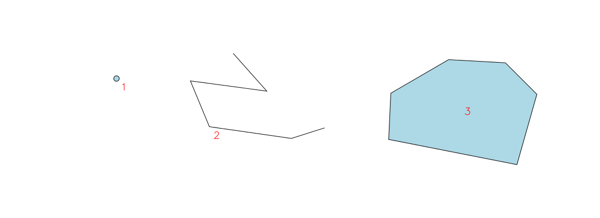
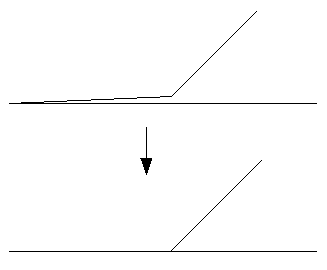

.. index:: Vektorová data
           
Vektorová data
==============

**Vektorová data** (:wikipedia-en:`Vector graphics`) jsou souborem
geometrických elementů, reprezentující fenomény reálného světa jako
diskrétní prvky. Prvky jsou podle svého charakteru reprezentovány jako
*bod*, *linie* nebo *polygon*.

        
   Vektorové prvky - bod, linie a polygon.

.. index::
   pair: feature; vzhled jevu
   pair: feature; prvek

.. note:: V anglické literatuře je *vektorový prvek* označován jako
    *feature*.  Slovo *feature* je pak tradičně do češtiny překládáno
    jako *charakteristický rys*, resp. *vlastnost objektu*.  Aby
    zmatení bylo dokonalé, v českých normách je anglické *feature* ve
    významu vektorového objektu v GIS překládáno jako *vzhled jevu*.
    Závěr: narazíte-li v anglické literatuře na slovo *feature* a
    v českých normách na *vzhled jevu*, vždy se jedná o *vektorový
    prvek* v GIS s geometrií a atributy.

Vektorová data jsou vhodná všude tam, kde se jedná o modelování
*diskrétních* objektů, jako ideální reprezentace fenoménu reálného světa:

* výskyt jedince sledovaného druhu (bod),
* významný orientační prvek (bod),
* středová linie silnice, silniční síť (linie),
* průběh elektrického vedení (linie),
* říční síť, dráhy povrchového odtoku (linie),
* hranice parcel katastru nemovitostí (polygon),
* hranice vodních ploch (polygon),
* hranice půdního krytu (polygon),
* ...

.. figure:: images/vector-model-sfa.png
   :width: 350px
        
   Ukázka vektorové reprezentace jevů realného světa - bod (významný
   orientační prvek), linie (středová linie silnice) a *polygony*
   (hranice půdního krytu).

Vektorová data jsou většinou uložena ve formě uspořádaných dvojic
souřadnic :math:`x, y`.  Linie a plocha je zapsána pomocí množiny
těchto uspořádaných dvojic definující jejich lomové body. Přesnost
takto zadaných souřadnic tak může být teoreticky nekonečná (co umožní
počítačové systémy).

.. index:: Multiprvky
           
Zvláštním případem jsou tzv. *multiprvky* (angl. *multipoints,
multilinestrings, multipolygons*). Jde o vektorové prvky skládající se
z více vzájemně nepropojených geometrických objektů. Například dálnice
D8 je v úseku přes České středohoří přerušena - lze ji tak
reprezentovat jako objekt *multiline* sestávající se ze dvou
nesouvislých liniových geometrických elementů.

.. index:: Atributy vektorových dat
           
Atributy vektorových dat
------------------------

Kromě informace o *geometrických vlastnostech* prvků nesou vektorová
data také popisnou informaci uloženou v *atributech*. Atributy jsou
většinou zaznamenány do formy databázové tabulky. V závislosti na
použitém software se jedná buď o souborý formát (například DBF u
formátu :ref:`Esri Shapefile<shapefile>`) nebo plnohodnotný databázový
server (například PostgreSQL).

.. figure:: images/vector-attributes.png
    :class: middle

    Mapa velkoplošných chráněných území spolu s atributy uloženými v
    atributové tabulce (zdroj: `AOPK OGC WFS Server
    <https://gis.nature.cz/arcgis/services/UzemniOchrana/ChranUzemi/MapServer/WFSServer>`_).

Geometrická a atributová složka bývají obvykle uloženy zvlášť a navzájem
propojeny pomocí jednoznačného interního identifikátoru (tzv. *feature id*).

.. index:: Databáze
           
Počet atributů vektorových prvků je teoreticky nekonečný. Pokud
použijeme pro uložení atributů databázový systém, je možné s daty dále
pracovat pomocí standardních nástrojů databazových systémů jako je
např. SQL (více ve školení :skoleni:`PostGIS pro začátečníky
<postgis-zacatecnik/kapitoly/3_jazyk_sql.html>`).

.. note:: Některé softwary, například databázový systém PostGIS nebo
    souborová databáze SpatialLite, ukládají geometrickou složku dat
    jako *jeden z atributů* vektorového prvku (viz kapitola
    :doc:`../databaze/index`). Data jsou uspořádána do klasické
    databázové tabulky, geometrie je pouze další atribut - geometrie
    tak není od atributů nijak oddělena. Příklad: výpis parcel s
    jejich identifikátorem, parcelním číslem a geometrií ve formě WKT:
    
    ::
          
          +------------+------------------------------------------------------+--------+
          |    fid     |                       geometry                       |  cislo |
          +============+======================================================+========+
          |45496175010 | POLYGON((-728524.789710812 -1066515.49883718,-728... | 515    |
          +------------+------------------------------------------------------+--------+
          |2982799209  | POLYGON((-723694.909701298 -1063302.12883134,-723... | 1331/10|
          +------------+------------------------------------------------------+--------+
          |2969999209  | POLYGON((-718640.439694238 -1037240.20878015,-718... | 1276   |
          +------------+------------------------------------------------------+--------+

.. task:: Vektorová data

    V programu QGIS otevřete vektorovou vrstvu `shp/aopk/velkoplosna_chranena_uzemi.shp`

    Pomocí nástroje lupy přibližujte zvětšení - na rozdíl o rastrové mapy
    nejsou vidět jednotlivé pixely.

    Zobrazte atributovou tabulku vrstvy (po kliknutí pravým tlačítkem myši v
    přepínači vrstev). Zjistěte, jak spolu je spojena geometrie jednotlivých
    prvků a jejich další popisné atributy.

.. index:: Topologie
                     
Vektorová topologie
-------------------

:wikipedia:`Topologie` je vlastnost vektorových prvků, pomocí které
lze určit jejich vzájemné prostorové vztahy. Pomocí topologie lze
popsat charakteristiky dvou vektorových prvků jako:

* prvek *leží v* jiném prvku,
* prvek *se kříží s* jiným prvku,
* prvek *je nalevo/napravo od* prvku,
* prvek *je shodný s* prvkem a tak dále.

Softwary a jejich formáty přistupují k topologii různě, dnes ale
převládá takový přístup, že data jsou uložena v *netopologickém*
formátu jako tzv. *jednoduché prvky*, resp. *simple features* a
topologické charakteristiky jsou počítány na vyžádání.

.. note:: Jiné softwary jako např. `GRASS GIS
   <http://grass.osgeo.org>`_ naopak data vždy ukládá v topologickém
   formátu (více ve :skoleni:`školení pro začátečníky
   <grass-gis-zacatecnik/intro/vektor.html#topologicky-model>`).
          
.. figure:: images/area-1-2.png

   Ukázka topologického datového modelu (uzly, hrany a plochy).

.. index:: Topologické chyby
              
Nejsou-li data tzv. *topologicky čistá*, obsahují různě závažné *chyby
topologie*. Například společná hranice dvou parcel není stejná, ale každá 
parcela má lehce posunuté hraniční lomové body a tudíž dochází v některých 
místech k nedotažení společné hranice, na jiných místech zase obě parcely 
do sebe zasahují. Dalšími chybami mohou být nedotažení lomových bodů nebo 
naopak jejich přetažení. Většina pokročilích GIS obsahují nástroje pro 
*čištění topologie*.

.. figure:: images/overshoot.png
   :width: 400px
      

   Zdroje: Běžné chyby v topologii vektorových dat `Digitalisation de
   cartes vectorielles
   <https://grass.osgeo.org/gdp/grass5tutor/HTML_fr/c925.html>`_ a
   `GRASS GIS Manual
   <https://grass.osgeo.org/grass72/manuals/v.clean.html>`_.

.. index:: Vektorové formáty
      
Vektorové formáty
-----------------

Mezi nejčastěji používané vektorové formáty v GIS patří:

* *OGC GeoPackage*
* *Esri Shapefile*
* *KML*
* *GML*
* *GeoJSON*
* *Esri FileGDB*

Vektorová data se také tradičně ukládají do prostorových databází (popsaných v
:doc:`další části <../databaze/index>`).

.. index:: GeoPackage, GPKG

.. _geopackage:
         
Formát OGC GeoPackage
^^^^^^^^^^^^^^^^^^^^^
             
Formát, který by si zasloužil větší pozornost je standardizovaný
formát :wikipedia-en:`OGC GeoPackage`. GeoPackage je postavený na souborové
databázi `SQLite <http://sqlite.org>`_. Umožňuje ukládat jak vektorová, tak i
rastrová data - dokáže uložit data i v "nadlaždicované" podobě. 

GeoPackage je v současnosti nastupující formát, který adresuje většinu problémů
nejčastěji používaného Shapefile (viz níže).

.. index:: Shapefile, SHP
                
.. _shapefile:
         
Formát Esri Shapefile
^^^^^^^^^^^^^^^^^^^^^

Formát Esri :wikipedia:`Shapefile` je tradičně nejpoužívanějším
formátem pro vektorová data.  Tento datový formát je dnes již
zastaralý, nicméně pro některé jednodušší typy dat stále
dostačující. Je podporován prakticky všemi nástroji GIS a ve své době
se stal prakticky oborovým standardem. Důvodem je, že firma Esri
uvolnila dokumentaci k tomuto formátu a jeho licence nezakazuje jeho
implementaci v software třetích stran.

Vektorové prvky jsou v tomto formátu uloženy v netopologické formě,
tj. například společná hranice dvou polygonů je uložena dvakrát,
jednou jako součást prvního polygonu a podruhé jako součást druhého
polygonu.

Data jsou uložena (minimálně) ve třech souborech, lišících se od sebe
navzájem koncovkou:

* ``*.shp`` - geometrie (shape)
* ``*.dbf`` - atributy (databáze)
* ``*.shx`` - propojení geometrie a atributů (index)

.. note:: Souborů tvořící datovou vrstvu v tomto formátu může být
          potencionálně víc, např. soubor s koncovkou ``*.prj``
          obsahující informace o souřadnicovém systému ve formě Esri
          WKT, ``*.cfg`` s informací o kódování atributových dat a
          další.
          
**Důvody proč dnes již Esri Shapefile nepoužívat**

Z dnešního pohledu obsahuje formát Shapefile několik slabých míst:

* data nejsou uložena v jednom souboru, ale minimálně ve trojici
  (*shp+shx+dbf*) souborů. Různé softwarové produkty si navíc
  přidávají vlastní metadatové soubory, které nejsou součástí
  specifikace tohoto formátu.
* Názvy atributů jsou omezeny pouze na deset znaků.
* Data neobsahují informaci o znakové sadě (některé softwary tuto
  informaci zapisují do souboru s příponou ``*.cfg``, ale je to spíše
  vyjímka), což vede k problémům při automatické konverzi dat a
  používání na různých operačních systémech.
* Velikost souborů je maximálně 2GB.
* Neumožňuje ukládat topologické informace o vzájemných vztazích mezi prvky
  geodat.
* Každý soubor SHP umožňuje ukládat pouze jeden typ geometrie (bod,
  linie, polygon).
* Neumožňuje uložit stromovou strukturu dat.

**Důvody proč se Esri Shapefile stále používá**

* Je podporován prakticky všemy softwary.

.. index:: KML
             
Formát KML
^^^^^^^^^^

OGC :wikipedia:`KML` je určen především pro vizualizaci jednotlivých prvků
geodat. Formát byl původně vyvinut firmou Google a je postavený na jazyce XML.
Data v souborech KML, na rozdíl od GML (viz níže), umožňují použít pouze
souřadnicový systém :doc:`../soursystemy/wgs84`.

KML podporují produkty firmy Google, ale i řada služeb a programů třetích stran.
Bývá často podporován moderními GPS přijímači. V minulosti býval nasazován ve
webových mapových aplikacích, protože je v porovnání s GML menší a obsahuje
zmíněnou informaci o vizualizaci jednotlivých prvků geodat. Ačkoliv byl v době
před cca 3 lety tento formát populární, dnes je často nahrazován formátem
:ref:`GeoJSON <geojson>`.

.. index:: GML
   pair: GML; Geography Markup Language

Formát GML
^^^^^^^^^^

OGC :wikipedia:`GML` (Geography Markup Language) jako otevřený standard je
perspektivním formátem pro přenos vektorových dat. Jedná se o jednosouborový
textový formát založený na značkovacím jazyce XML, je proto interpretovatelný i
bez speciálního software.  Kromě standardizace na úrovni OGC je definován
technickou normou ISO 19136.  Vzhledem k tomu je podporován většinou moderních
GIS nástrojů. GML je také předepsaný technickými dokumenty INSPIRE a výchozím
formátem služby :doc:`WFS <../standardy/ogc/wfs>`.

GML se používá jako univerzální formát pro data, která mohou mít i
komplikovanější stromovou strukturu. Díky tomu, že je postaven na XML, je jeho
strojové zpracování jednoduché i běžnými systémy, například pomocí transformace
XSLT.

.. index:: JSON, GeoJSON, TopoJSON
   
.. _geojson:

Formáty GeoJSON a TopoJSON
^^^^^^^^^^^^^^^^^^^^^^^^^^

Populárními formáty se v poslední době stávají formáty odvozené z formátu JSON,
především GeoJSON a TopoJSON. Formáty JSON mají své uplatnění především mezi
webovými technologiemi. Oproti formátům odvozených z XML (GML, KML) mají kratší
zápis, což je výhodné při přenosech v prostředí Internetu. Stejně jako při
využití formátů odvozených z XML, je i zde je možné zabezpečit správnost
struktury dat to pomocí schémat.

.. _json:

:wikipedia-en:`JSON` je velice přívětivý k netypovým programovacím
jazykům, je srozumitelný prostým lidským okem. Souřadnicový systém
není v těchto formátech jak specifikovat, předpokládá se, že se jedná
o :doc:`../soursystemy/wgs84`. Data lze libovolným způsobem zanořovat a větvit.

`GeoJSON <http://geojson.org>`__ je využíván u webových služeb pro svůj malý
objem a jednoduchost. Je méně náročný na zpracování, což je vhodné zejména u
webových prohlížečů. U uživatelů mimo svět GIS je oblíbený, protože jeho
strukturu je možné rychle pochopit a připravit vlastní parser.

`TopoJSON <https://github.com/mbostock/topojson>`_ je druhým formátem odvozeným
z formátu JSON, který ale zatím nenabyl takové popularity jako GeoJSON. Hlavním
úkolem formátu TopoJSON je minimalizace datového toku mezi webovým serverem a
klientem. Formát je částečně ztrátový, neboť souřadnice bodů a lomových bodů
jsou zapisovány v relativní poloze od daného počátku a v celých číslech (ztrácí
se přesnost). K úspoře datové velikosti vede také fakt, že např. hranice
polygonů jsou uloženy pro dvě sousedící plochy pouze jednou (formát je tedy
topologický).

.. index:: Geodatabáze, GDB
   
.. _gdb:

Formát Esri File GeoDatabase
^^^^^^^^^^^^^^^^^^^^^^^^^^^^

Tzv. (souborová) Geodatabáze, je proprietární formát firmy ESRI a využívá ho
nejčastěji produkty této firmy, jako je ArcGIS.

Pomocí otevřených nástrojů lze tyto soubory do vysoké míry číst a zobrazit a i
ukládat. Pro ukládání je potřeba mít v systémy přítomnout speciální knihovnu od
firmy ESRI.

GeoDatabáze je často používaný výměnný formát dat v (české) veřejné správě.
