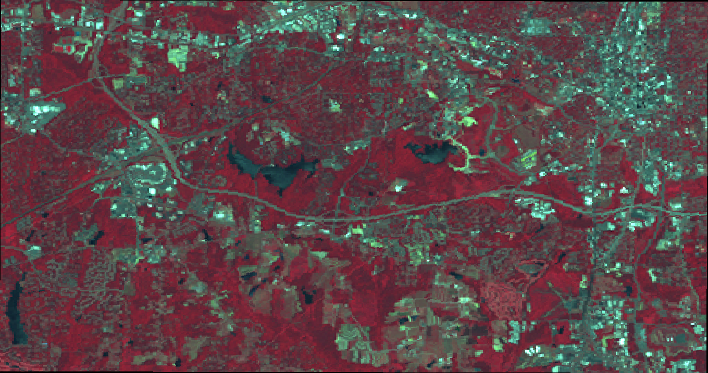
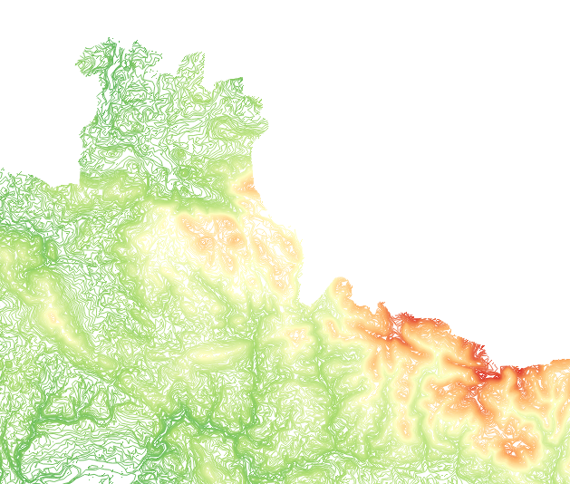

Knihovna GDAL pro převod mezi formáty a souřadnicovými systémy
--------------------------------------------------------------

.. index:: GDAL
   pair: GDAL; OGR

Programátorská knihovna `GDAL <http://gdal.org>`_ (Geospatial Data
Abstraction Library) je určena pro práci s množstvím `rastrových
<http://gdal.org/formats_list.html>`_ i `vektorových
<http://gdal.org/ogr_formats.html>`_ formátů používaných v GIS. GDAL
je využíván celou řadou dalších programů jako základní knihovna
(`GRASS GIS <http://grass.osgeo.org>`_, `QGIS <http://qgis.org>`_,
...), dokonce i v proprietárním produktu `ArcGIS
<http://www.arcgis.com>`_.

.. note:: V dřívějšich verzích byla tato knihovna rozdělena na dvě
    části. GDAL pracující s rastrovými daty a OGR pro vektorová
    data. Ve verzi 2.0 byly tyto dvě větve sloučeny. Stále však můžete
    narazit na označení části pro práci s vektory jako *OGR*.

Knihovna je šířena s několika konzolovými programy, které můžeme
použít na celou řadu operací. Detailnější práci s knihovnou z pohledu
programátora rozebíráme v části věnované programovacímu jazyku
:skoleni:`Python z pohledu GIS <geopython-pokrocily>`.  Knihovna GDAL
kromě toho nabízí mnoho užitečných příkazů pro práci s rastrovými
(:ref:`gdalinfo <gdalinfo>`, :ref:`gdalsrsinfo <gdalsrsinfo>`,
:ref:`gdalwarp <gdalwarp>`, :ref:`gdaltransform <gdaltransform>`,
:ref:`gdal_translate <gdal-translate>`, :ref:`gdaldem <gdaldem>`,
:ref:`gdallocationinfo <gdallocationinfo>`, :ref:`gdalmanage
<gdalmanage>`, :ref:`gdaladdo <gdaladdo>`, :ref:`gdal_contour
<gdal-contour>`, :ref:`gdaltindex <gdaltindex>`) nebo vektorovými
(:ref:`ogrinfo <ogrinfo>`, :ref:`ogrtindex <ogrtindex>`,
:ref:`ogrlineref <ogrlineref>`, :ref:`ogr2ogr <ogr2ogr>`) daty.

Zde si představíme pouze některé příkazy, které jsou distribuovány spolu s
knihovnou GDAL. Úplný seznam naleznete na 
`www.gdal.org/gdal_utilities.html <http://www.gdal.org/gdal_utilities.html>`_ 
a `www.gdal.org/ogr_utilities.html <http://www.gdal.org/ogr_utilities.html>`_.

Příkazy pro práci s rastrovými daty
^^^^^^^^^^^^^^^^^^^^^^^^^^^^^^^^^^^

.. index:: gdalinfo
             
.. _gdalinfo:

**gdalinfo**

Příkaz `gdalinfo <http://www.gdal.org/gdalinfo.html>`__ umožňuje
zobrazit některá metadat rastrových dat.

.. notecmd:: Zobrazení metadat z rastrového souboru

    .. code-block:: bash

       gdalinfo lsat7_2002_nir.tiff

    ::
      
        Driver: GTiff/GeoTIFF
        Files: lsat7_2002_nir.tiff
        Size is 1287, 831
        Coordinate System is:
        PROJCS["Lambert Conformal Conic",
            GEOGCS["NAD83",
                DATUM["North_American_Datum_1983",
                    SPHEROID["GRS 1980",6378137,298.2572221010002,
                        AUTHORITY["EPSG","7019"]],
                    AUTHORITY["EPSG","6269"]],
                PRIMEM["Greenwich",0],
                UNIT["degree",0.0174532925199433],
                AUTHORITY["EPSG","4269"]],
            PROJECTION["Lambert_Conformal_Conic_2SP"],
            PARAMETER["standard_parallel_1",36.16666666666666],
            PARAMETER["standard_parallel_2",34.33333333333334],
            PARAMETER["latitude_of_origin",33.75],
            PARAMETER["central_meridian",-79],
            PARAMETER["false_easting",609601.22],
            PARAMETER["false_northing",0],
            UNIT["metre",1,
                AUTHORITY["EPSG","9001"]]]
        Origin = (630540.000000000000000,226980.000000000000000)
        Pixel Size = (10.000000000000000,-10.000000000000000)
        Metadata:
          AREA_OR_POINT=Area
        Image Structure Metadata:
          INTERLEAVE=PIXEL
        Corner Coordinates:
        Upper Left  (  630540.000,  226980.000) ( 78d46' 6.04"W, 35d47'45.23"N)
        Lower Left  (  630540.000,  218670.000) ( 78d46' 6.81"W, 35d43'15.59"N)
        Upper Right (  643410.000,  226980.000) ( 78d37'33.46"W, 35d47'43.96"N)
        Lower Right (  643410.000,  218670.000) ( 78d37'34.70"W, 35d43'14.31"N)
        Center      (  636975.000,  222825.000) ( 78d41'50.25"W, 35d45'29.85"N)
        Band 1 Block=1287x1 Type=Float32, ColorInterp=Gray
        Band 2 Block=1287x1 Type=Float32, ColorInterp=Undefined
        Band 3 Block=1287x1 Type=Float32, ColorInterp=Undefined

.. index:: gdalsrsinfo
                   
.. _gdalsrsinfo:

**gdalsrsinfo**

Pokud vám stačí pouze informace o použitém souřadnicovém systému, tak
stačí použít příkaz `gdalsrsinfo
<http://www.gdal.org/gdalsrsinfo.html>`__, který vrátí definici
souřadnicového systému rastru ve formátu knihovny :doc:`Proj.4 <proj4>` a v
tzv. Well Known Text (WKT) notaci:

.. notecmd:: Zobrazení informace o souřadnicovém systému

    .. code-block:: bash

       gdalsrsinfo lsat7_2002_nir.tiff

    ::
      
       PROJ.4 : '+proj=lcc +lat_1=36.16666666666666 +lat_2=34.33333333333334 +lat_0=33.75 +lon_0=-79
        +x_0=609601.22 +y_0=0 +datum=NAD83 +units=m +no_defs '

        OGC WKT :
        PROJCS["Lambert Conformal Conic",
            GEOGCS["NAD83",
                DATUM["North_American_Datum_1983",
                    SPHEROID["GRS 1980",6378137,298.2572221010002,
                        AUTHORITY["EPSG","7019"]],
                    AUTHORITY["EPSG","6269"]],
                PRIMEM["Greenwich",0],
                UNIT["degree",0.0174532925199433],
                AUTHORITY["EPSG","4269"]],
            PROJECTION["Lambert_Conformal_Conic_2SP"],
            PARAMETER["standard_parallel_1",36.16666666666666],
            PARAMETER["standard_parallel_2",34.33333333333334],
            PARAMETER["latitude_of_origin",33.75],
            PARAMETER["central_meridian",-79],
            PARAMETER["false_easting",609601.22],
            PARAMETER["false_northing",0],
            UNIT["metre",1,
                AUTHORITY["EPSG","9001"]]]

.. index:: gdalwarp
                           
.. _gdalwarp:
                
**gdalwarp**
 
Asi nejpoužívanější příkaz je `gdalwarp
<http://www.gdal.org/gdalwarp.html>`__.  Tento příkaz má dvě funkce:
práce se souřadnicovými systémy rastrových dat a jejich transformace
mezi jednotlivými formáty.

Podporované formáty zjistíte pomocí parametru `--formats`:

.. notecmd:: Podporované formáty knihovny gdal

    .. code-block:: bash
        
        gdalwarp --formats

    ::
                       
        Supported Formats:
          VRT (rw+v): Virtual Raster
          GTiff (rw+vs): GeoTIFF
          NITF (rw+vs): National Imagery Transmission Format
          RPFTOC (rovs): Raster Product Format TOC format
          ECRGTOC (rovs): ECRG TOC format
          HFA (rw+v): Erdas Imagine Images (.img)
          SAR_CEOS (rov): CEOS SAR Image
          CEOS (rov): CEOS Image
          JAXAPALSAR (rov): JAXA PALSAR Product Reader (Level 1.1/1.5)
          GFF (rov): Ground-based SAR Applications Testbed File Format (.gff)
          ELAS (rw+v): ELAS
          AIG (rov): Arc/Info Binary Grid
          AAIGrid (rwv): Arc/Info ASCII Grid
          GRASSASCIIGrid (rov): GRASS ASCII Grid
          SDTS (rov): SDTS Raster
          ...

Syntaxe programu :ref:`gdalwarp <gdalwarp>` (i u tohoto programu funguje
parametr :option:`--help` a určitě se podívejte na manuálovou stránku
programu ``man gdalarp``) je následující::

    gdalwarp [PŘEPÍNAČE A VOLBY] zdrojový_soubor výstupní_soubor

Transformace rastru ve formátu GeoTIFF do formátu Windows Bitmap při zachování
souřadnicového  systému vypadá následovně:

.. notecmd:: Transformace GDAL z GeoTIFF do BMP

    .. code-block:: bash

        gdalwarp -of BMP lsat7_2002_nir.tiff lsat7_2002_nir.bmp

        Creating output file that is 1287P x 831L.
        ERROR 1: Attempt to create BMP dataset with an illegal
        data type (Float32), only Byte supported by the format.

    Vidíme, že formát BMP nepodporuje zdrojová data - číslo s plovoucí
    desetinnou čárkou. Datový typ nastavíme pomocí parametru
    :option:`-type` (samozřejmě tak přijdeme o hodnoty mimo rozsah
    tohoto datového typu).

    .. code-block:: bash

        gdalwarp -of BMP -ot Byte lsat7_2002_nir.tiff lsat7_2002_nir.bmp

        Creating output file that is 1287P x 831L.
        Processing input file lsat7_2002_nir.tiff.
        0...10...20...30...40...50...60...70...80...90...100 - done.

    Výsledný obrázek převodu rastrové mapy na formát BMP.

.. note:: Vedle souboru `lsat7_2002_nir.bmp` vytvořil GDAL také
   souboru `lsat7_2002_nir.bmp.aux.xml` obsahující metadata, mimo jiné
   i informace o souřadnicovém systému. Pokud tento soubor smažete
   nebo změníte jeho jméno, dostanete následující výstup, tj. bez
   informace o souřadnicovém systému.

   .. notecmd:: Ověření výsledného souboru pomocí gdalinfo

    .. code-block:: bash

        gdalinfo lsat7_2002_nir.bmp

        Driver: BMP/MS Windows Device Independent Bitmap
        Files: lsat7_2002_nir.bmp
        Size is 1287, 831
        Coordinate System is `'
        Corner Coordinates:
        Upper Left  (    0.0,    0.0)
        Lower Left  (    0.0,  831.0)
        Upper Right ( 1287.0,    0.0)
        Lower Right ( 1287.0,  831.0)
        Center      (  643.5,  415.5)
        Band 1 Block=1287x1 Type=Byte, ColorInterp=Red
        Band 2 Block=1287x1 Type=Byte, ColorInterp=Green
        Band 3 Block=1287x1 Type=Byte, ColorInterp=Blue

Dalším obvyklým krokem je transformace při změně souřadnicového
systému (v našem případě zůstane vstupní formát GeoTIFF zachován i na
výstupu). Při transformacích můžeme použít 2 parametry pro popis
souřadnicových systémů ve vztahu ke vstupní resp. výstupní rastrové
mapě:

:option:`-s_srs`
    definice souř. systému vstupní dat (source)
:option:`-t_srs`
    definice souř. systému výstupní dat (target)

Tyto parametry mají větší prioritu při zpracování vstupních dat, než případná
metadata v těchto datech přítomná.

.. notecmd:: Transformace rastrových dat do jiného souřadnicového systému

    Souřadnicový systém vstupních dat je známý, v našem příkladě
    nastavíme pouze souřadnicový systém pro výstupní data.  Zápis
    souřadnicového systému je totožný se zápisem pro knihovnu
    :program:`Proj.4`. My použijeme kód :epsg:`4326`, což je
    souřadnicový systém :doc:`../soursystemy/wgs84`.

    .. code-block:: bash

        gdalwarp -t_srs +init=epsg:4326 lsat7_2002_nir.tiff lsat7_2002_nir-wgs84.bmp

        Creating output file that is 1359P x 717L.
        Processing input file lsat7_2002_nir.tiff.
        0...10...20...30...40...50...60...70...80...90...100 - done.

    Výsledek převodu rastrových dat do souřadnicového systému WGS84.

.. index:: gdaltransform
               
.. _gdaltransform:

**gdaltransform**

Funguje podobně jako program :ref:`cs2cs <cs2cs>` knihovny Proj4,
tj. transformuje souřadnice mezi souřadnicovými systémy.

.. index:: gdal-translate
           
.. _gdal-translate:

**gdal_translate**

Převádí rastrová data mezi různými formáty. Na rozdíl od
:ref:`gdalwarp <gdalwarp>` neumožňuje data transformovat do jiného
souřadnicového systému. Lze ale nastavit souřadnicový systém
výstupních dat pomocí parametru :option:`-a_srs` (kdy nechodází k
transformaci dat, ale pouze nastavení souřadnicového systému do
metadat výstupního souboru).

.. index:: gdaldem
           
.. _gdaldem:

**gdaldem**

Nástroj `gdaldem <http://www.gdal.org/gdaldem.html>`__ vám pomůže zanalyzovat a
vizualizovat digitální modely reliéfu (DMR). Ze vstupního DMR lze vygenerovat

* stínovaný reliéf,
* mapu sklonu svahu,
* mapu expozice,
* barevný reliéf,
* a další ...

.. notecmd:: Vytvoření mapy stínového reliéfu ze vstupního rastrového souboru

    .. code-block:: bash

        gdaldem hillshade dem.tiff hillshade.tiff

.. figure:: images/hillshade.png

    Mapa stínovaného reliéfu vytvořená pomocí utility `gdaldem`.

.. index:: gdallocationinfo
               
.. _gdallocationinfo:

**gdallocationinfo**

Nástroj `gdallocationinfo
<http://www.gdal.org/gdallocationinfo.html>`__ se umožňuje ptát se na
hodnoty rastrových dat o daných rastrových souřadnicích.

.. notecmd:: Dotaz na hodnotu rastru podle souřadnic

    .. code-block:: bash

        gdallocationinfo lsat7_2002_nir-wgs84.tiff 15 50

    ::
      
        Report:
          Location: (15P,50L)
          Band 1:
            Value: 110
          Band 2:
            Value: 221
          Band 3:
            Value: 189

.. index:: gdalmanage
                       
.. _gdalmanage:

**gdalmanage**

Program `gdalmanage <http://www.gdal.org/gdalmanage.html>`__ umožňuje práci s
rastrovými soubory na úrovni operačního systému, jejich identifikaci,
přejmenování, mazání a kopírování.

.. notecmd:: Použití

   Obsah pracovního adresáře může vypadat z pohledu GDAL následovně:

   .. code-block:: bash
        
      gdalmanage identify *

   ::

        dem_srtm.tiff: GTiff
        hillshade.bmp: BMP
        hillshade.png: PNG
        hillshade.tiff: GTiff
        lsat7_2002_nir.bmp: BMP
        lsat7_2002_nir.png: PNG
        lsat7_2002_nir.tiff: GTiff
        lsat7_2002_nir-wgs84.bmp: BMP
        lsat7_2002_nir-wgs84.png: PNG
        lsat7_2002_nir-wgs84.tiff: GTiff

.. note:: :program:`gdalmanage` lze použít pro případné změny a mazání
          více souborových formátů (např. `*.tfw` soubory).

.. index:: gdaladdo
           
.. _gdaladdo:

**gdaladdo**

Nástroj `gdaladdo <http://www.gdal.org/gdaladdo.html>`__ umožňuje
pracovat s tzv. pyramidami - zmenšenými kopiemi rastrových dat
uložených přímo uvnitř anebo externě rastrového souboru. Ve výsledku
bude práce s rastrem u malých měřítek výrazně rychlejší - vznikne v
podstatě prostorový index rastrových dat (používá např.  QGIS pro
zobrazování rastrů).

.. notecmd:: Vytvoření přehledových pyramid rastrového souboru

    .. code-block:: bash

        # ověření velikosti původního souboru
        ls -lh lsat7_2002_nir.tiff

        -rw-rw-r-- 1 user user 13M apr 18 00:00 lsat7_2002_nir.tiff

        # vytvoření pyramid
        gdaladdo lsat7_2002_nir.tiff 2 4 8 16

        # opětovné ověření velikosti změněného souboru
        ls -lh lsat7_2002_nir.tiff

        -rw-rw-r-- 1 user user 19M apr 18 00:00 lsat7_2002_nir.tiff

.. index:: gdal-contour
                   
.. _gdal-contour:

**gdal_contour**

Nástroj `gdal_contour <http://www.gdal.org/gdal_contour.html>`__
vytvoří vektorové vrstevnice ze vstupního digitálního modelu reliéfu.

.. notecmd:: Vytvoření vrstevnic

    .. code-block:: bash

        gdal_contour -a elev dem.tiff vrstevnice.shp -i 10.0

    Získané (a obarvené) vrstevnice z DMT.

.. index:: gdal-rasterize
       
.. _gdal-rasterize:

**gdal_rasterize**

Nástroj `gdal_rasterize <http://www.gdal.org/gdal_rasterize.html>`__
provede :ref:`rasterizaci <rasterizace>` vektorových dat (tj. převede
data z vektorové reprezentace do rastru).

.. notecmd:: Převod vektorových vrstevnic na rastrová data

    Výstupní formát BMP, prostorové rozlišení 10m

    .. code-block:: bash

        gdal_rasterize -a elev -of GeoTIFF -ot Byte -tr 10 10 -l vrstevnice vrstevnice.shp vrstevnice.tiff

.. index:: gdaltindex
                   
.. _gdaltindex:

**gdaltindex**

Vytvoří tzv. tile-index vektorový soubor obsahující obalový polygon
(obdélník) okolo každého rastrového souboru. Tento prostorový index
lze pak použít do dalších operací v prostředí GDAL, stejně tak jako
vrstvu v programu :ref:`mapserver`.

Příkazy pro práci s vektorovými daty
^^^^^^^^^^^^^^^^^^^^^^^^^^^^^^^^^^^^

.. index:: ogrinfo
             
.. _ogrinfo:

**ogrinfo**

Sesterským programem ke :program:`gdalinfo` je :program:`ogrinfo` -
vypíše dostupné informace o vektorových datech.

.. note:: OGR pracuje na abstraktním datovém modelu

    * *Zdroj* (data source)
        * *Vrstva* (layer)
            * *Vektorový objekt* (feature)

    kde

    * Zdrojem může být soubor, adresář nebo prostorová databáze
    * Vrstvou může být tabulka v databázi nebo vlastní data v souboru

    Jsou-li data uložena v souboru, bývá název souboru a název vrstvy totožný.

    Toto na první pohled možná lehce matoucí uspořádání je způsobeno tím, že
    GDAL (resp. vektorová část OGR) se snaží přistupovat ke všem možným datovým
    zdrojům, z nichž některé umožňují do zdroje (souboru, databáze, ...) uložit
    více dat (vrstev, tabulek) a jiné ne.

    Podrobnější informace o datovém modulu knihovny GDAL najdete ve
    školení :skoleni:`GeoPython pro pokročilé <geopython-pokrocily>`.

.. notecmd:: Dotaz na metadata vektorového souboru

    Necháme si vypsat informace o souboru `vrstevnice.shp` (pokud
    vynecháme parametr `-so` (summary only), vypíší se informace o
    každém vektorovém prvku):

    .. code-block:: bash

        ogrinfo vrstevnice.shp vrstevnice -so

        INFO: Open of `vrstevnice.shp'
              using driver `ESRI Shapefile' successful.

        Layer name: vrstevnice
        Geometry: Line String
        Feature Count: 175150
        Extent: (-904049.056059, -1227170.827189) - (-431499.549460, -935327.979496)
        Layer SRS WKT:
        PROJCS["Krovak",
            GEOGCS["GCS_bessel",
                DATUM["Militar_Geographische_Institut",
                    SPHEROID["Bessel_1841",6377397.155,299.1528128]],
                PRIMEM["Greenwich",0],
                UNIT["Degree",0.017453292519943295]],
            PROJECTION["Krovak"],
            PARAMETER["latitude_of_center",49.5],
            PARAMETER["longitude_of_center",24.8],
            PARAMETER["azimuth",0],
            PARAMETER["pseudo_standard_parallel_1",0],
            PARAMETER["scale_factor",0.9999],
            PARAMETER["false_easting",0],
            PARAMETER["false_northing",0],
            UNIT["Meter",1]]
        ID: Integer (8.0)
        elev: Real (12.3)

    Vidíme, že vektorová data jsou v souřadnicovém systému S-JTSK,
    hraniční souřadnice jsou (-904049.056059, -1227170.827189) -
    (-431499.549460, -935327.979496) a atributová tabulka má 2
    atributy: `ID` a `elev` (obsahující výšku nad mořem každé vrstevnice).
    Jedná se o soubor s liniovou geometrií.

.. index:: ogrtindex
               
.. _ogrtindex:

**ogrtindex**

`ogrtindex <http://www.gdal.org/ogrtindex.html>`__ je sesterským programem k
programu `gdaltindex`. Máte-li adresář plný vektorových dlaždic a chcete-li s
nimy rychle pracovat, vytvoříte vektrový soubor s hranicemi těchto souborů a
odkazem do adresářové struktury.

.. index:: ogrlineref
           
.. _ogrlineref:

**ogrlineref**

`ogrlineref <http://www.gdal.org/ogrlineref.html>`__ slouží k tvorbě
souboru obsahujícím segmenty o daných délek. Umožňuje získávat jejich
souřadnice, vzdálenosti, staničení atd., to vše v lineární referenční síti.

.. index:: ogr2ogr
           
.. _ogr2ogr:

**ogr2ogr**

Nástroj `ogr2ogr <http://www.gdal.org/ogr2ogr.html>`__ je obdobou
rastrového :ref:`gdalwarp <gdalwarp>`, který umožňuje transformaci
vektorových dat.

Obecná syntaxe je:

::
   
    ogr2ogr [VOLBY] výstupní_soubor vstupní_soubor

Stejně jako u :ref:`gdalwarp <gdalwarp>`, můžete podporované formáty vypsat 
pomocí parametru `--formats`:

.. code-block:: bash
    
    ogr2ogr --formats

    Supported Formats:
      -> "ESRI Shapefile" (read/write)
      -> "MapInfo File" (read/write)
      -> "UK .NTF" (readonly)
      -> "SDTS" (readonly)
      -> "TIGER" (read/write)
      -> "S57" (read/write)
      -> "DGN" (read/write)
      ...

Pro práci se souřadnicovými systémy opět můžeme použít některý z
následujících parametrů:

* :option:`-a_srs` - přiřadí informaci o souřadnicovém systému do
  metadat výstupnímu souboru
* :option:`-t_srs` - provode transformaci dat do souřadnicového
  systému výstupních dat
* :option:`-s_srs` - nastaví souřadnicový systém vstupních dat

Tyto parametry jsou kompatibilní se zápisem pro knihovnu :doc:`Proj4 <proj4>`.

.. notecmd:: Převod souboru vrstevnic ve formátu Esri Shapefile na formát KML

    .. code-block:: bash

        ogr2ogr -f KML -t_srs epsg:4326 vrstevnice.kml vrstevnice.shp

    Výsledný soubor můžeme zkontrolovat pomocí :program:`ogrinfo`:

    .. code-block:: bash
        
        ogrinfo vrstevnice.kml vrstevnice -so

    ::
      
        INFO: Open of `vrstevnice.kml'
              using driver `LIBKML' successful.

        Layer name: vrstevnice
        Geometry: Unknown (any)
        Feature Count: 175150
        Extent: (12.060792, 48.554130) - (18.825375, 51.055295)
        Layer SRS WKT:
        GEOGCS["WGS 84",
            DATUM["WGS_1984",
                SPHEROID["WGS 84",6378137,298.257223563,
                    AUTHORITY["EPSG","7030"]],
                TOWGS84[0,0,0,0,0,0,0],
                AUTHORITY["EPSG","6326"]],
            PRIMEM["Greenwich",0,
                AUTHORITY["EPSG","8901"]],
            UNIT["degree",0.0174532925199433,
                AUTHORITY["EPSG","9108"]],
            AUTHORITY["EPSG","4326"]]
         ...
