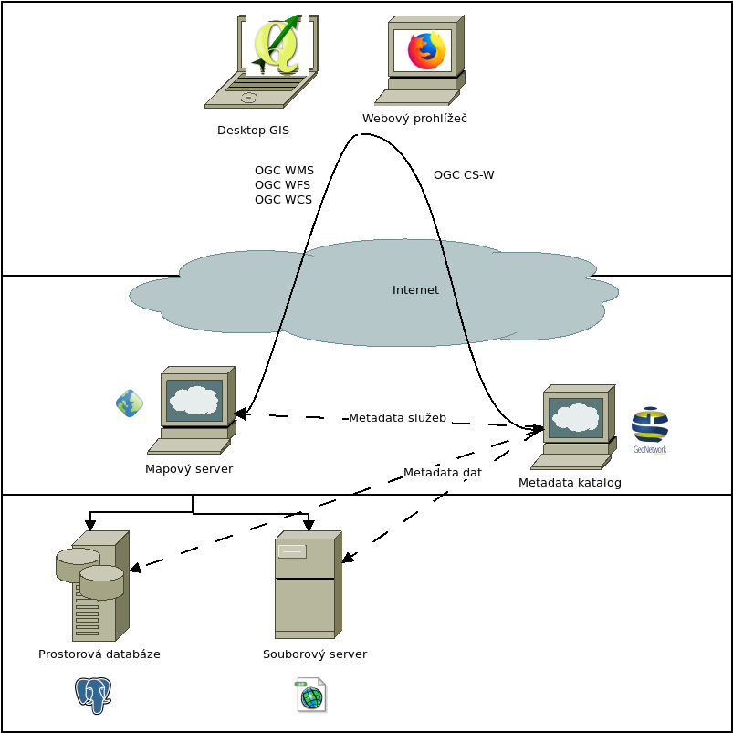

.. index:: SDI, INSPIRE

*********************************
Spatial data infrastructure - SDI
*********************************

`SDI`_ je datová infrastruktura a rámce pro geografická data, metadata, uživatele
a nástroje, které je navzájem propojují tak, aby se prostorová data mohla
používat efektivním způsobem. 

Data a metadata by neměla být uchovávána centrálně, ale tam, kde vznikají a
systémy by měly být navzájem propojené.

Každý takový uzel v rámci SDI je většinou tvořen systémem GIS.

======================
Softwareové komponenty
======================

SDI musí uživateli umožnit nelézt, stáhnout prostorová data z repozitáře prostřednictvím
poskytovatele služby.

* Softwarový klient pro zobrazení a dotazování prostorových dat
* Katalogový server (služba) pro nalézání metadat služeb a datových sad
* Mapový server pro sdílení dat přes Internet
* Processing server - projekce, transformace
* Datový repozitář kde budou data uložena, např. prostorová databáze
* GIS desktopový klient pro tvorbu a aktualizaci dat.
* Jednotlivé komponenty jsou spolu propojeny prostřednictvím API

Naší snahou je budovat také SDI, ve kterém budou jednotlivé komponenty
vyměnitelné. Toho lze dosáhnout zejména stabilním aplikačním rozhraním (API). 

SDI principy
------------

* Systém pro nalézání datových sad a služeb
* Distribuce mapových náhledů a datových sad
* Možnost vyvolat výpočetní operaci na serveru
* Harmonizované datasety

Nástroje SDI
------------

* Metadatový katalog prostorových dat
* Prohlížecí služby (OGC WMS, WMTS)
* Stahovací služby (OGC WFS, WCS, Atom, S3, ...)
* Processingové služby (OGC WPS, ...)

.. toctree::
   :maxdepth: 2

   inspire

.. _SDI: https://en.wikipedia.org/wiki/Spatial_data_infrastructure
