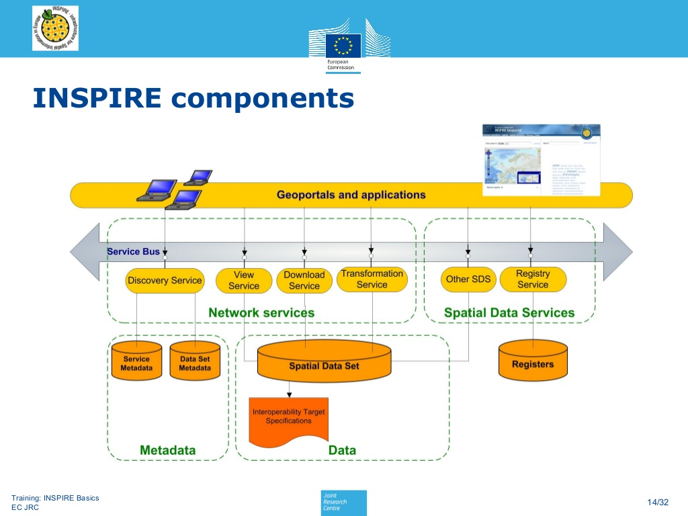

.. index:: INSPIRE

=======
INSPIRE
=======

INSPIRE (INfrastructure for SPatial InfoRmation in Europe) je iniciativou
Evropské komise, která si klade za cíl vytvořit evropský legislativní rámec
potřebný k vybudování evropské infrastruktury prostorových informací.

Východiska INSPIRE
------------------

Zpráva_Komise_ zmiňuje nedostatky prostorových dat a jejich databáze na všech
úrovních veřejné správy:

* Prostorová data jsou buď nekompletní nebo zcela chybí
* Popis (dokumentace) prostorových dat, pokud je vůbec dostupná, je často neúplná.
* Prostorové datasety nemohou být jednoduše kombinovány s dalšími prostorovými
  datasety.
* Systémy pro vyhledávání a zpřístupňování prostorových dat fungují pouze
  izolovaně a nejsou spolu navzájem kopatibilní.
* Existují kulturní, organizační, finanční a legální bariéry, které znemožňují
  nebo značně komplikují znovu použití existujících prostorových dat.

    
    Architektura INSPIRE (Vlado Cetl,
    https://www.slideshare.net/inspireeu/inspire-principles-components-and-implementation)

Principy INSPIRE
----------------

Mezi principy_, nakterých staví INSPIRE patří:

* Data musí být sbírána jednou a uchovávána tam, kde je jejich správa
  nejefektivnější
* Musí být možné bezešvě kombinovat prostorové informace z různých datových
  zdrojů  v Evropě a sdílet je mezi mnoha uživateli a aplikacemi
* Geoprostorová informace potřebná na všech úrovních správy by měla být okamžitě
  dostupná
* Musí být jednoduché nalézt, jaké geoprostorové informace jsou dostupné, jak se
  mohou používat pro patřičnou potřebu, a za jakých podmínek smějí být
  používány. 

Legislativa
-----------

Direktiva_INSPIRE_ vstoupila v platnost v roce 2007, jednotlivé státy ji museli
implementovat do národních legislativ (ČR 103_2010_, SK 3_2010_). 

Evropská komise ještě předepisuje celou řadu Implementačních pravidel
(Implementacni_pravidla_INSPIRE_) a to pro oblasti:

* Metadata
* Datové specifikace
* Síťové služby
* Data služby sdílecí služby
* Spatial data services
* Monitoring a Reporting

Metadata
^^^^^^^^

Metadata_implementacnin_pravidla_ jsou založeny na normách ISO 19115 (metadata
dat) a ISO 19119 (metadata služeb). Výstupní schema metadat pak je většinou XML soubor
podle ISO 19139, ale existují a používají se i další výstupní schemata:

* Dublin Core
* ISO 19139
* FGDC CSDGM
* NASA DIF
* Atom
* GM03

Datové specifikace
^^^^^^^^^^^^^^^^^^
Datove_specifikace_INSPIRE_ předepisují datové profily pro jednotlivá datová
témata. Jsou rozdělena do více Annexů:

Annex 1:
 * Addresses
 * Administrative units
 * Cadastral parcels
 * Coordinate reference systems
 * Geographical grid systems
 * Geographical names
 * Hydrography
 * Protected sites
 * Transport networks 	

Annex 2:
 * Elevation
 * Geology
 * Land cover
 * Orthoimagery

Annex 3:
 * Agricultural and aquaculture facilities
 * Area management / restriction / regulation zones & reporting units
 * Atmospheric conditions
 * Bio-geographical regions
 * Buildings
 * Energy Resources
 * Environmental monitoring Facilities
 * Habitats and biotopes
 * Human health and safety
 * Land use
 * Meteorological geographical features
 * Mineral Resources
 * Natural risk zones
 * Oceanographic geographical features
 * Population distribution and demography
 * Production and industrial facilities
 * Sea regions
 * Soil
 * Species distribution
 * Statistical units
 * Utility and governmental services

Organizace jsou povinny poskytovat datové sady v soulady s Annexy 1-3 INSPIRE.
Většinou za tímto účelem tvoří automatizované procesy, které z národních
datových sad tvoří datové sady odpovídající profilu INSPIRE. 

INSPIRE nevyžaduje pořizování nových dat, pouze harmonizaci stávajících
datasetů.

Síťové služby
^^^^^^^^^^^^^

Síťové služby INSPIRE (Network_services_) jsou služby sloužící pro 

* vyhledávání (discovery)
* prohlížení (view)
* stahování (download)
* transformace (transformation)

dat. Jsou postaveny na standardech OGC (CSW, WFS/WCS, WMS, WPS).

Monitoring a reporting
^^^^^^^^^^^^^^^^^^^^^^
Národní organizace odpovědné za INSPIRE musí implementovat nástroje pro
reportování stavu implementace INSPIRE ve svých státech a jednotlivé organizace
musí implementovat nástroje pro monitorování služeb.

.. _Zpráva_Komise: https://inspire.ec.europa.eu/reports/analysis_consultation_01092003.pdf

.. _principy: https://inspire.ec.europa.eu/inspire-principles/9

.. _SDI: https://en.wikipedia.org/wiki/Spatial_data_infrastructure

.. _Direktiva_INSPIRE: https://inspire.ec.europa.eu/

.. _103_2010: https://www.zakonyprolidi.cz/cs/2010-103

.. _3_2010: http://www.epi.sk/zz/2010-3

.. _Implementacni_pravidla_INSPIRE: https://inspire.ec.europa.eu/inspire-implementing-rules/51763

.. _Metadata_implementacnin_pravidla: http://inspire.ec.europa.eu/documents/Metadata/MD_IR_and_ISO_20131029.pdf

.. _Datove_specifikace_INSPIRE: https://inspire.ec.europa.eu/data-specifications/2892

.. _Network_services: https://inspire.ec.europa.eu/network-services
