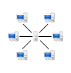
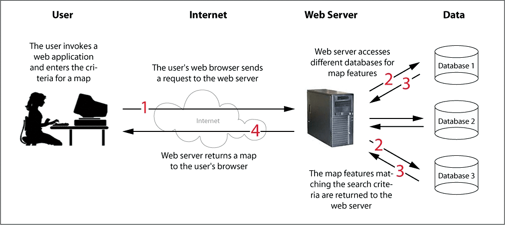
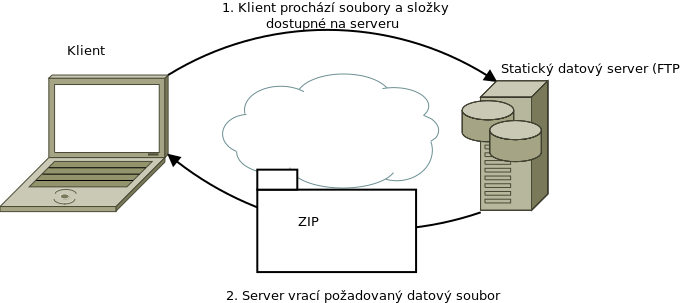
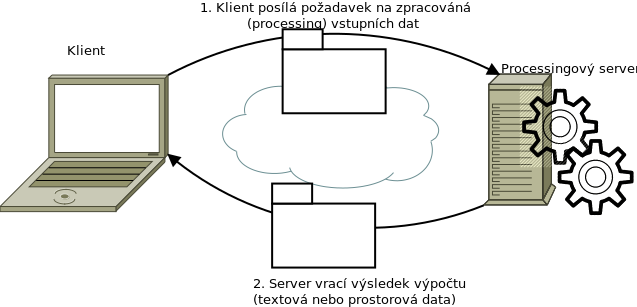
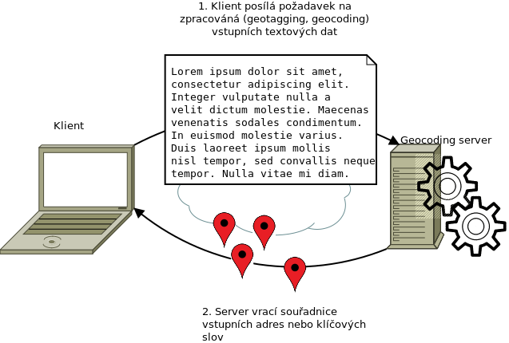

.. _server-gis:

.. index:: standardy, server, klient

**********
Server GIS
**********

.. warning:: :red:`Obsahuje pouze osnovu kapitoly`

V současné době se systémy stavějí na principu *client - server*. Klient je
program, který posílá prostřednictvím definovaného protokolu požadavky (žádá o
službu) na server. Program server požadavky
odbavuje, a posílá klientovi zpět požadovaná data.  Klient-server je síťová
architektura, která odděluje klienta (často aplikaci s grafickým uživatelským
rozhraním) a server, kteří spolu komunikují přes počítačovou síť.

    Autor: User:Mauro Bieg – derived from the Image:Computer n screen.svg which is under the GNU LGPL, LGPL, https://commons.wikimedia.org/w/index.php?curid=2551745

**Výhody**

Rozdělení systémů z jedné velké monolitické aplikace na klienty a více serverů
vede ke

* rozdělení jednotlivých úloh
* možnosti menších, ale specializovaných programů
* větší modularitě systémů - lze aktualizovat či vyměňovat části systému, aniž by
  to mělo fatální dopad na celek, snadnější údržba
* propojovat navzájem nekompatibilní technologie prostřednictvím aplikačních
  rozhraní (API)
* data uložená na serveru jsou relativně bezpečněji uložená, než data uložená na
  klientu
* centrální úložiště vede k větší aktuálnosti dat

**Nevýhody**

* Dochází k velkému přetěžování sítě a k závislosti na síťové infrastruktuře
  vůbec.
* Architektura klient-server není tak robustní ve srovnání s P2P architekturou
  (když každý klient se zároveň stává uzlem sítě).

**Klient je**
* aktivní
* posílá žádosti 
* čeká a dostává odpovědi
* obvykle je připojen k menšímu počtu serverů najednou
* obvykle komunikuje s koncovým uživatelem (má uživatelské rozhraní)

**Server je**
* pasivní
* naslouchá na síti a reaguje na žádosti
* obsluhuje požadavky

.. index:: API, Aplikčaní rozhranní

API
===
Klient se serverem komunikuje vždy prostřednictvím definovaného aplikačního
rozhraní - API (Application Interface). Je v podstatě jedno jak je API
definováno, podstatné je, aby bylo stabilní a v čase neměnné tak, aby se
jednotlivé části systému server-klient daly nahrazovat a měnit. 

Vztah server-klient
===================
Přidělené role **server** a **klient** nemusí mít programy bez výhradně. Jedná
se **způsob, jakým vystupují na venek** a ne o **absolutní roli v rámci
systému**. Serverová aplikace může (a často se tak děje) vystupovat jako klient
vůči jiné serverové aplikaci. 

Například mapový server poskytující obrazové podkladové mapy může vystupovat
jako klient vůči jinému serveru WFS, ze kterého si může stáhnout potřebná
vektorová data.

Úlohy serverů v GIS systémech
=============================

Pro běh geografických informačních systémů jsou potřeba úlohy společné pro
všechny informační systémy, jako je *autorizace* a *autentifikace* uživatelů,
*správa* uživatelů  celkově, *logování* došlých požadavků, *monitoring a
reporting* stavu systémů v reálném čase ale i v průběhu historie a podobně. 

Primárním smyslem informačních systémů je *správa datových sad*, jejich údržba,
aktualizace, zpřístupnění autorizovaným uživatelům.

V případě geografických informačních systémů se jedná zejména o zpřístupnění a
správu *prostorových datových sad*.

Servery specifické pro oblast GIS můžeme podle funkce a zaměření rozdělit do
následujících skupin:

* Servery pro správu a poskytování prostorových dat
* Servery pro správu metadat
* Processingové servery
* Servery pro geotagging 

V praxi se samozřejmě stává, že jeden projekt (produkt) umí najednou obsloužit
více skupin požadavků (např. GeoServer je primárně určen pro poskytování dat, s
příslušným zásuvným modulem umí ale obsloužit i processingovou službu, ArcGIS
firmy ESRI je na tom podobně).

.. index:: Mapový server, Mapserver, Web Mapping, Statický, Dynamický, WMS,
        WMTS, WFS, WCS, Atom, FTP, SOS, Sensors

Servery pro správu a poskytování prostorových dat - Mapové servery a senzorové servery
--------------------------------------------------------------------------------------
Jedná se o asi největší skupinu serverů, souhrnně se označují jako *mapové
servery* či *mapservery*. Obecně se jedná o servery poskytující *prostorová data* na
základě *požadavku* klienta.

*Data* mohou být buď *syrová* - tedy přímo otisk souborů a databází uložených
na serveru, nebo nějakým způsobem pozměněná případně se může jednat pouze o
mapový náhled na zdrojová data.

    Diagram webových mapových serverů podle http://www.xyht.com/spatial-itgis/web-mapping/

    1. Uživatel zadá kritéria pro požadovanou mapu → 2. požadavek je poslán
    prostřednictvím sítě Internet na server → 3. Mapový server stáhne data z
    databází a připravý výslednou mapu nebo výřez dat → 4. Server odešle
    výsledek dotazu zpět uživateli

Mapové servery se dále dělí na **statické** a **dynamické** podle toho, jestli
poskytují předgenerovaná (statická) data (např. :wikipedia:`FTP` servery, data zpřístupněná pomocí
souborů :wikipedia:`Atom_(standard)` nebo třeba dlaždicové servery, poskytující
předgenerované dlaždice pro předem definovaná mapová měřítka a rozsah) nebo
jestli výslednou odpověď "skládají" až na základně vstupných požadavků, které se
mohou měnit (což jsou typické *webové mapové servery*). 

Podle druhu výstupných dat a zejména aplikačních rozhraní (API) můžeme rozlišit

**Webové mapové servery**
    poskytují dynamicky vyrenderované mapy, náhledy nad vstupními daty - ale nikoliv data
    samotná

    .. figure:: ../images/map-servers.png

**Webové dlaždicové servery**
    poskytují statické dlaždice (rastrové i vektorové) pro definovanou sadu
    měřítek a definovaný počátek sítě dlaždic

    .. figure:: ../images/tile-servers.png

**Dynamické datové servery**
    poskytující zdrojová data (rastrová nebo vektorová). Je možné, že server
    původní data lehce přizpůsobí požadavkům klienta (transformuje je do
    cílového souřadnicového systému, aplikuje požadovaný filtr, takže nevrací
    celý dataset, ale pouze jeho výsek), a tak dále, data však nejsou žádným
    způsobem "znehodnocena" a vždy je lze považovat za primární.

    .. figure:: ../images/data-servers.png

**Statické datové servery**
    data jsou dostupná ve formě nejčastěji statických souborů, které si klient
    jednoduše stáhne. Nejčastěji se může jednat o FTP server.

    .. figure:: ../images/static-servers.png

**Senzorové servery**
    senzorové servery jsou zvláštním případem  dynamických datových serverů,
    poskytující měření ze senzorových sítí - ať již on-line nebo s možností
    filtrování dat zpětně do historie. Senzory mohou být buď staticky umístěné
    (např. meteorologická budka) nebo pohyblivé ("čapí baťůžek" nebo automobil).

    Senzory mohou být propojeny do sítí, ve kterých si jednotlivé prvky
    předávájí svá měření a navzájem se informují o svém aktuálním stavu.

.. note:: K datovým serverům se nejčastěji přistupuje prostřednictvím standardů
        a webových služeb (:ref:`standardy-gis`), jako je :ref:`ogc-wms`,
        :ref:`ogc-wfs`, :ref:`ogc-wcs`, :ref:`ogc-wmts` a
        dalších. Tyto standardy jsou popsány v dalších částech tohoto textu.

.. index:: Metadata, CKAN, Dublin Core, ISO 119115, CSW

Servery pro správu metadat
--------------------------
:wikipedia:`Metadata` jsou *data o datech* - tedy informace o nich. Jako příklad
se udává nejčastěji katalogizační lístek v knihovně, obsahující informaci o dané
knize (název, autor, rok vydání, klíčová slova, ...).

Metadata pro oblast GIS (:wikipedia-en:`Geospatial_metadata`) udržují *metadatové
servery*. Metadata jsou uložena podle určitého standardu (např.
:wikipedia:`Dublin_Core` nebo `ISO 19115 <https://www.iso.org/obp/ui/#iso:std:iso:19115:ed-1:v1:en>`_).

V oblasti prostorových dat se spravují 

* metadata dat - tedy primárních vstupních dat
* metadata služeb - tedy :ref:`ogc-wms` a dalších webových služeb
* metadata aplikací - tedy webových mapových aplikací a datových sad

Pro přenos metadat se používá nejčastěji standard :ref:`ogc-cs-w`.

.. note:: Metadatové servery a metadata obecně jsou velice důležité pro udržení pořádku v
    datových sadách a publikovaných webových službách. Organizace nemající v
    pořádku metadata se bude brzy potýkat s problémem neznalosti původu dat a
    jejich životního cyklu.

    Metadata lze samozřejmě zajistit i jinými prostředky, např. pomocí textových
    souborů a jejich důsledném vyplňování. 

.. note:: Metadatové servery a metadata pro prostorová data se v poslední době
        kombinují se systémy pro správu otevřených dat, např. v systému `CKAN <http://ckan.org/>`_

.. index:: Processing, Web Processing Service, WPS

Processingové servery
---------------------
Processingové servery neposkytují data, ale *analytické funkce* (procesy) nad
prostorovými daty. Těmito procesy může být jednoduchá operace - jako sečtení
hodnot buněk dvou rastrových map - nebo komplexní operace - jako výpočet
globální změny klimatu. Procesy nejsou předem definovány, ale často se jedná o
standardní GIS úlohy (obalové zóny, průnik vektorových objektů, rastrová mapová
alegbra) a jejich kombinaci do komplexních modelů.

Vstupní data lze poslat spolu se žádostí o jejich zpracování nebo na ně odkázat,
aby si je processingová služba stáhla sama.  Výstupem jsou buď textová,
tabelární nebo prostorová data (např. interpolovaná rastrová mapa ze vstupních
bodových vektorových dat).

Výhody processingových služeb jsou

* možnost standardního opakovatelného výstupu pro všechny klienty
* přesunutí zátěže z lokálního počítače na server
* centrální správa procesů, jejich aktualizace, údržba

.. note:: Pomocí processingových služeb lze v podstatě implementovat libovolnou
        jinou webovou službu, protože definice vstupních a výstupních dat je
        značně obecná. Pro speciální úlohy (publikace dat, map) se ale v praxi
        využívají speciální typy služeb.

.. index:: Geotagging, Geocoding

Servery pro geotagging (geocoding)
----------------------------------

Mohli bychom říct, že :wikipedia:`Geotagging` je speciální případ processingové
služby. Jde o proces, kdy *ze vstupních textových dat se odvozují prostorové
objekty*. Pomocí geotaggingu se např. z adres získávají bodová data konkrétní
lokalizace dané adresy, z textu se vyhledávají klíčová slova a jejich tvary a
dovozují se jejich prostorová lokalizace (např. `Krkonoše <https://mapy.cz/s/1cJNL>`_,
`Babiččino údolí <https://mapy.cz/s/SxEE>`_, 
`Kolín - Zálabí <https://mapy.cz/s/rtqM>`_ a podobně).

V následující části se podíváme na seznam některých otevřených programů pro
řešení některých serverových úloh pro GIS.
