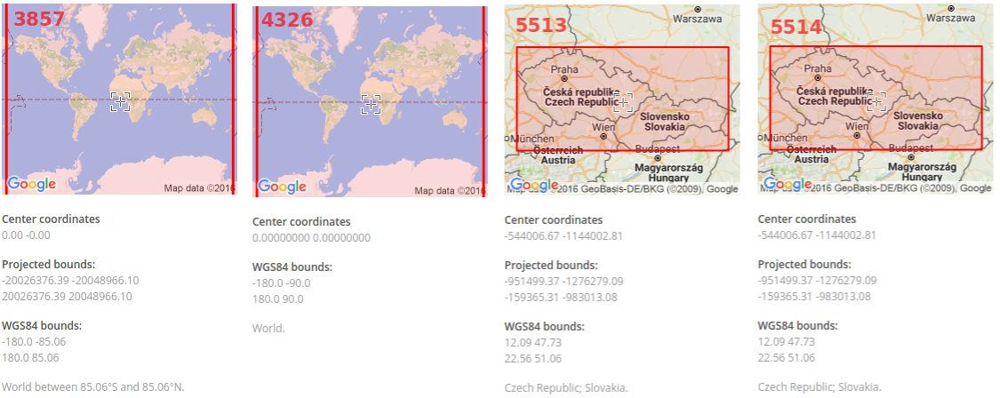

.. _epsg:

EPSG
====
:wikipedia:`European Petroleum Survey Group`  byla od roku 1986 do roku 2005
vědecká organizace s vazbou k evropskému naftovému průmyslu. Od roku 2005 se 
pod `EPSG <http://www.epsg.org/>`_ rozumí dataset spravovaný nástupnickou organizací 
`IOGP <http://www.iogp.org/>`_ (The International Association of Oil & Gas producers).

Jde o databázu zemských elipsoidů, geodetických dat, zeměpisných a kartografických 
souřadnicových systémů, měrných jednotek a podobně.
Každé kartografické zobrazení, resp. souřadnicový systém má dán jedinečný kód.
Tento kód je celé nezáporné číslo vyjma nuly, které se nesmí opakovat. 
Například :epsg:`4326` vyjadřuje souřadnicový systém WGS84 o souřadnicích
zeměpisné šířky a délky v celých stupních s Greenwichem jako nultým poledníkem.
Databáze je podporována a rozšířena ve všech programech pracujících s
geografickými daty. Oficiální stránka systému je 
`www.epsg.org <http://epsg.org>`_, transformaci lze zkoušet na
`www.epsg-registry.org <http://www.epsg-registry.org>`_.

.. tip:: Nejnovější přehled včetně exportu do různých formátů naleznete na
         stránce http://epsg.io

.. figure:: ./images/epsg_page.png
    :class: middle

    Hlavní stránka `epsg.io <https://epsg.io/>`_.

Významné kódy EPSG
------------------

:epsg:`3857`
    sférické Mercatorovo zobrazení, používaný například :wikipedia:`Google`, 
    :wikipedia:`Bing`, :wikipedia:`OpenStreetMap`

:epsg:`4326`
    WGS84, souřadnicový systém používaný mimo jiné v zařízeních GPS, 
    použito zobrazení geografickými souřadnicemi 

:epsg:`5513`
    systém S-JTSK, jih :math:`x` / západ :math:`y` (S-JTSK / Krovak), 
    definováno od nultého poledníku Greenwiche, kladné souřadnice

:epsg:`5514`
    systém S-JTSK, východ :math:`x` / sever :math:`y` (S-JTSK / Krovak East North), 
    definováno od nultého poledníku Greenwiche, záporné souřadnice

Kódy, se kterými se také můžete setkat
--------------------------------------

:epsg:`2065`
    systém S-JTSK, jih :math:`x` / západ :math:`y` (S-JTSK / Krovak), 
    definováno od Ferrova poledníku, kladné souřadnice; 
    někdy se chybně využívá jako ekvivalent :epsg:`5514` (S-JTSK / Krovak); tyto 
    systémy však nejsou ekvivaletní a tento kód by se takto používat neměl

:epsg:`5221`
    systém S-JTSK, východ :math:`x` / sever :math:`y` (S-JTSK / Krovak East North), 
    definováno od Ferrova poledníku, záporné souřadnice

:epsg:`102067`
    systém S-JTSK, východ :math:`x` / sever :math:`y` (S-JTSK / Krovak East North), 
    kód využívaný v softwarech firmy ESRI, často přejímaný do jiných softwarů;
    provizorní náhrada, dokud kód :epsg:`5514` nebyl oficiálně přidán do databáze 
    EPSG; dnes je již zastaralý a není nutné jej využívat

:epsg:`900913`
    alternativní zápis Mercatorova zobrazení využívané v Google Maps; číslo
    :math:`900913` představuje grafickou podobu slova *google*; dnes již není 
    nutné, lepší je využívat oficiální kód :epsg:`3857`

`a další ... <http://epsg.io>`_
    EPSG:2003 EPSG:2004 EPSG:2005 EPSG:2006 EPSG:2007 EPSG:2008 EPSG:2009 EPSG:2010 EPSG:2011 EPSG:2012 EPSG:2013 EPSG:2014 EPSG:2015 EPSG:2016 EPSG:2017 EPSG:2018 EPSG:2019 EPSG:2020 EPSG:2021 EPSG:2022 EPSG:2023 EPSG:2024 EPSG:2025 EPSG:2026 EPSG:2027 EPSG:2028 EPSG:2029 EPSG:2030 EPSG:2031 EPSG:2032 EPSG:2033 EPSG:2034 EPSG:2035 EPSG:2036 EPSG:2037 EPSG:2038 EPSG:2039 EPSG:2040 EPSG:2041 EPSG:2042 EPSG:2043 EPSG:2044 EPSG:2045 EPSG:2046 EPSG:2047 EPSG:2048 EPSG:2049 EPSG:2050 EPSG:2051 EPSG:2052 EPSG:2053 EPSG:2054 EPSG:2055 EPSG:2056 EPSG:2057 EPSG:2058 EPSG:2059 EPSG:2060 EPSG:2061 EPSG:2062 EPSG:2063 EPSG:2064 EPSG:2065 EPSG:2066 EPSG:2067 EPSG:2068 EPSG:2069 EPSG:2070 EPSG:2071 EPSG:2072 EPSG:2073 EPSG:2074 EPSG:2075 EPSG:2076 EPSG:2077 EPSG:2078 EPSG:2079 EPSG:2080 EPSG:2081 EPSG:2082 EPSG:2083 EPSG:2084 EPSG:2085 EPSG:2086 EPSG:2087 EPSG:2088 EPSG:2089 EPSG:2090 EPSG:2091 EPSG:2092 EPSG:2093 EPSG:2094 EPSG:2095 EPSG:2096 EPSG:2097 EPSG:2098 EPSG:2099 EPSG:2100 EPSG:2101 EPSG:2102 EPSG:2103 EPSG:2104 EPSG:2105 EPSG:2106 EPSG:2107 ...

.. important:: V oblasti užití dat v geografických informačních systémech není 
    užíván EPSG :epsg:`2065` S-JTSK/Krovak s kladnými souřadnicemi v pořadí 
    jih :math:`x`, západ :math:`y`, který naopak užívají 
    geodeti pro měření v terénu a zobrazují pak ve svých měřických výstupech kladné 
    souřadnice :math:`x`, :math:`y`. Pokud však tento výstup použiji přímo jako 
    zdroj pro GIS aplikaci či mapovou službu, data se nezobrazí správně, neboť 
    aplikace jsou naprogramovány na užití Křovákovy projekce se **zápornými** 
    souřadnicemi. 
    Vztah mezi souřadnicemi „záporného“ :math:`x`, :math:`y` a „kladného“ 
    :math:`x`, :math:`y` Křováka, tedy mezi :epsg:`5514` a :epsg:`2065`, je **x = -y a y = -x**.

.. _srovnani-epsg:

    
    Srovnání některých kódů - Mercator, WGS 84, S-JTSK Krovak a S-JTSK Krovak East North.
