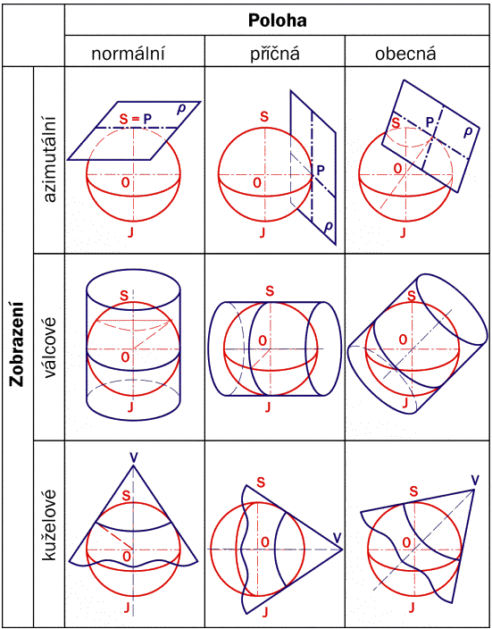
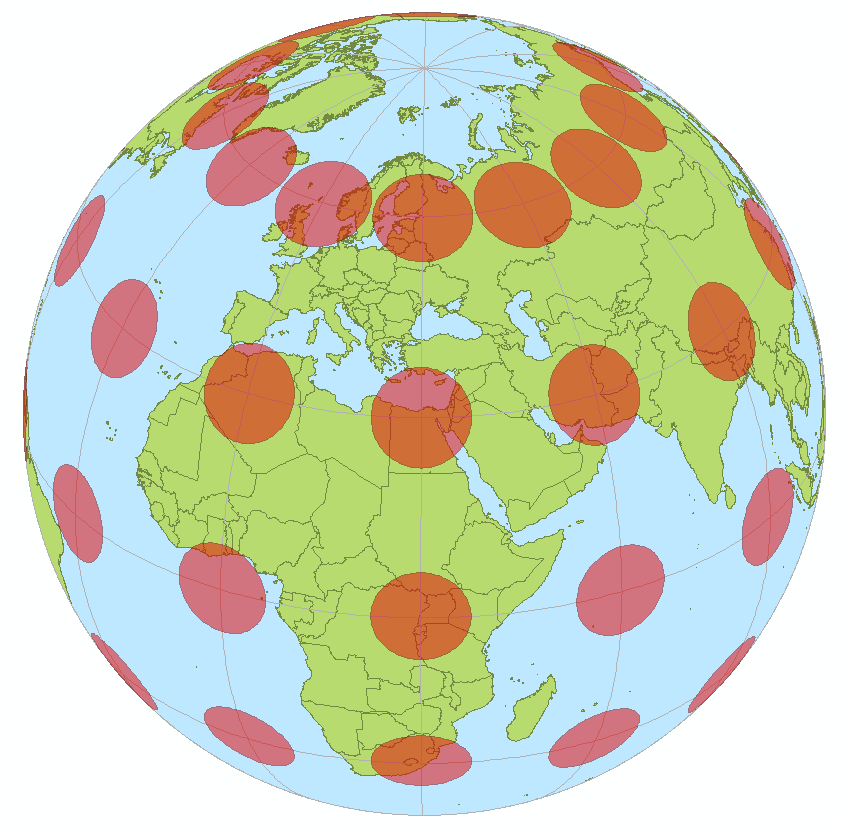
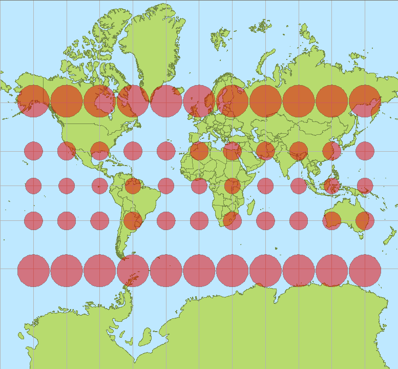
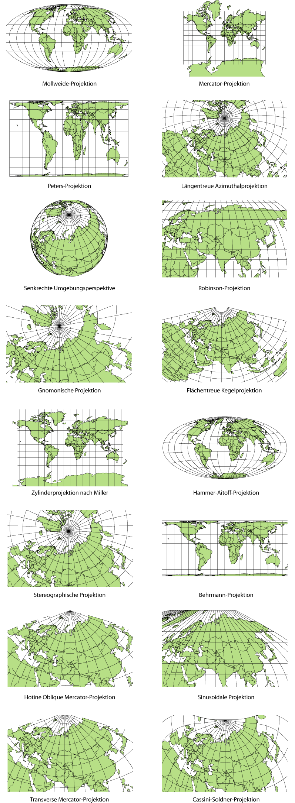

.. _řr-systemy:

********************
Souřadnicové systémy
********************

:wikipedia:`Mapové zobrazení`, resp. kartografická projekce je způsob, kterým
se převádí zobrazení povrchu Země, případně jiného nebeského tělesa 
z trojrozměrného zakřiveného povrchu referenčního elipsoidu či koule do roviny. 
Výsledek takového geometrického nebo početního postupu nazýváme *mapa*.

Protože povrch koule či elipsoidu není rozvinutelný do roviny, stejně jako nelze
do roviny bez deformace rozvinout oloupanou slupku pomeranče, je zapotřebí
jej převést na povrch geometrického objektu, jehož povrch do roviny
rozvinutelný je. Takovými objekty jsou **válec**, **kužel** 
a samozřejmě také **rovinná plocha** sama. Nejčastěji používaná zobrazování jsou 
jednoduchá zobrazení *azimutální*, *kuželová* a *válcová*, 
viz. :ref:`ukázka <j-zobrazeni>`. 

Mapová zobrazení podle polohy osy zobrazovací plochy může být *normální* 
(pólová) – osa válce nebo kužele je totožná s osou glóbu nebo se zobrazovací 
rovina dotýká glóbu na jednom pólu, *příčná* (transverzální, rovníková) – osa 
válce nebo kužele leží v rovině rovníku nebo se zobrazovací rovina dotýká 
glóbu na rovníku a *obecná* (šikmá) – osa válce nebo kužele prochází středem 
glóbu, ale nesplývá s jeho osou ani neleží na rovníku nebo se zobrazovací 
rovina dotýká glóbu v libovolném bodě mezi pólem a rovníkem. 

.. _j-zobrazeni:

   
   Přehled jednoduchých kartografických zobrazení spolu s polohou zobrazovací 
   plochy (zdroj: `Geodetické a kartografické základy <http://transformace.webst.fd.cvut.cz/Iframe/Basics_iframe.htm>`_). 

Převod kulové plochy do roviny ze své podstaty vždy přináší tvarové 
zkreslení části obsažených informací. Ve výsledném rovinném zobrazení nemohou být 
současně zachovány všechny hlavní údaje jako délky, úhly a plochy. 
**Vždy dochází ke zkreslení** některého z nich, případně všech. 
Proto byla postupem času vyvinuta
řada kartografických zobrazení, z nichž každé klade důraz na jiný z důležitých 
údajů. Při vytváření map malých území (do několika set km²) je zkreslení téměř
zanedbatelné, je-li však třeba zachytit na mapě větší oblast jako kraj, stát,
světadíl, oceán či celou Zemi, je nutné pečlivě volit kartografické zobrazení 
tak, aby odpovídalo účelu mapy.

   
   Kontrolní kruhy rozmístěné pravidelně na povrchu Země (zdroj:
   :wikipedia:`wikipedia <Mapové zobrazení>`).

.. _ukazka-mercator:
      

    
   Ukázka Mercatorova kartografické zobrazení. Všimněte si výrazného
   zkreslení vzdáleností v oblasti pólů (zdroj: :wikipedia:`wikipedia
   <Mapové zobrazení>`).

.. figure:: ./images/tissot_robinson.png
   :class: small
   
   Další možné zobrazení, všimněte si výrazného zkreslení úhlů v
   rozích mapy (zdroj: :wikipedia:`wikipedia <Mapové zobrazení>`).

Z uvedeného vyplývá, že můžeme kartografického zobrazení rozdělit na
základě charakteru zkreslení do několika skupin:

* **délkojevná** (ekvidistantní) – nezkreslují vzdálenosti podél
  určitého systému čar (netýká se všech délek),
* **plochojevná** (ekvivalentní) – zachovávají poměry ploch, silně
  jsou však zkresleny úhly,
* **úhlojevná** (konformní) – věrně zachycují úhly, ale silně
  zkreslují plochy,
* **vyrovnávací** (kompenzační) – kompromisní zobrazení s mírným
  zkreslením úhlů i ploch; do této kategorie lze počítat i mnohá
  zobrazení délkojevná.

    Příklady kartografických zobrazení podle vzhledu zobrazovací
    plochy - azimutální, kuželová, válcová, ... (zdroj: :wikipedia:`Mapové zobrazení`).

*Další témata:*

.. toctree::
   :maxdepth: 2

   souradnice
   sjtsk
   mercatorovo-zobrazeni
   wgs84
   etrs89
   epsg
   jak-poznat-ss-dat
