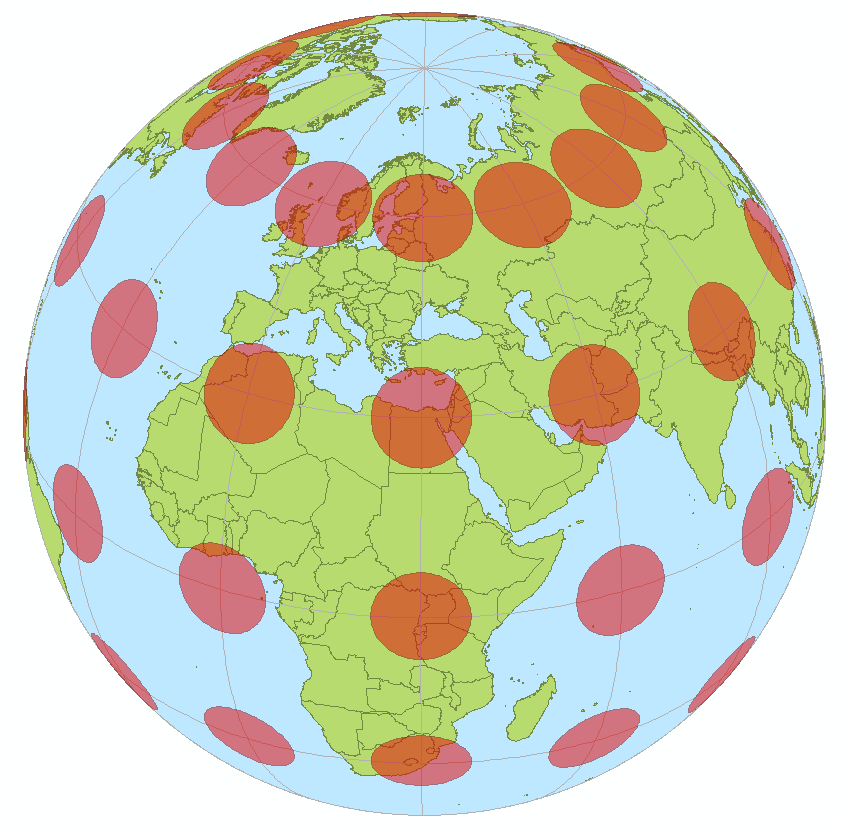
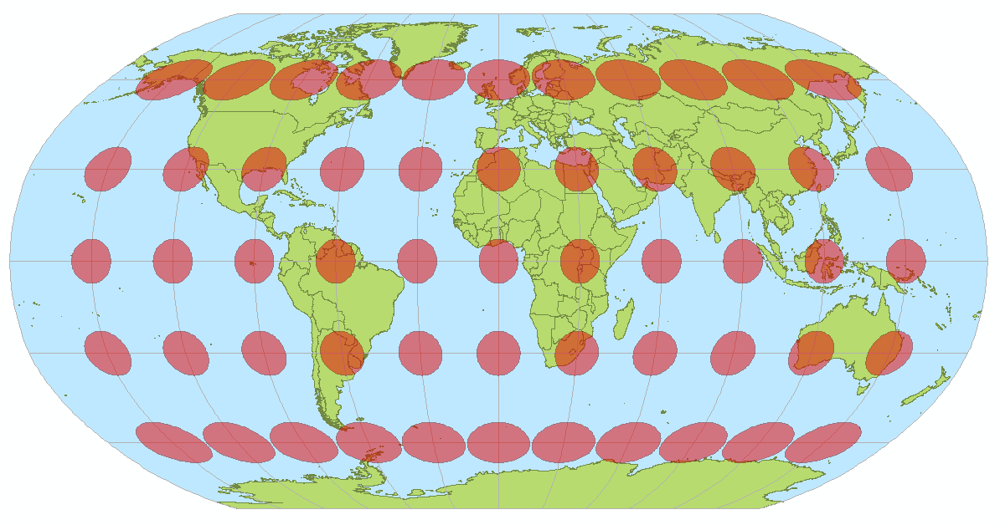
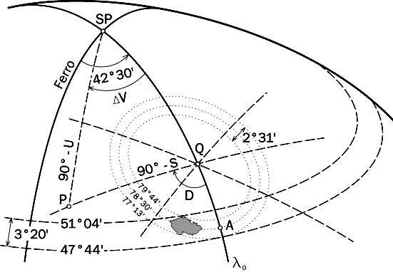

********************
Souřadnicové systémy
********************

:wikipedia:`Mapové zobrazení` často též kartografická projekce, je způsob, jakým
se převádí zobrazení povrchu Země (či jiného nebeského tělesa) z dvojrozměrného
zakřiveného povrchu referenčního elipsoidu či koule do roviny. Výsledek takového
geometrického či početního postupu nazýváme mapa.

Protože povrch koule či elipsoidu není rozvinutelný do roviny (stejně jako nelze
do roviny bez deformace rozvinout oloupanou slupku pomeranče), je zapotřebí
převést jej na povrch některého geometrického objektu, jehož povrch do roviny
rozvinutelný je. Takovými objekty jsou válec, kužel a samozřejmě také rovinná
plocha sama. Převod kulové plochy do roviny znamená vždy tvarové zkreslení části
obsažených informací. Ve výsledném rovinném zobrazení nemohou být současně
zachovány všechny hlavní údaje – délky, úhly a plochy – vždy dochází ke
zkreslení některého z nich (případně všech). Proto byla postupem času vyvinuta
řada mapových zobrazení, z nichž každé klade důraz na jiný z důležitých údajů.
Při vytváření map malých území (do několika set km²) je zkreslení téměř
zanedbatelné, je-li však třeba zachytit na mapě větší oblast (kraj, stát,
světadíl, oceán či celou Zemi), je nutné pečlivě volit mapové zobrazení tak, aby
odpovídalo účelu mapy.

    Kontrolní kruhy rozmístěné pravidelně na povrchu Země.

    Zdroj: http://cs.wikipedia.org/wiki/Mapov%C3%A9_zobrazen%C3%AD

.. figure:: ../images/Tissot_mercator.png
    :class: middle

    Jedno možné zobrazení (Mercatorovo) a ukázka výrazného zkreslení vzdáleností v oblasti pólů.

    Zdroj: http://cs.wikipedia.org/wiki/Mapov%C3%A9_zobrazen%C3%AD

    Další možné zobrazení a ukázka výrazného zkreslení úhlů v rozích mapy.

    Zdroj: http://cs.wikipedia.org/wiki/Mapov%C3%A9_zobrazen%C3%AD

Z uvedeného vyplývá, že podle zkreslení můžeme mapové projekce rozdělit do
skupin podle zkreslení na

* délkojevná (ekvidistantní) – nezkreslují vzdálenosti podél určitého systému čar (netýká se všech délek)
* plochojevná (ekvivalentní) – zachovávají poměry ploch, silně jsou však zkresleny úhly
* úhlojevná (konformní) – věrně zachycují úhly, ale silně zkreslují plochy
* vyrovnávací (kompenzační) – kompromisní zobrazení s mírným zkreslením úhlů i ploch; do této kategorie lze počítat i mnohá zobrazení délkojevná

.. figure:: ../images/Netzentwuerfe.png
    :class: middle

    Příklady mapových zobrazení podle vzhledu zobrazovací plocy - azimutální,
    kuželová, válcová, ..

    Zdroj: http://cs.wikipedia.org/wiki/Mapov%C3%A9_zobrazen%C3%AD

Křovákovo zobrazení - S-JTSK
============================

Systém jednotné trigonometrické sítě katastrální (`S-JTSK <http://freegis.fsv.cvut.cz/gwiki/S-JTSK>`_)
používá tzv. Křovákovo zobrazení. Křovákovo zobrazení je konformní kuželové
zobrazení v obecné poloze, které v roce 1922 navrhl Ing. Josef Křovák.
Transformace souřadnic :math:`\varphi,\lambda` na pravoúhlé :math:`X, Y` se provádí v několika krocích. Nejprve
je provedeno Gaussovo konformní zobrazení Besselova elipsoidu na kouli a poté
konformní zobrazení na kuželovou plochu obecně položenou.

    Křovákovo zobrazení

    Zdroj: http://freegis.fsv.cvut.cz/gwiki/S-JTSK

Česká republika leží celá ve třetím kvadrantu. V původním zobrazení mají
souřadnice pozitivní hodnoty. Pro převod do geografických informačních systémů
bylo kdysi potřeba souřadnice přenásobit hodnotou -1. Výsledkem je, že skoro
všechna data používaná v systému S-JTSK mají negativní souřadnice.

Mercatorovo zobrazení
=====================
Ve světě se momentálně jedná o asi nejrozšířenější zobrazení.
:wikipedia:`Mercatorovo zobrazení`  je druh úhlojevného válcového mapového
zobrazení, které navrhl roku 1569 vlámský kartograf Gerhard Mercator (1512 –
1594). Používá se zejména na námořních a leteckých navigačních mapách.

Základem zobrazení je válec v normální poloze (tedy rovnoběžný se zemskou osou),
dotýkající se glóbu na rovníku. Po zobrazení povrchu koule na válec a po
rozvinutí pláště válce do roviny vznikne pravoúhlá síť poledníků a rovnoběžek.
Poledníky jsou zobrazeny ve stejných rozestupech, zatímco vzájemná vzdálenost
rovnoběžek směrem k pólům vzrůstá do nekonečna. Protože se válec po celém obvodu
rovníku glóbu dotýká, je zobrazení rovníku délkojevné. Totéž už neplatí o
ostatních rovnoběžkách, které jsou znázorněny jako úsečky stejné délky – čím
blíže k pólům, tím je tedy zkreslení v délce (a ploše) větší. Proto nelze
Mercatorovo zobrazení vůbec použít při tvorbě map polárních oblastí nad 86.
stupeň zeměpisné šířky. Naopak v rovníkových oblastech, přibližně mezi 15.
stupněm severní a jižní zeměpisné šířky, je délková a plošná nepřesnost vcelku
zanedbatelná.

Toto zobrazení se používá zejména na webových mapách (Google, Bing,
OpenStreetMap).

WGS 84
======
:wikipedia:`World Geodetic System` (zkratka WGS84)  je světově uznávaný
geodetický standard vydaný ministerstvem obrany USA roku 1984, který definuje
souřadnicový systém, referenční elipsoid pro geodézii a navigaci. Odchylky od
referenčního elipsoidu pak popisují geoid EGM84. V roce 1996 byl rozšířen o
zpřesněnou definici geoidu EGM96. Byl vytvořen na základě měření pozemních
stanic družicového polohového systému TRANSIT a nahrazuje dřívější systémy
WGS 60, WGS 66 a WGS 72.

WGS-84 používá souřadnice zeměpisné, polohu tedy určíme pomocí zeměpisné délky,
šířky a výšky. Šírka nabývá 0°-90° na sever od rovníku a 0°-90° na jih od
rovníku. Délka pak nabývá hodnot 0°-180° na západ od nultého poledníku a 0°-
180° na východ od nultého poledníku. Nultým poledníkem ve WGS-84 je IERS
Reference Meridian. Leží 5.31 úhlových vteřin východně od "Greenwich Prime
Meridian". Souřadnicový systém WGS 84 je pravotočivá kartézská soustava
souřadnic se středem v těžišti Země (včetně moří a atmosféry). Kladná osa x
směřuje k průsečíku nultého poledníku a rovníku, kladná osa z k severnímu pólu a
kladná osa y je na obě předchozí kolmá ve směru doleva (90° východní délky a 0°
šířky), tvoří tak pravotočivou soustavu souřadnic.

ETRS
====
`ETRS-89 (European Terrestrial Reference System 1989)
<http://transformace.webst.fd.cvut.cz/Iframe/ETRS_iframe.htm>`_, ve kterém je
Euroasijská deska jako celek statická. 

EPSG
====
:wikipedia:`European Petroleum Survey Group`  byla od roku 1986 do roku 2005
vědecká organizace s vazbou k evropskému naftovému průmyslu. Od roku 2005 se
EPSG rozumí dataset spravovaný nástupnickou organizací The International
Association of Oil & Gas producers (OGP).

Dnes se pod EPSG rozumí databáze zemských elipsoidů, geodetických dat,
zeměpisných a kartografických souřadnicových systémů, měrných jednotek a pod.
Každé kartografické zobrazení, resp. souřadnicový systém má dán jedinečný kód.
Tento kód je celé nezáporné číslo vyjma nuly, které se nesmí opakovat. Například
EPSG:4326 vyjadřuje standardní zeměpisnou projekci WGS84 o souřadnicích
zeměpisné šířky a délky v celých stupních s Greenwichem jako nultým poledníkem.

Databáze je podporována a rozšířena ve všech programech pracujících s
prostorovými daty.

Oficiální stránka systému je http://epsg.org, transformaci lze zkoušet na
http://www.epsg-registry.org/ nejnovější přehled včetně exportu do různých
formátů je na stránce http://epsg.io

Významné kódy EPSG:
-------------------

EPSG:5514
    S-JTSK, Křovákovo zobrazení, negativní souřadnice

EPSG:4326
    WGS84, souř. systém používaný mimo jiné v zařízeních GPS

EPSG:3857
    Mercator, používaný např. Google Map, Bing Maps, OpenStreetMap

Kódy, se kterými se také můžete setkat:
---------------------------------------

EPSG:2065
    Křovákovo zobrazení, odvozené od Ferrova poledníku, pozitivní souřadnice.
    Někdy se využívá jako ekvivalent *Křovák-GIS* EPSG:5514, ale tyto systémy
    nejsou ekvivaletní a tento kód by se takto používat neměl.

EPSG/ESRI:102067
    Kód využívaný v softwarech firmy ESRI, často přejímaný do jiných softwarů.
    Provizorní náhrada, dokud kód 5514 nebyl oficiálně přidán do databáze EPSG.
    Dnes již zastaralý a není nutné jej využívat.

EPSG:900913
    Alternativní zápis Mercatorova zobrazení využívané v Google Maps. Číslo
    900913 představuje grafickou podobu slova *google*. Dnes již není nutné
    používat, lepší využívat oficiální kód 3857.

EPSG:2003 EPSG:2004 EPSG:2005 EPSG:2006 EPSG:2007 EPSG:2008 EPSG:2009 EPSG:2010 EPSG:2011 EPSG:2012 EPSG:2013 EPSG:2014 EPSG:2015 EPSG:2016 EPSG:2017 EPSG:2018 EPSG:2019 EPSG:2020 EPSG:2021 EPSG:2022 EPSG:2023 EPSG:2024 EPSG:2025 EPSG:2026 EPSG:2027 EPSG:2028 EPSG:2029 EPSG:2030 EPSG:2031 EPSG:2032 EPSG:2033 EPSG:2034 EPSG:2035 EPSG:2036 EPSG:2037 EPSG:2038 EPSG:2039 EPSG:2040 EPSG:2041 EPSG:2042 EPSG:2043 EPSG:2044 EPSG:2045 EPSG:2046 EPSG:2047 EPSG:2048 EPSG:2049 EPSG:2050 EPSG:2051 EPSG:2052 EPSG:2053 EPSG:2054 EPSG:2055 EPSG:2056 EPSG:2057 EPSG:2058 EPSG:2059 EPSG:2060 EPSG:2061 EPSG:2062 EPSG:2063 EPSG:2064 EPSG:2065 EPSG:2066 EPSG:2067 EPSG:2068 EPSG:2069 EPSG:2070 EPSG:2071 EPSG:2072 EPSG:2073 EPSG:2074 EPSG:2075 EPSG:2076 EPSG:2077 EPSG:2078 EPSG:2079 EPSG:2080 EPSG:2081 EPSG:2082 EPSG:2083 EPSG:2084 EPSG:2085 EPSG:2086 EPSG:2087 EPSG:2088 EPSG:2089 EPSG:2090 EPSG:2091 EPSG:2092 EPSG:2093 EPSG:2094 EPSG:2095 EPSG:2096 EPSG:2097 EPSG:2098 EPSG:2099 EPSG:2100 EPSG:2101 EPSG:2102 EPSG:2103 EPSG:2104 EPSG:2105 EPSG:2106 EPSG:2107 ...

Jak poznat v jakém souř. systému jsou data
==========================================
.. todo: Doplnit odkaz na část věnující se gdalinfo, ogrinfo

Pokud není souř. systém poznamenaný v metadatech datové sady (viz dále), můžeme
se pokusit uhodnout souř. systém čistě z hodnot souřadnic (platí především pro
území České republiky, lze ale vztáhnout na celý svět):

WGS84 - EPSG:4326
    Pozitivní čísla nabývající hodnot 11 až 20 ve směru osy `x` a 
    47 až 52 ve směru osy `y`.

S-JTSK - EPSG:5514
    Souřadnice jsou negativní (záporné) a nabývají hodnot -925000 až -400646 v
    ose `x` a -1444353 až -920000 v ose `y`

Mercator - EPSG:3857
     Pozitivní souřadnice s hodnotamy `x` mezi 129295 až 1817312 a osy `y`
     6185018 až 6709371.

.. figure:: ../images/map_projections.png
    :class: middle

    Řekni jakou projekci používáš a já ti povím, jaký jsi

    Zdroj: https://xkcd.com/977/

Knihovna Proj-4
===============
`Proj-4 <https://trac.osgeo.org/proj/>`_ je přítomne ve všech softwarech
odvozených od jazyka C. Má své klony v jazyce JavaScript http://proj4js.org/,
PHP https://sourceforge.net/projects/proj4php/ (https://github.com/jachym/proj4php),
Python https://github.com/jswhit/pyproj, ...

Kromě možnosti používat knihovnu z různých programů, existují i užitečné
nástroje v příkazové řádce. 

cs2cs
-----
Provádí transformaci mezi jednotlivými souř. systémy. 

.. notecmd:: použití 

    .. code-block:: bash

        echo "-868208.53 -1095793.57 512.30" | cs2cs +init=epsg:5514 \
            +towgs84=570.8,85.7,462.8,4.998,1.587,5.261,3.56 +to +init=epsg:4326

        12d48'25.16"E	49d27'8.146"N 559.261

    Převede souřadnice ze souř. systému S-JTSK (kód EPSG:5514
    do WGS84 (EPSG:4326)

    .. code-block:: bash

        echo "12d48'25.15992 49d27'8.14571 559.417" | cs2cs +proj=longlat \
            +datum=WGS84 +to +proj=krovak +lat_0=49.5 +lon_0=24.83333333333333 \
            +alpha=30.28813972222222 +k=0.9999 +x_0=0 +y_0=0 +ellps=bessel \
            +pm=greenwich +units=m +no_defs \
            +towgs84=570.8,85.7,462.8,4.998,1.587,5.261,3.56

        -868208.54	-1095793.58 512.46

    Provede převod WGS84 na S-JTSK (při zápisu není použit kód EPSG, ale plná
    definice).

geod a invgeod
--------------
Provádí dopředné a zpětné geodetické výpočty pro určení zem. šířky a délky, při
zadání výchozího bodu, azimutu a délky.

.. notecmd:: použití

    Výpočet azimutu a vzdálenosti mezi Prahou a Brnem

    .. code-block:: bash

        geod +ellps=bessel <<EOF -I +units=m
        15d20'55.444"E47d43'10.405"N 14d28'7.821"E50d4'2.641"N
        EOF

        110d53'32.868"	-68d30'12.184"	270855.602

proj a invproj
--------------
Provádí transformaci souřadnicových systému z/do systému WGS-84.

Funguje podobně jako `cs2cs`, který ale umí transformovat mezi libovolnými souř.
systémy.

Knihovna GDAL
=============
Knihovna `GDAL <http://gdal.org>`_, resp. její nástroje, umožňují prácovat se
souř. systémy nad celými rastrovými či vektorovými souborovými formáty.

gdalinfo a ogrinfo
------------------

.. todo::

gdalwarp a ogr2ogr
------------------

.. todo::
