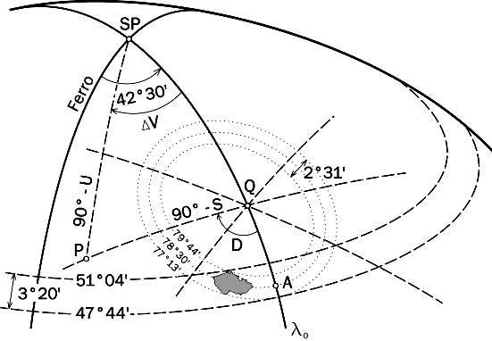
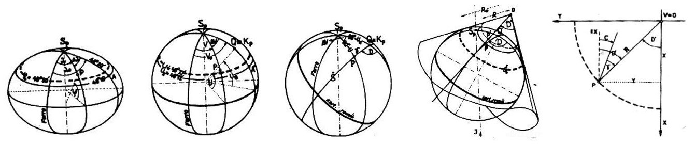

.. _krovakovo-zobrazeni:

Křovákovo zobrazení (S-JTSK)
============================

Nejpoužívanější souřadnicový systém v České republice **Systém jednotné
trigonometrické sítě katastrální** (`S-JTSK
<http://freegis.fsv.cvut.cz/gwiki/S-JTSK>`_) používá tzv. Křovákovo
zobrazení. Jde o dvojité konformní kuželové zobrazení v
obecné poloze, které v roce 1922 navrhl Ing. :wikipedia:`Josef Křovák`.

    Křovákovo zobrazení (zdroj: `Portál FreeGIS
    <http://freegis.fsv.cvut.cz/gwiki/S-JTSK>`_).

Transformace elipsoidických souřadnic :math:`\varphi,\lambda` na pravoúhlé 
rovinné souřadnice :math:`x, y` 
se provádí ve čtyřech krocích. Spočívá ze zobrazení elipsoidu na kulovou plochu, 
z transformace zeměpisných sférických souřadnic na sférické kartografické 
souřadnice na kulové ploše, ze zmenšení kulové plochy 
(kvůli zmenšení zkreslení z + 24 cm na +14 cm) a její konformního zobrazení 
na dotykový kužel v obecné poloze a nakonec z rozvinutí plochy dotykového kužele 
do roviny.
Česká republika leží celá ve třetím kvadrantu (první kvadrant
geodetického souřadnicového systému, kladná osa :math:`x` směřuje dolů, kladná 
osa :math:`y` do leva). 

    Transformace v krocích - elipsoidické, sférické, kartografické, 
    polární a rovinné souřadnice (zdroj: podle `SAŽP <http://www.sazp.sk/slovak/struktura/ceev/DPZ/EDU/c002.htm>`_).

.. note:: V geografických informačních systémech se často používá 
	  forma převedená do matematického třetího kvadrantu, osy jsou potom 
	  prohozené a souřadnice záporné.
