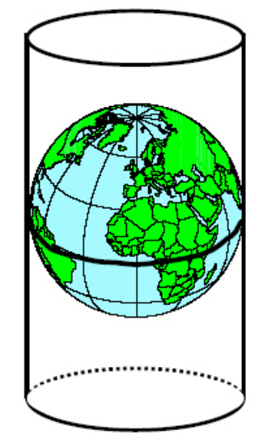

.. index:: Mercatorovo zobrazení, Bing, OpenStreetMap, Google Maps
   
Mercatorovo zobrazení
=====================

Ve světě se momentálně jedná o asi nejrozšířenější kartografické
zobrazení.  :wikipedia:`Mercatorovo zobrazení` je druh *úhlojevného
válcového* kartografického zobrazení, které navrhl roku 1569 vlámský
kartograf :wikipedia:`Gerhard Mercator` (1512 – 1594).  Základem
zobrazení je válec v normální poloze, tedy rovnoběžný se zemskou osou,
dotýkající se glóbu na rovníku.

.. _valec-normalni-poloha:
      

    
   Valec v normální poloze dotýkajíci se glóbu na rovníku 
   (zdroj: `Geografická kartografie <https://web.natur.cuni.cz/~bayertom/Mmk/>`_).

Po zobrazení povrchu koule na válec a po rozvinutí pláště válce do
roviny vznikne pravoúhlá síť poledníků a rovnoběžek, viz :ref:`ukázka
zobrazení <ukazka-mercator>`. Poledníky jsou zobrazeny ve stejných
rozestupech, zatímco vzájemná vzdálenost rovnoběžek směrem k pólům
vzrůstá do nekonečna.

Zobrazení na rovníku je délkojevné (dotyk válce a glóbu na rovníku).
Totéž už neplatí o ostatních rovnoběžkách znázorněnych jako úsečky
stejné délky – čím blíže k pólům, tím je zkreslení v délce (a ploše)
větší.  Proto nelze Mercatorovo zobrazení použít při tvorbě map
polárních oblastí nad **86. stupeň** zeměpisné šířky. Naopak v
rovníkových oblastech, přibližně mezi **15. stupněm** severní a jižní
zeměpisné šířky, je délková a plošná nepřesnost vcelku zanedbatelná.

Toto zobrazení se používá zejména na námořních, leteckých navigačních 
a webových mapách jako :wikipedia:`Google`, :wikipedia:`Bing`, 
:wikipedia:`OpenStreetMap`.

