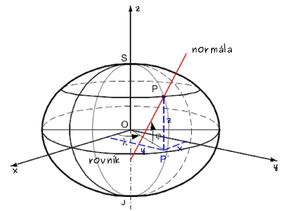
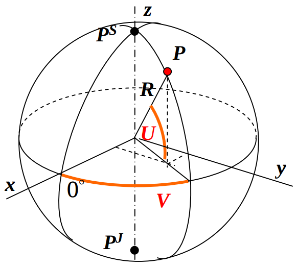
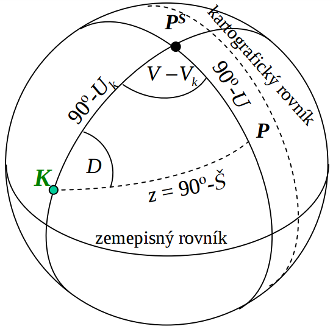
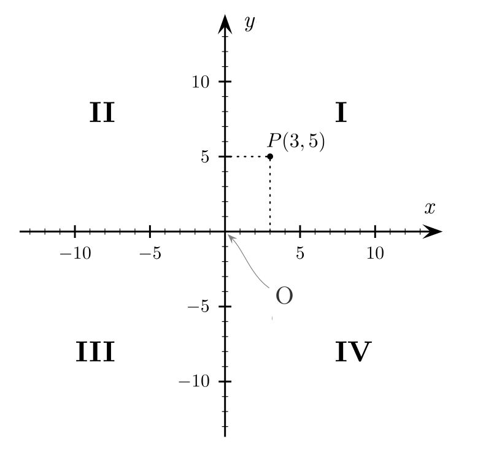
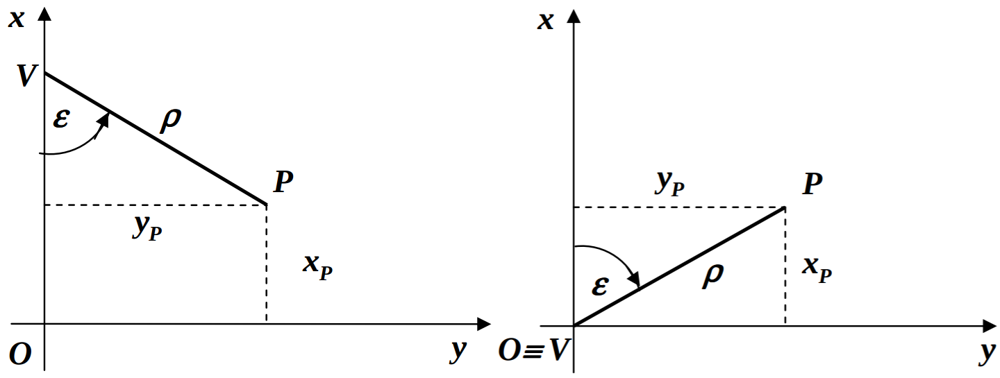

.. index:: typy souřadnic
           
Typy souřadnic
==============

Poloha bodu na referenční ploše je vyjádřena pomocí souřadnic. S
uvažováním trojrozměrného prostoru se v geodetické a kartografické
praxi nejčastěji používají:

.. index:: kartézské souřadnice
           
**Kartézské prostorové souřadnice** :math:`x,y,z`

Prostorová pravoúhlá souřadnicová soustava má začátek ve středu
referenčního tělesa (sféra, elipsoid), osa :math:`z` prochází osou
rotace a osa :math:`x` průsečnicí roviny rovníku a roviny základního
poledníku. Osa :math:`y` je kolmá na osy :math:`x`, :math:`z`.

.. index:: zeměpisné souřadnice
           
**Zeměpisné souřadnice** :math:`\varphi,\lambda` na referenčním elipsoidu
 
Elipsoidická šířka :math:`\varphi` je definována jako úhel normály
elipsoidu daným bodem s rovinou rovníku, kladná je na sever od
rovníku, t.j. severní polokoule :math:`\varphi =` ``<0°, 90°>`` a
jižní polokoule :math:`\varphi =` ``<0°, -90°>``. Elipsidická délka
:math:`\lambda` je definováná jako úhel roviny určené daným bodem a
zemskou osou s rovinou určenou zemskou osou a základním bodem
(například Greenwich), kladná je na východ, t.j. :math:`\lambda =`
``<0°, 360°>`` nebo východní polokoule :math:`\lambda =` ``<0°,
180°>``, západní polokoule :math:`\lambda =` ``<0°, -180°>``.

.. _xyz:

   Kartézské a zeměpisné souřadnice na referenčním elipsoidu (zdroj:
   `Matematické metody v kartografii
   <https://web.natur.cuni.cz/~bayertom/Mmk>`_).

**Zeměpisné souřadnice** :math:`U,V` na referenční sféře
 
Zeměpisné souřadnice :math:`U,V` na referenční sféře jsou definovány
stejně jako na referenčním elipsoidu.

.. _uv:

   Zeměpisné souřadnice na referenční sféře (zdroj: `Metódy
   zobrazovania
   <http://www.svf.stuba.sk/docs//dokumenty/skripta/metody_zobrazovania/index1.html>`_).

**Kartografické souřadnice** :math:`Š,D` na referenční sféře

Kartografické souřadnice se používají proto, aby se obraz referenční
plochy co nejvíce přimykal ke zvolenému území. Důsledkem jsou nižší
hodnoty kartografických zkreslení. Osa zobrazovací plochy není
rovnoběžná se zemskou osou.  Souřadnice jsou vztaženy ke
kartografickému pólu, který se zpravidla označuje jako :math:`K`.
Kartografická šířka :math:`Š` se měří od kartografického rovníku. Je
definována analogicky jako zeměpisná šířka :math:`\varphi`,
resp. :math:`U`.  Kartografická délka :math:`D` se měří od zeměpisného
poledníku procházejícího kartografickým (a severním) pólem, definována
je analogicky jako zeměpisná délka :math:`\lambda`, resp. :math:`V`.

.. _sd:

   Kartografické souřadnice na referenční sféře.

**Pravoúhlé souřadnice** :math:`x,y` v zobrazovací rovině

Pravoúhlá souřadnicová soustava je dána začátkem soustavy v bodě
:math:`O` a osami :math:`x` a :math:`y`. Kvadranty se pak číslují od
kladné poloosy :math:`x` proti směru otáčení hodinových ručiček jako
*první* až *čtvrtý*.  Obě souřadnice bodů v prvním kvadrantu jsou tedy
kladné, ve třetím kvadrantu obě záporné.

.. _oxy:

   Pravoúhlé souřadnice bodu v zobrazovací rovině a kvadranty I, II,
   III a IV.

**Polární souřadnice** :math:`\rho,\varepsilon` v zobrazovací rovině

Polární souřadnicová soustava je dána začátkem soustavy v bodě
:math:`V` a polárnimi souřadnicemi :math:`\rho` a
:math:`\varepsilon`. Polární poloměr :math:`\rho` je vzdálenost bodu
od začátku soustavy :math:`V` a polární úhel :math:`\varepsilon` je
měřený od záporného směru osy :math:`x`.  Po ztotožněni začátků
pravoúhlé a polární soustavy souřadnic :math:`V` a :math:`O` je
polární úhel :math:`\varepsilon` měřený od kladné větve osy :math:`x`
(*Vajsáblová, 2013*).

.. _vxy:

   Pravouhlé a polární souřadnice bodu v zobrazovací rovině.

.. task:: Typy souřadnic

    Při přepínání mapy v předchozím úkolu si můžete všimnout, že se čísla
    ukazující pozici kurzoru myši mění. Někdy ukazují "stupně", jindy "metry.

.. task:: Typu souřadnic II

    V jakých jednotkách nejčastěji ukazuje pozici na mapě přístroj GPS? A v
    jakých český Katastr nemovitostí?
