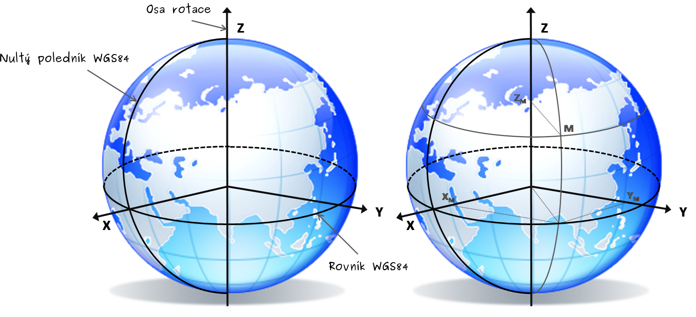

.. _wgs84:

WGS84
=====
:wikipedia:`World Geodetic System` (zkratka WGS84) je světově uznávaný
geodetický standard vydaný ministerstvem obrany USA v roce 1984. 
Jedná se o geocentrický pravoúhlý pravotočivý systém pevně spojený se Zemí.
Definuje souřadnicový systém a referenční elipsoid WGS84 pro geodézii a navigaci. 
Odchylky od
referenčního elipsoidu pak popisují geoid EGM84. V roce 1996 byl rozšířen o
zpřesněnou definici geoidu EGM96. Byl vytvořen na základě měření pozemních
stanic družicového polohového systému TRANSIT a nahrazuje dřívější systémy
WGS60, WGS66 a WGS72.
Tento systém je spojen s reálnou Zemí prostřednictvím souboru přesných
souřadnic WGS84 pozemních stanic kontrolního segmentu GPS.

WGS84 používá zeměpisné souřadnice. Polohu tedy určíme pomocí zeměpisné délky,
šířky a výšky. Šírka nabývá 0°-90° na sever od rovníku a 0°-90° na jih od
rovníku. Délka pak nabývá hodnot 0°-180° na západ od nultého poledníku a 0°-
180° na východ od nultého poledníku. Nultým poledníkem ve WGS84 je 
:wikipedia:`IERS Reference Meridian`. Leží 5.31 úhlových vteřin východně od 
:wikipedia:`Prime meridian (Greenwich)`.

Souřadnicový systém WGS84 dále používá i pravoúhlé souřadnice, které
jsou definovány pravotočivou kartézskou soustavou souřadnic se středem
v těžišti Země (včetně moří a atmosféry). Kladná osa :math:`x` směřuje k
průsečíku nultého poledníku a rovníku, kladná osa :math:`z` k severnímu pólu a
kladná osa :math:`y` je na obě předchozí kolmá ve směru doleva (90° východní
délky a 0° šířky), tvoří tak pravotočivou soustavu souřadnic.

    Referenční systém a pravoúhlé souřadnice bodu M v systéme WGS84 
    (zdroj: `Royal Observatory of Belgium <http://gnss.be/systems_tutorial.php>`_).
