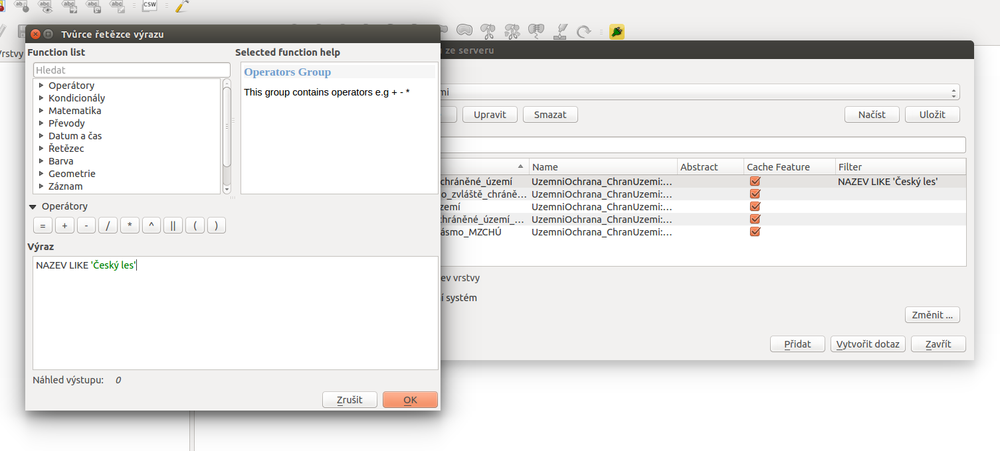

.. _ogc-wfs:

.. index::
   single: WFS; Web Feature Service
   pair: OGC OWS; WFS

OGC Web Feature Service - WFS
-----------------------------

Narozdíl od služeb :doc:`WMS <wms>` či :doc:`WMTS <wmts>`, které vrací
mapový náhled na poskytovaná data, služba **OGC Web Feature Service**
(`WFS <http://opengeospatial.org/standards/wfs>`_) slouží pro práci s
geografickými daty ve vektorové reprezentaci (tzv. "features" -
vektorové prvky). WFS primárně pracuje s formátem :doc:`gml`, další
formáty mohou být podporovány podle možností serveru.

Pokud dané řešení podporuje, je možné provádět vybrané
prostorové operace na straně serveru, stejně tak jako filtrovat prvky
(na základě prostorového nebo atributového dotazu) podle požadavků
klienta.

WFS poskytuje data v režimu čtení, nepodporuje tedy opačný směr toku
dat, tj. od klienta na server. Tuto problematiku řeší navazující
standard **WFS-T** (*Transactional WFS*), který tak umožňuje editovat
elementy na straně serveru, zamykat jednotlivé záznamy a pod.

.. index::
   pair: WFS; GetCapabities

WFS GetCapabilities
^^^^^^^^^^^^^^^^^^^

Jako příklad použijeme WFS server `AOPK ČR <http://www.ochranaprirody.cz>`_:

  http://gis.nature.cz/arcgis/services/UzemniOchrana/ChranUzemi/MapServer/WFSServer

Nejprve zjistíme vlastnosti serveru z tzv. *Capabilities* dokumentu:

https://gis.nature.cz/arcgis/services/UzemniOchrana/ChranUzemi/MapServer/WFSServer?server=WFS&request=GetCapabilities

.. code-block:: xml

  <wfs:WFS_Capabilities version="2.0.0" xsi:schemaLocation="http://w... >
    <ows:ServiceIdentification>
        <ows:Title>Chráněná území</ows:Title>
        <ows:Abstract>Služba zpřístupňuje geografická data zvláště a smluvně chráněných území v České republice</ows:Abstract>
        <ows:Keywords>
            <ows:Keyword>Chráněné území</ows:Keyword>
        </ows:Keywords>
        <ows:ServiceType>WFS</ows:ServiceType>
        <ows:ServiceTypeVersion>1.1.0</ows:ServiceTypeVersion>
        <ows:Fees>žádné</ows:Fees>
        <ows:AccessConstraints>licence (CC BY 3.0 CZ): Uveďte původ</ows:AccessConstraints>
    </ows:ServiceIdentification>
    <ows:ServiceProvider>
        <ows:ProviderName>Agentura ochrany přírody a krajiny České republiky</ows:ProviderName>
        <ows:ProviderSite xlink:href="http://www.ochranaprirody.cz"/>
        ...
    </ows:ServiceProvider>
    <ows:OperationsMetadata>
        ...
    </ows:OperationsMetadata>

Seznam dostupných typů prvků najdeme v sekci *FeatureTypeList*:

.. code-block:: xml

    <wfs:FeatureTypeList>
        <wfs:FeatureType>
            <wfs:Name>UzemniOchrana_ChranUzemi:Velkoplošné_zvláště_chráněné_území</wfs:Name>
            <wfs:Title>Velkoplošné_zvláště_chráněné_území</wfs:Title>
            <wfs:DefaultSRS>urn:ogc:def:crs:EPSG:6.9:5514</wfs:DefaultSRS>
            <wfs:OtherSRS>urn:ogc:def:crs:EPSG:6.9:4326</wfs:OtherSRS>
            <wfs:OutputFormats>
            <wfs:Format>text/xml; subType=gml/3.1.1/profiles/gmlsf/1.0.0/0</wfs:Format>
            </wfs:OutputFormats>
            <ows:WGS84BoundingBox>
                <ows:LowerCorner>12.135781691549301 48.405980213444934</ows:LowerCorner>
                <ows:UpperCorner>18.824874392730379 51.278530725092587</ows:UpperCorner>
            </ows:WGS84BoundingBox>
        </wfs:FeatureType>
        <wfs:FeatureType>
        ...
        <wfs:FeatureType>
            <wfs:Name>UzemniOchrana_ChranUzemi:Maloplošné_zvláště_chráněné_území__MZCHÚ_</wfs:Name>
            <wfs:Title>Maloplošné_zvláště_chráněné_území__MZCHÚ_</wfs:Title>
            <wfs:DefaultSRS>urn:ogc:def:crs:EPSG:6.9:5514</wfs:DefaultSRS>
            <wfs:OtherSRS>urn:ogc:def:crs:EPSG:6.9:4326</wfs:OtherSRS>
            <wfs:OutputFormats>
            <wfs:Format>text/xml; subType=gml/3.1.1/profiles/gmlsf/1.0.0/0</wfs:Format>
            </wfs:OutputFormats>
            <ows:WGS84BoundingBox>
                <ows:LowerCorner>11.996206262583122 48.270769845462425</ows:LowerCorner>
                <ows:UpperCorner>18.952872493443596 51.240248516869322</ows:UpperCorner>
            </ows:WGS84BoundingBox>
        </wfs:FeatureType>
        <wfs:FeatureType>
        ...
    </wfs:FeatureTypeList>

Filtrovací operace podporované serverem jsou vypsány v sekci *Filter_Capabilities*:

.. code-block:: xml

    <ogc:Filter_Capabilities>
        <ogc:Spatial_Capabilities>
            <ogc:GeometryOperands>
                <ogc:GeometryOperand>gml:Envelope</ogc:GeometryOperand>
                <ogc:GeometryOperand>gml:Point</ogc:GeometryOperand>
                <ogc:GeometryOperand>gml:Polygon</ogc:GeometryOperand>
                <ogc:GeometryOperand>gml:LineString</ogc:GeometryOperand>
            </ogc:GeometryOperands>
            <ogc:SpatialOperators>
                <ogc:SpatialOperator name="BBOX"/>
                <ogc:SpatialOperator name="Equals"/>
                <ogc:SpatialOperator name="Disjoint"/>
                <ogc:SpatialOperator name="Intersects"/>
                <ogc:SpatialOperator name="Crosses"/>
                <ogc:SpatialOperator name="Touches"/>
                <ogc:SpatialOperator name="Within"/>
                <ogc:SpatialOperator name="Contains"/>
                <ogc:SpatialOperator name="Overlaps"/>
            </ogc:SpatialOperators>
        </ogc:Spatial_Capabilities>
        <ogc:Scalar_Capabilities>
            <ogc:LogicalOperators/>
            <ogc:ComparisonOperators>
                <ogc:ComparisonOperator>EqualTo</ogc:ComparisonOperator>
                <ogc:ComparisonOperator>NotEqualTo</ogc:ComparisonOperator>
                <ogc:ComparisonOperator>LessThan</ogc:ComparisonOperator>
                <ogc:ComparisonOperator>GreaterThan</ogc:ComparisonOperator>
                <ogc:ComparisonOperator>LessThanEqualTo</ogc:ComparisonOperator>
                <ogc:ComparisonOperator>GreaterThanEqualTo</ogc:ComparisonOperator>
                <ogc:ComparisonOperator>Like</ogc:ComparisonOperator>
                <ogc:ComparisonOperator>Between</ogc:ComparisonOperator>
                <ogc:ComparisonOperator>NullCheck</ogc:ComparisonOperator>
            </ogc:ComparisonOperators>
        </ogc:Scalar_Capabilities>
        <ogc:Id_Capabilities>
            <ogc:EID/>
            <ogc:FID/>
        </ogc:Id_Capabilities>
        </ogc:Filter_Capabilities>
    </wfs:WFS_Capabilities>

Stáhnutí dat
^^^^^^^^^^^^

Stažení dat obstará dotaz typu *GetFeature*, kde navíc musíte
specifikovat *typename*, tj. typ prvků, který chcete obdžet jako
výsledek dotazu. Server vratí prvky ve výchozím datovém formátu
(tj. :doc:`GML`) a souřadnicivém systému, v případě ukázkového serveru
to je S-JTSK (:epsg:`5514`).

::

   https://gis.nature.cz/.../WFSServer?server=WFS&request=GetFeature&typename=UzemniOchrana_ChranUzemi:...
                                            |            |                   |
   typ sluzby ------------------------------+            |                   |
   dotaz typu GetFeature --------------------------------+                   |
   specifikace typu prvku (typename)-----------------------------------------+

Příklad pro získání prvků velkoprošných chráněných území:
   
`https://gis.nature.cz/.../WFSServer?server=WFS&request=GetFeature&typename=UzemniOchrana_... <https://gis.nature.cz/arcgis/services/UzemniOchrana/ChranUzemi/MapServer/WFSServer?server=WFS&request=GetFeature&typename=UzemniOchrana_ChranUzemi:Velkoplo%C5%A1n%C3%A9_zvl%C3%A1%C5%A1t%C4%9B_chr%C3%A1n%C4%9Bn%C3%A9_%C3%BAzem%C3%AD>`_

Pokud si přejeme stáhnout data v jiném než výchozím souřadnicovém
systému, můžeme jej definovat pomocí parametru *srsname*. Následuje
příklad pro získání dat v souřadnicovém systému WGS-84 (:epsg:`4326`,
pozor na pořadí souřadnic (viz *Capabilities response*)):

`https://gis.nature.cz/.../WFSServer?server=WFS&request=GetFeature&typename=UzemniOchrana_...&srsname=epsg:4326
<https://gis.nature.cz/arcgis/services/UzemniOchrana/ChranUzemi/MapServer/WFSServer?server=WFS&request=GetFeature&typename=UzemniOchrana_ChranUzemi:Velkoplo%C5%A1n%C3%A9_zvl%C3%A1%C5%A1t%C4%9B_chr%C3%A1n%C4%9Bn%C3%A9_%C3%BAzem%C3%AD&srsname=epsg:4326>`_

Filtrování dat
~~~~~~~~~~~~~~

Následuje příklad stažení dat vybraných na základě **prostorového**
filtru. Filtr je předán parametrem *filter* a definován dle standardu
`OGC Filter Encoding
<http://www.opengeospatial.org/standards/filter>`_. V našem připadě
může vypadat následovně (v jedné řadce):

.. code-block:: xml
                
   <ogc:Filter>
      <ogc:Within>
        <ogc:PropertyName>SHAPE</ogc:PropertyName>
        <gml:Envelope>
           <gml:lowerCorner>48.4744444 12.7083628</gml:lowerCorner>
           <gml:upperCorner>49.4017450 14.8397106</gml:upperCorner>
        </gml:Envelope>
      </ogc:Within>
   </ogc:Filter>

.. warning:: Níže uvedené příklady berte prozatím pouze jako ilustrační,
             server AOPK ČR působí, že prostorové filtrování v současné
             době nepodporuje (viz sekce *Filter_Capabilities* v
             dokumentu *Capabilities*).

Vybereme tedy prvky, které leží uvnitř (*within*) daného minimálního
ohraničujícího obdélníku:
   
`https://gis.nature.cz/.../WFSServer?server=WFS&request=GetFeature&typename=UzemniOchrana_...&srsname=epsg:4326&filter=<ogc:Filter>... <https://gis.nature.cz/arcgis/services/UzemniOchrana/ChranUzemi/MapServer/WFSServer?server=WFS&request=GetFeature&typename=UzemniOchrana_ChranUzemi:Velkoplo%C5%A1n%C3%A9_zvl%C3%A1%C5%A1t%C4%9B_chr%C3%A1n%C4%9Bn%C3%A9_%C3%BAzem%C3%AD&srsname=epsg:4326&filter=%3Cogc:Filter%3E%3Cogc:Within%3E%3Cogc:PropertyName%3ESHAPE%3C/ogc:PropertyName%3E%3Cgml:Envelope%3E%3Cgml:lowerCorner%3E48.4744444 12.7083628%3C/gml:lowerCorner%3E%3Cgml:upperCorner%3E49.4017450 14.8397106%3C/gml:upperCorner%3E%3C/gml:Envelope%3E%3C/ogc:Within%3E%3C/ogc:Filter%3E>`_

Podobně může být definován **atributový** filtr:

.. code-block:: xml

   <ogc:Filter>
      <ogc:PropertyIsLike wildCard="%" singleChar="?" escapeChar="!">
         <ogc:PropertyName>NAZEV</ogc:PropertyName>
         <ogc:Literal>Český kras</ogc:Literal>
      </ogc:PropertyIsLike>
   </ogc:Filter>
                
kdy vybereme pouze prvky velkoplošných chraněných území, které mají
atribut NAZEV s hodnotou "Český kras". Jinými slovy získáme všechny
polygony, které definují CHKO Český kras:

`https://gis.nature.cz/.../WFSServer?server=WFS&request=GetFeature&typename=UzemniOchrana_...&srsname=epsg:4326&filter=<ogc:Filter><ogc:PropertyIsLike... <https://gis.nature.cz/arcgis/services/UzemniOchrana/ChranUzemi/MapServer/WFSServer?server=WFS&request=GetFeature&typename=UzemniOchrana_ChranUzemi:Velkoplo%C5%A1n%C3%A9_zvl%C3%A1%C5%A1t%C4%9B_chr%C3%A1n%C4%9Bn%C3%A9_%C3%BAzem%C3%AD&srsname=epsg:4326&filter=%3Cogc:Filter%3E%3Cogc:PropertyIsLike wildCard="%" singleChar="?" escapeChar="!"%3E%3Cogc:PropertyName%3ENAZEV%3C/ogc:PropertyName%3E%3Cogc:Literal%3EČeský kras%3C/ogc:Literal%3E%3C/ogc:PropertyIsLike%3E%3C/ogc:Filter%3E'>`_
   
Filtrovat data poskytovaná službou WFS lze pohodlně ve vhodném
desktopové klientovi, např. :skoleni:`QGIS <qgis-zacatecnik>`:

::
  
  NAZEV LIKE 'Český les'

  Ukázka aplikace WFS filtru v prostředí QGIS.
