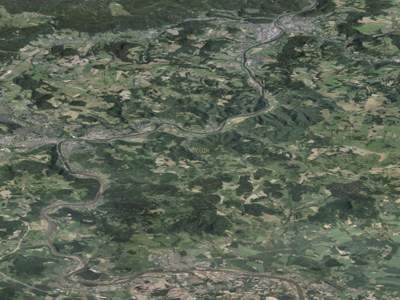

.. _ogc-wms:

OGC Web Map Service - WMS
-------------------------

.. index::
   single: WMS; Web Map Service
   pair: OGC OWS; WMS

**OGC Web Map Service** (`WMS
<http://opengeospatial.org/standards/wms>`_) je asi nejrozšířenější a
nejpoužívanější standard OGC. OGC WMS slouží k popisu toho, jakým
způsobem požaduje klient po serveru vygenerovat mapový náhled z dat
uložených (z pohledu klienta) na serveru.  Symbologii mapy lze do
určité míry ovlivnit, vstupní data nikoliv.

OGC WMS definuje 3 typy dotazů, tzv. *requestů*:

* **GetCapabilities**
* **GetMap**
* Nepovinný **GetFeatureInfo**

.. note:: Většina webových služeb OGC funguje podobně, proto se
          pokusíme WMS rozebrat podrobněji.

.. index::
   pair: WMS; GetCapabities

.. _ogc-wms-capabilities:

WMS GetCapabilities
^^^^^^^^^^^^^^^^^^^
Jako příklad zvolíme službu ČÚZK, poskytující letecké ortofoto snímky, dostupnou na
adrese:

http://geoportal.cuzk.cz/WMS_ORTOFOTO_PUB/WMService.aspx

Tzv. `Capabilities` dokument obdržíme pomocí dotazu *GetCapabilities*:

http://geoportal.cuzk.cz/WMS_ORTOFOTO_PUB/WMService.aspx?service=WMS&request=GetCapabilities

.. index:: URL
           
Pokusíme se výše uvednou :wikipedia:`URL` blíže rozebrat:

::

    http://geoportal.cuzk.cz/WMS_ORTOFOTO_PUB/WMService.aspx?service=WMS&request=GetCapabilities
                                                           ^          ^                 ^
    Adresa serveru ČUZK se službou leteckým snímků --------+          |                 |
    Specifikace požadované služby OGC WMS ----------------------------+                 |
    Specifikace dotazu GetCapabilities -------------------------------------------------+

Po zadání této adresy do webového prohlížeče server ČÚZK vrátí XML
dokument popisující jeho schopnosti. V případě OGC WMS má 2 části
(první část bývá pro všechny služby OGC OWS stejná nebo alespoň hodně
podobná) - metadata serveru (v části *Service*) a informace o
dostupných službách (*Capability*):

.. code-block:: xml
    
    <WMS_Capabilities xsi:schemaLocation="http://www.opengis.net/wms ....>
        <Service>
            <Name>WMS</Name>
            <Title>Prohlížecí služba WMS - Ortofoto</Title>
            <Abstract>Prohlížecí služba WMS-ORTOFOTO je poskytována jako veřejná ...</Abstract>
            ...
            <ContactInformation>
            ...
            </ContantInformation>
            <Fees>Neplatí</Fees>
            <AccessConstraints>http://geoportal.cuzk.cz/Dokumenty/Podminky_sluzby_CUZK.pdf</AccessConstraints>
        </Service>
        <Capability>
            <Request>
                ...
            </Request>
            <inspire_vs:ExtendedCapabilities>
                ...
            </inspire_vs:ExtendedCapabilities>
            <Layer>
                ...
            </Layer>
        </Capability>
    </WMS_Capabilities>

.. index::
   pair: WMS; Service

Service
"""""""
V části dokumentu označené jako *Service* jsou uloženy metadata služby. Její
*jméno*, *titulek* a širší popis, tzv. *abstrakt*. Dále zde nalezneme kontaktní
informace na provozovatele služby, informace o poplatcích a omezeních přístupu.

.. index::
   pair: WMS; Capability

Capability
""""""""""
V části *Capability* jsou již praktické informace pro připojení služby, adresy
URL na jednotlivé dotazy (*GetCapabilities*, *GetMap* a *GetFeatureInfo*, které
mohou být různé(!)) a seznam dostupných vrstev (ten může být hierarchicky
zanořený).

Dokument také může obsahovat relativně obsáhlou část, kterou jsou
metadata doplněna o atributy vyžadované směrnicí :doc:`INSPIRE
<../inspire>`. V původní definici dokumentu toto vyžadováno
není. INSPIRE tak pouze rozšiřuje existující standard (což považujeme
za příhodné a elegantní řešení).

.. index::
   pair: WMS; Layer

Layer
"""""

Podíváme se blíže na část `Layer`:

.. code-block:: xml
    
    ...
    <Layer cascaded="1">
        <Name>GR_ORTFOTORGB</Name>
        <Title>Ortofoto</Title>
        <Abstract>Vrstva Ortofoto</Abstract>
        <KeywordList>
            <Keyword>ortofoto</Keyword>
        </KeywordList>
        <CRS>EPSG:5514</CRS>
        <CRS>EPSG:4326</CRS>
        <CRS>EPSG:3857</CRS>
        ...
        <BoundingBox CRS="EPSG:5514" minx="-950003.17502118601" miny="-1250003.1750036045"
         maxx="-399990.47499578597" maxy="-899996.82499090442"
         resx="6.3500127000253999" resy="-6.3500127000253999"/>
        <BoundingBox CRS="EPSG:4326" miny="11.214011580382529" minx="47.964914601259672"
         maxy="19.407662623095131" maxx="51.691664934538636"/>
        <BoundingBox CRS="EPSG:3857" minx="1248338.0588780562" miny="6101019.8582439059"
         maxx="2160451.1206905982" maxy="6744565.3811490489"/>
        ...
        <Attribution>
            <Title>© Český úřad zeměměřický a katastrální</Title>
            <OnlineResource xlink:href="http://www.cuzk.cz" xlink:type="simple"/>
            <LogoURL height="20" width="20">
                <Format>image/gif</Format>
                <OnlineResource xlink:href="http://geoportal.cuzk.cz/design/logo.gif" xlink:type="simple"/>
            </LogoURL>
        </Attribution>
        ...
        
        <MinScaleDenominator>2.5253813613805272</MinScaleDenominator>
        <MaxScaleDenominator>7576144.0841415804</MaxScaleDenominator>
    </Layer>
    ...

Každá vrstva je identifikovaná svým jménem (*Name*), má nadpis
(*Title*) a může mít širší popis (*Abstract*). Za klíčovými slovy
následuje seznam podporovaných souřadnicových systémů. Některé servery
podporují ve výchozím nastavení "všechny", což značně komplikuje
strojové zpracování podobných odpovědí.

V další části lze dohledat hraniční souřadnice dat *BoundingBox*. *Attribution*
pak obsahuje informace o licenci a copyrightu. Některé vrstvy nabízejí více
možností, např. jak zobrazit symbologii (*Style*). Nakonec následují informace o
měřítcích, ve kterých se bude daná vrstva vykreslovat.

.. index::
   pair: WMS; GetMap

WMS GetMap
^^^^^^^^^^

Po prostudování dokumentu *Capabilities* jsme schopni (nebo námi
napsaný program) sestavit dotaz typu *GetMap*, který vrátí požadovaný
mapový náhled na poskytovaná data. Výsledek WMS služba vratí na
základě dotazu, ve kterém musí být specifikováno:

* Identifikátor vrstev
* Souřadnicový systém
* Hraniční souřadnice požadovaného výřezu
* Velikost obrázku
* Formát obrázku
* a některé nepovinné parametry

::

    http://geoportal.cuzk.cz/WMS_ORTOFOTO_PUB/WMService.aspx?
    ^   service=WMS&
    |   ^   request=GetMap&
    |   |   ^   version=1.3.0&
    |   |   |   ^   layers=GR_ORTFOTORGB&
    |   |   |   |   ^   format=image/jpeg&
    |   |   |   |   |   ^   width=800&height=600&
    |   |   |   |   |   |   ^   bbox=50.5,14.0,50.8,14.3&
    |   |   |   |   |   |   |   ^   crs=epsg:4326&
    |   |   |   |   |   |   |   |   ^   styles=
    |   |   |   |   |   |   |   |   |   ^
    |   |   |   |   |   |   |   |   |   +- Legenda (symbologie)
    |   |   |   |   |   |   |   |   +- Souřadnicový systém
    |   |   |   |   |   |   |   +- Hraniční souřadnice výřezu
    |   |   |   |   |   |   +- Velikost obrázku
    |   |   |   |   |   +- Formát výstupního obrázku
    |   |   |   |   +- Seznam vrstev
    |   |   |   +- Verze standardu
    |   |   +- Požadavek GetMap
    |   +- Specifikace služby
    +- Server URL

Příklad:
    
http://geoportal.cuzk.cz/WMS_ORTOFOTO_PUB/WMService.aspx?service=WMS&request=GetMap&version=1.3.0&layers=GR_ORTFOTORGB&format=image/jpeg&width=800&height=600&bbox=50.5,14.0,50.8,14.3&crs=epsg:4326&styles= 

    
    Letecký snímek získaný pomocí služby OGC WMS ze serverů ČUZK.

.. note:: Všiměte si, že hraniční souřadnice (*bbox*) jsou zadány ve formě `miny, minx,
    maxy, maxx` - což je v rozporu s obecně platným zápisem párů souřadnic `[x, y]`. 

    To je způsobeno tím, že ve standardu WMS verze 1.3.0 se dbá na
    pořadí souřadnic, *jak jsou definovány v souřadnicovém
    systému*. Systém WGS84 preferuje zápis v pořadí Y, X
    (tj. zeměpisná šířka a délka). Stejné platí např. INSPIREm
    předepsaný souřadnicnicový systém ETRS (:epsg:`3035`) či pro
    systém S-JTSK (:epsg:`5514`). Viz kapitola
    :doc:`../../soursystemy/index`. V praxi se ale pořadí os souřadnic
    `[x, y]` zachovává.

    Jak lze tušit, způsobuje tato nekonzistence množství problémů v komunikaci
    mezi servery klienty, i vzhledem k tomu, že ve starších verzích standardu
    WMS byl zápis pořadí souřadnic *vždy* `[x, y]`.

.. index::
   pair: WMS; GetFeatureInfo

WMS GetFeatureInfo
^^^^^^^^^^^^^^^^^^

Pokud daná vrstva (*Layer*) tento dotaz podporuje, tak je možné se
dotázat na hodnotu pixelu na daných souřadnicích. To zda je tento
dotaz podporován zjistíme z atributu `queryable` u každé vrstvy. V
případě výše uvedené služby, není žádná vrstva dotazovatelná (viz
dokument *Capalities*). Služby nabízející náhled na datovou sadu ZABAGED
nicméně takovou dotazovatelnou vrstvu obsahuje:

http://geoportal.cuzk.cz/WMS_ZABAGED_PUB/WMService.aspx?SERVICE=WMS&VERSION=1.3.0&REQUEST=GetCapabilities

.. code-block:: xml

    ...
    <Layer queryable="1" opaque="0" noSubsets="0">
        <Name>GL_CA010</Name>
        <Title>Vrstevnice základní</Title>
        <Abstract>Vrstva Vrstevnice základní</Abstract>
        <KeywordList>
            <Keyword>vrstevnice základní</Keyword>
        </KeywordList>
        <CRS>EPSG:3035</CRS>
        <CRS>EPSG:3034</CRS>
        <CRS>EPSG:4326</CRS>
        <CRS>EPSG:4258</CRS>
        ...
        <MinScaleDenominator>1</MinScaleDenominator>
        <MaxScaleDenominator>15000</MaxScaleDenominator>
    </Layer>
    ...

Dotaz typu *GetFeatureInfo* vyžaduje stejné parametry jako *GetMap* a
k tomu ještě následující hodnoty:

* `request=GetFeatureInfo` hodnota parametru `request` je samozřejmě změněna
* `QUERY_LAYERS=GL_CA010` vrstvy o které se zajímáme
* `INFO_FORMAT=text/html` formát odpovědi
* `I=568&J=179` souřadnice dotazu v pixelech obrázku

http://geoportal.cuzk.cz/WMS_ZABAGED_PUB/WMService.aspx?SERVICE=WMS&VERSION=1.3.0&REQUEST=GetFeatureInfo&BBOX=49.87085021713301103,15.03782399164211903,49.88182000062317911,15.05671808005681278&CRS=EPSG:4326&WIDTH=1247&HEIGHT=724&LAYERS=GL_CA010&STYLES=&FORMAT=image/png&QUERY_LAYERS=GL_CA010&INFO_FORMAT=text/html&I=568&J=179&FEATURE_COUNT=10

Odpověď ze serveru:

.. table::
   :class: border
        
   +---------------------+
   | Vrstevnice základní |
   +======+==============+
   |ID    | 24358813     |
   +------+--------------+
   |MAPNO | 133221       |
   +------+--------------+
   |VYSKA | 408          |
   +------+--------------+
   | TYP  | ZM10         |
   +------+--------------+        

.. index:: QGIS
              
.. note:: Dotaz byl poskládán pomocí programu :skoleni:`QGIS
    <qgis-zacatecnik>`. Odhadovat BBOX vrstvy a souřadnice obrázku
    samozřejmě lze (po dopočítání rozlišení pixelu), pomocí výše
    uvedeného software je to ale přesnější.
