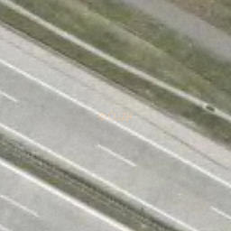

.. _ogc-wmts:

OGC Web Map Tiled Service - WMTS
--------------------------------

S příchodem `mapové aplikace firmy Google <http://maps.google.com>`_
se značně změnil přístup k poskytování podkladových mapových
kompozic. Uživatelé pochopili, že pro více-méně statická data (jako
jsou letecké snímky či topografická mapa, atd.) je možné předgenerovat
výslednou mapu do formy dlaždic (anglicky *tile*), ty pak lze ze
serveru odbavovat relativně rychle. Cenou za rychlost je omezení
nabízených souřadnicových systémů (pro každý nabízený souřadnicový
systém se musí vyrobit a udržovat celá dlaždicová sada zvlášť) a
dostupných měřítek na předem připravené kroky.

Odpovědí na tuto potřebu je specifikace `OGC WMTS
<http://opengeospatial.org/standards/wmts>`_ (Web Map Tiled
Service). Ta umožňuje definovat dostupné dlaždicové sady pro různá
měřítka a souřadnicové systémy.

.. index::
   pair: WMTS; GetCapabities

WMTS GetCapabilities
^^^^^^^^^^^^^^^^^^^^

Podobně jako u :ref:`ogc-wms-capabilities`, má dotaz typu *GetCapabilities* i služba
WMTS. Otestujeme ji opět na serverech ČÚZK:

http://geoportal.cuzk.cz/WMTS_ORTOFOTO/WMTService.aspx?service=WMTS&request=GetCapabilities

Odpověď ze serveru má opět více částí:

.. code-block:: xml

    <Capabilities xsi:schemaLocation="http://www.opengis.net/wmts/1.0 ...>
        <ows:ServiceIdentification>...</ows:ServiceIdentification>
        <ows:ServiceProvider>...</ows:ServiceProvider>
        <ows:OperationsMetadata>...</ows:OperationsMetadata>
        <Contents>...</Contents>
    </Capabilities>
   
Vidíme, že výsledný dokument má 4 části:

    * Identifikace služby (*ServiceIdentification*)
    * Identifikace poskytovatele (*ServiceProvider*)
    * Metadata operací (requestů) (*OperationsMetadata*)
    * Vlastní obsah služby (*Contents*)

      
ServiceIdenitication
""""""""""""""""""""

.. code-block:: xml

    ...
    <ows:ServiceIdentification>
        <ows:Title>Prohlížecí služba WMTS - Ortofoto ČR</ows:Title>
        <ows:Abstract>Prohlížecí služba WMTS-ORTOFOTO-P je poskytována ...</ows:Abstract>
        <ows:Keywords>
        <ows:Keyword>WMTS</ows:Keyword>
        <ows:Keyword>OTDF</ows:Keyword>
        </ows:Keywords>
        <ows:ServiceType>OGC WMTS</ows:ServiceType>
        <ows:ServiceTypeVersion>1.0.0</ows:ServiceTypeVersion>
        <ows:Fees>no conditions apply</ows:Fees>
        <ows:AccessConstraints>http://geoportal.cuzk.cz/Dokumenty/Podminky_sluzby_CUZK.pdf</ows:AccessConstraints>
    </ows:ServiceIdentification>
    ...

Vidíme, že služba se chová podobně jako :doc:`OGC WMS <wms>`. Je dána svým
identifikátorem (*Name*), nadpisem, abstraktem, klíčovými slovy,
dostupnými verzemi, informacemi o poplatcích a licencí.

ServiceProvider
"""""""""""""""

.. code-block:: xml

        ...
        <ows:ServiceProvider>
            <ows:ProviderName>Zeměměřický úřad</ows:ProviderName>
            <ows:ProviderSite xlink:href="http://geoportal.cuzk.cz"/>
            <ows:ServiceContact>
                <ows:IndividualName>Srovnal Pavel, Mgr.</ows:IndividualName>
                <ows:PositionName/>
                <ows:ContactInfo>
                    <ows:Phone>
                        <ows:Voice>+420 000 000 000</ows:Voice>
                        <ows:Facsimile/>
                    </ows:Phone>
                    <ows:Address>
                        <ows:DeliveryPoint>Pod sídlištěm 9</ows:DeliveryPoint>
                        <ows:City>Praha</ows:City>
                        <ows:AdministrativeArea/>
                        <ows:PostalCode>182 11</ows:PostalCode>
                        <ows:Country>Česká republika</ows:Country>
                        <ows:ElectronicMailAddress>pavel.srovnal [zavináč] cuzk [tečka] cz</ows:ElectronicMailAddress>
                    </ows:Address>
                </ows:ContactInfo>
            </ows:ServiceContact>
        </ows:ServiceProvider>
        ...

Část *ServiceProvider* poskytuje adresu a další kontaktní informace na
poskytovatele.

OperationsMetadata
""""""""""""""""""

.. code-block:: xml

    <ows:OperationsMetadata>
        <ows:Operation name="GetCapabilities">
            <ows:DCP>
                <ows:HTTP>
                    <ows:Get xlink:href="http://geoportal-orto.cuzk.cz/WMTS_ORTOFOTO/service.svc/get?"/>
                </ows:HTTP>
            </ows:DCP>
            <ows:Parameter name="AcceptFormats">
                <ows:AllowedValues>
                    <ows:Value>application/xml</ows:Value>
                    <ows:Value>text/xml</ows:Value>
                </ows:AllowedValues>
            </ows:Parameter>
        </ows:Operation>
        <ows:Operation name="GetTile">
            <ows:DCP>
                <ows:HTTP>
                    <ows:Get xlink:href="http://geoportal-orto.cuzk.cz/WMTS_ORTOFOTO/service.svc/get?"/>
                </ows:HTTP>
            </ows:DCP>
        </ows:Operation>
    </ows:OperationsMetadata>

*OperationsMetadata* popisuje adresy URL pro jednotlivé operace (requesty). Vidět
můžeme detailní informace pro dotazy typu *GetCapabilities* a *GetTile*.

Contents
""""""""

Vlastní obsah služby popíšeme po jednotlivých částech. Nejprve
začínáme seznamem dostupných vrstev, jejich názvem, titulkem,
abstraktem a hraničními souřadnicemi.

.. code-block:: xml

    <Contents>
        <Layer>
            <ows:Title>Ortofoto ČR</ows:Title>
            <ows:Abstract>Ortofoto ČR</ows:Abstract>
            <ows:Keywords/>
            <ows:Identifier>orto</ows:Identifier>
            <ows:WGS84BoundingBox>
                <ows:LowerCorner>12.066950249369 48.535342162056</ows:LowerCorner>
                <ows:UpperCorner>18.886701204096 51.080141266427</ows:UpperCorner>
            </ows:WGS84BoundingBox>
            
            <Format>image/png</Format>
            <Format>image/jpeg</Format>

Každá vrstva odkazuje pomocí "Linků" na tzv. *MatrixSet* připraveného
schématu dlaždic. Pro každé měřítko a souřadnicový systém specifikuje
rozmezí sloupečků a řádků v matici dlaždic:

.. code-block:: xml

            <TileMatrixSetLink>
                <TileMatrixSet>jtsk:epsg:5514</TileMatrixSet>
                <TileMatrixSetLimits>
                    ...
                    <TileMatrixLimits>
                        <TileMatrix>5</TileMatrix>
                        <MinTileRow>0</MinTileRow>
                        <MaxTileRow>20</MaxTileRow>
                        <MinTileCol>0</MinTileCol>
                        <MaxTileCol>31</MaxTileCol>
                    </TileMatrixLimits>
                    <TileMatrixLimits>
                        <TileMatrix>6</TileMatrix>
                        <MinTileRow>0</MinTileRow>
                        <MaxTileRow>40</MaxTileRow>
                        <MinTileCol>0</MinTileCol>
                        <MaxTileCol>62</MaxTileCol>
                    </TileMatrixLimits>
                    ...
                </TileMatrixSetLimits>
            </TileMatrixSetLink>
        </Layer>

Po seznamu vrstev následuje seznam tzv. *MatrixSetů* - připravených
schémat dlaždicové sady. V našem příkladu si to ukážeme na schématu
pro souřadnicový systém S-JTSK:

.. code-block:: xml

        <TileMatrixSet>
            <ows:Identifier>jtsk:epsg:5514</ows:Identifier>
            <ows:BoundingBox>
                <ows:LowerCorner>-925000.000000000000 -1444353.535999999800</ows:LowerCorner>
                <ows:UpperCorner>-400646.464000000040 -920000.000000000000</ows:UpperCorner>
            </ows:BoundingBox>
            <ows:SupportedCRS>EPSG:5514</ows:SupportedCRS>

Po počátečních metadatech následuje definice levého-horního rohu, velikost
dlaždice a počet sloupců/řádků matice dlaždic:

.. code-block:: xml

            <TileMatrix>
                <ows:Identifier>0</ows:Identifier>
                <ScaleDenominator>7315200</ScaleDenominator>
                <TopLeftCorner>-925000.000000000000 -920000.000000000000</TopLeftCorner>
                <TileWidth>256</TileWidth>
                <TileHeight>256</TileHeight>
                <MatrixWidth>1</MatrixWidth>
                <MatrixHeight>1</MatrixHeight>
            </TileMatrix>
            ...
            <TileMatrix>
                <ows:Identifier>14</ows:Identifier>
                <ScaleDenominator>446.484375</ScaleDenominator>
                <TopLeftCorner>-925000.000000000000 -920000.000000000000</TopLeftCorner>
                <TileWidth>256</TileWidth>
                <TileHeight>256</TileHeight>
                <MatrixWidth>16384</MatrixWidth>
                <MatrixHeight>16384</MatrixHeight>
            </TileMatrix>
        </TileMatrixSet>
    </Contents>

Na základě tohoto dokumentu, lze tedy zkonstruovat dotaz typu
*GetTile*, který vrátí požadovanou dlaždici v daném měřítku a
umístění:

http://geoportal.cuzk.cz/WMTS_ORTOFOTO/WMTService.aspx?service=wmts&request=gettile&version=1.0.0&layer=orto&format=image/jpeg&TileMatrixSet=jtsk:epsg:5514&TileMatrix=14&TileRow=4001&TileCol=8191&style=default

        
   Dlaždice ze služby `ČUZK Ortofoto WMTS <http://geoportal.cuzk.cz/(S(vqbwo5id0qvp14kha13iwkqb))/Default.aspx?mode=TextMeta&side=wmts.uvod&metadataID=CZ-CUZK-WMTS-ORTOFOTO-P&metadataXSL=metadata.sluzba&head_tab=sekce-03-gp&menu=3151>`_.

