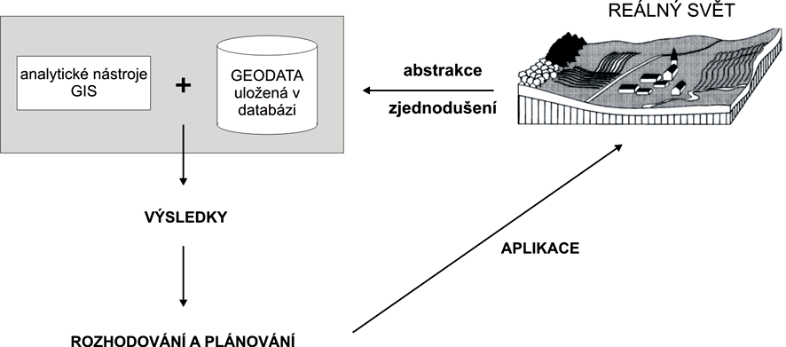

Úvod
====

Úvodní kapitola nastiňuje motivaci, proč pracovat s nástroji open source GIS. 
Dále poskytuje přehled zdrojů, odkazy na komunitní skupiny světové i lokální.

Proč GIS
--------

:wikipedia:`Geografický informační systém` (GIS) je na počítačích
založený informační systém pro získávání, ukládání, analýzu a
vizualizaci dat, která mají prostorový vztah k povrchu Země. Hovoříme
o geografických datech, zkráceně *geodatech* (angl. spatial data, spatial 
information). 

Počátek geoinformačních technologií a vědního oboru geoinformatiky sahá do Kanady 
a 60. let 20. století. Tu se přišlo na to, že úkoly jako například plánování 
regionálniho rozvoja území jsou jako stvořené pro informační technologie, které 
lze při správném používání podle správně zadaných algoritmů efektivně využít.

Prostorově orientovaný informační systém shromažďuje a zpracováva data,
poskytuje informace a poznatky vázané k místu svého vzniku a k místu svého
použití. Vyvinul se z map středních a malých měřítek. Obecně klade nižší 
požadavky na podrobnost a polohovou přesnost, naproti tomu vysoké požadavky 
na aktuálnost dat. 

Možno říci, že GIS se skládá z:

 * hardwaru,
 * softwaru,
 * dat,
 * pracovnícků (operátorů a uživatelů).
  
.. _gis-slozeni:
      

    
   Hlavní složky GIS.

GIS využíva data z digitální fotogrammetrie a DPZ, geografické průzkumy, analýzy 
a statistiky. Pomocí dostupných softwarových a hardwarových prostředků umožňuje 
vytvářet digitální modely části zemského povrchu. Takto vytvořený model
lze pak využít například při evidenci katastru nemovitostí, předpovídání vývoje
počasí, určování záplavových zón řek, výběru vhodné lokace pro čistírnu
odpadních vod, plánování výstavby silnic, krizové řízení apod.

Geodata, geoprvky
-----------------

Jak bylo již zmíněno, GIS pracuje s prostorovými daty, tzv. *geodaty*. 
Ty se skládají z jednotlivých (geo)prvků. Každý *geoprvek* představuje 
model fenoménu reálného světa. Od jiných objektů ho je možné odlišit 
na základě prostorové polohy, tematických charakteristik, polohových vztahů 
k jiným geoprvkům a časových změn.

Geoprvek je teda tvořen dvěma základními složkami:

* *geometrickou* (informaci o tvaru, umístění na zemském povrchu),
* *popisnou, atributovou* (nejčastěji popisné vlastnosti každého prvku).

Další složky popisují tzv. *topologii* (vztah k jiným geoprvkům), případně *dynamiku* 
(časové změny geoprvku).

Reprezentace reálného světa se od té reálné liši, protože interpretace vždy 
zahrnuje určitou míru abstrakce, která je pro zpracování v GIS nezbytná.

.. _mira-abstrakce:
      

    
   Digitální reprezentace reálného světa (zdroj: 
   `GIS v regionálním rozvoji <https://is.mendelu.cz/eknihovna/opory/index.pl?opora=5784>`_).

Důležitá je zejména prostorová dimenze objektů, která charakterizuje jeho 
rozšíření v různých směrech prostoru:

.. table::
   :class: border
        
   +----------------------------------------------+
   |                  Dimenze objektů             |
   +===========+=======+=======+=======+==========+
   | **Modely**| **0D**|**1D** |**2D** |  **3D**  |
   +-----------+-------+-------+-------+----------+
   |geometrický|  bod  | linie | plocha|  těleso  |
   +-----------+-------+-------+-------+----------+
   |topologický| uzel  | hrana |polygon|polyhedron|
   +-----------+-------+-------+-------+----------+
   |dynamický  | čas                              |
   +-----------+-------+-------+-------+----------+
  
Datový model
------------

Jak již bylo řečeno, pomocí nástrojů GIS vytváříme modely objektů
(fenoménů) reálného světa. Správně určit datovou strukturu (reprezentaci 
v databázi) a navrhnout nejvhodnější kartografickou reprezentaci při jejich 
vizualizaci je důležité. 
Rozlišuje se dvě základní reprezentace dat:

**Vektorový formát**
    Prvek je popsán nejčastěji svým obrysem pomocí párů (ve 3D tripletů)
    souřadnic lomových bodů. Nejčastěji si v rámci vektorového modelu vystačíme
    s body nebo liniemi a polygony.

**Rastrový formát**
    Představuje nejčastěji uspořádanou matici hodnot (buňek), které
    označujeme jako pixely. Buňky mohou být 3D, pak hovoříme o
    tzv. voxelech (volume pixel).

.. _datovy-model:
      
.. figure:: ./images/datovy-model.png
   :class: middle
    
   Vektorová a rastrová reprezentace objektů (podle Voženílek, 1998).

*Diskrétní* fenomény  (katastr, uliční síť, mapa výskytu vorvaňů) se
nejčastěji modeluje pomocí vektorového reprezentace dat.

*Spojité* fenomény (nadmořská výška, srážková mapa, teplotní mapa a
pod.) se nejčastěji modelují pomocí rastrové reprezentace dat.

Proč open source
----------------
:wikipedia:`Otevřený software` (open source) je počítačový software, jehož licence
podle definice `FSF <https://www.gnu.org/philosophy/free-sw.en.html>`_ 
(Free Software Foundation, resp. Nadace svobodného software) umožňuje:

* **Freedom 0**: spouštět program jakýmkoli způsobem pro jakýkoliv účel,
* **Freedom 1**: modifikovat program, aby co nejlépe vyhovoval uživateli (pomoci sobě),
* **Freedom 2**: distribuovat kopie programu (pomoci přátelům),
* **Freedom 3**: publikovat dokonalejší verzi i pro ostatní (pomoci vybudovat komunitu).

Open source není business model, ale *vývojový model*. Způsob práce se software
předurčuje, jakým způsobem probíhá komunikace mezi vývojáři a mezi uživateli a
vývojáři. 

Komunita
--------

U dobrých open source projektů existuje silná a zdravá komunita vývojářů a
uživatelů. Rozhodovací procesy jsou otevřené a dokumentovatelé. KOmunita je často 
prvním místem podpory, kterou může uživatel nebo začínající
vývojář dostat. Často se řeší problémy a otázky, které by jinak zůstaly skryty. 
Organizují se konference, code sprinty, project steering committy, problémy 
se řeší na mailing listech, IRC a podobně. 

Další výhodou open source projektů je, že 
v případě jakýchkoliv problémů je odezva poměrně rychlá - hodně očí hodně najde. 
Malé týmy pracují na menších projektech a hledají propojení většinou postavené 
na standardech. Tato spojení se dějí spíše náhodně než plánovaně. 
V proprietárním GIS je to více začleněny do balíků a v případě, že se na něco 
ve velkém designu zapomene, je to pak těžší dodělat.

Způsob financování
------------------

Nic není zadarmo - ani práce vývojářů otevřeného software. Protože každý může
získat zdrojový kód, nelze stavět podnikání na prodeji krabicových verzí. Business
model je častěji stavěn na poskytování podpory, plnění určitých úloh pomocí open source
software. Cena za software není součástí plnění.

OSGeo.org
---------

`Open Source Geospatial Foundation <http://osgeo.org>`_ je ve Spojených státech 
amerických registrovaná nezisková organizace, která se stará o podporu open source 
software projektů zaměřených na práci s prostorovými daty. Podpora je právní, 
infrastrukturní i technická.
Většina nejrozšířenějších projektů je registrována jako tzv. *OSGeo Projekt*, což
znamená že prošly inkubační fází, která garantuje určitou kvalitu software,
zrojový kód nezatížený patentovými spory a dostatečně velkou a zdravou komunitu
okolo projektu.

.. _osgeo-logo:
      
.. figure:: ./images/osgeo-logo.png
   :class: small
    
   Standardní plnobarevné verze loga Open Source Geospatial Foundation.

OSGeo.cz
--------

`Spolek Otevřená GeoInfrastruktura <http://osgeo.cz>`_ je český registrovaný
spolek, který se stará o podporu otevřeného software pro GIS a otevřených
prostorových dat v České republice. Základními cíli sdružení jsou zejména:

* propagovat používání a vývoj nástrojů FOSS (Free and Open Source Software) 
  pro geomatiku, geoinformatiku, geodézii a kartografii,
* podporovat tvorbu, sdílení a publikování volně dostupných a otevřených dat 
  a informací, zejména geodat, v souladu s obecně uznávanými standardy,
* vyhledávat, aktivizovat a podporovat v České republice síly k naplňování těchto cílů.

.. _osgeo-cz-logo:
      
.. figure:: ./images/osgeo-cz-logo.png
   :class: small
    
   Spolek Otevřená GeoInfrastruktura České republiky.
